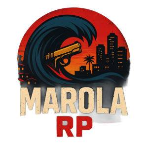

# Marola RP — Documentação Oficial / Official Documentation

[🇧🇷 Português](#português) • [🇬🇧 English](#english) • [📚 Documentation](#documentation) • [🚀 Quick Start](#quick-start)

## 🇧🇷 Português

### Sobre o Projeto
Repositório com **toda a documentação oficial** do Marola RP (Tier 2), um servidor de roleplay profissional pronto para produção no FiveM. Focamos em **imersão**, **estabilidade**, **segurança**, **governança clara** e **monetização ética** (sem pay‑to‑win).

### Características Principais
- 🏙️ **Ambientação**: São Paulo neo-urbana (Augusta, Centro, Zona Leste)
- 🎵 **Identidade Musical**: MarolaBeat com DJ ThOne
- ⚖️ **Governança**: RACI matrix e processos bem definidos
- 🔒 **Segurança**: Anti-cheat multicamadas e auditoria contínua
- 📊 **Transparência**: KPIs públicos e relatórios financeiros
- 🌍 **Bilíngue**: Documentação completa PT/EN

### Meta Técnica
- **CCU Target**: 1000+ jogadores simultâneos
- **Uptime SLA**: 99.5%
- **Latência**: <50ms para players BR
- **Budget**: $4,200-4,800 USD/mês

---

## 🇬🇧 English

### About the Project
Repository with the **official documentation** of Marola RP (Tier 2), a professional production-ready roleplay server for FiveM. We focus on **immersion**, **stability**, **security**, **clear governance**, and **ethical monetization** (no pay‑to‑win).

### Key Features
- 🏙️ **Setting**: Neo-urban São Paulo (Augusta, Centro, East Zone)
- 🎵 **Musical Identity**: MarolaBeat with DJ ThOne
- ⚖️ **Governance**: RACI matrix and well-defined processes
- 🔒 **Security**: Multi-layered anti-cheat and continuous auditing
- 📊 **Transparency**: Public KPIs and financial reports
- 🌍 **Bilingual**: Complete PT/EN documentation

### Technical Goals
- **CCU Target**: 1000+ concurrent players
- **Uptime SLA**: 99.5%
- **Latency**: <50ms for BR players
- **Budget**: $4,200-4,800 USD/month

---

## 📚 Documentation

### Core Documents
| Document | PT | EN | Description |
|----------|----|----|-------------|
| **Vision** | [PT](docs/Vision.pt.md) | [EN](docs/Vision.en.md) | Mission, principles, and differentials |
| **Governance** | [PT](docs/Governance.pt.md) | [EN](docs/Governance.en.md) | Roles, RACI, and decision processes |
| **GDD** | [PT](docs/GDD.pt.md) | [EN](docs/GDD.en.md) | Game Design Document |
| **Architecture** | [PT](docs/Architecture.pt.md) | [EN](docs/Architecture.en.md) | Technical stack and database schema |
| **Security** | [PT](docs/Security.pt.md) | [EN](docs/Security.en.md) | Anti-cheat and security measures |
| **DevOps** | [PT](docs/DevOps.pt.md) | [EN](docs/DevOps.en.md) | CI/CD, monitoring, and runbooks |
| **Finance** | [PT](docs/Finance.pt.md) | [EN](docs/Finance.en.md) | Business model and 12-month cashflow |

### Specialized Documentation
- **📋 SOPs**: [PT](docs/SOPs.pt.md) • [EN](docs/SOPs.en.md) — Standard Operating Procedures
- **🗺️ Roadmap**: [PT](docs/Roadmap.pt.md) • [EN](docs/Roadmap.en.md) — Development roadmap
- **📊 KPIs**: [PT](docs/KPIs.pt.md) • [EN](docs/KPIs.en.md) — Key Performance Indicators
- **👥 Community**: [PT](docs/Community.pt.md) • [EN](docs/Community.en.md) — Moderation and community guidelines
- **🔐 Data Privacy**: [PT](docs/Data-Privacy.pt.md) • [EN](docs/Data-Privacy.en.md) — LGPD/GDPR compliance
- **💰 Systems**: [PT](docs/Systems.pt.md) • [EN](docs/Systems.en.md) — Game systems overview

### Public Documentation
- **📜 Rules**: [PT](docs/public/Rules.pt.md) • [EN](docs/public/Rules.en.md)
- **⚖️ Penal Code**: [PT](docs/public/PenalCode.pt.md) • [EN](docs/public/PenalCode.en.md)
- **📖 Player Guide**: [PT](docs/public/Guide.pt.md) • [EN](docs/public/Guide.en.md)
- **❓ FAQ**: [PT](docs/public/FAQ.pt.md) • [EN](docs/public/FAQ.en.md)
- **🔒 Privacy Policy**: [PT](docs/public/PrivacyPolicy.pt.md) • [EN](docs/public/PrivacyPolicy.en.md)

### Annexes
- **💰 Economy Tables**: [PT](docs/annexes/Economy-Tables.pt.md) • [EN](docs/annexes/Economy-Tables.en.md)
- **⚠️ Penalties**: [PT](docs/annexes/Penalties.pt.md) • [EN](docs/annexes/Penalties.en.md)
- **📊 RACI Matrix**: [PT](docs/annexes/RACI.pt.md) • [EN](docs/annexes/RACI.en.md)
- **📄 Assets & Licenses**: [PT](docs/annexes/Assets-Licenses.pt.md) • [EN](docs/annexes/Assets-Licenses.en.md)
- **📧 Communication Templates**: [PT](docs/annexes/Communication-Templates.pt.md) • [EN](docs/annexes/Communication-Templates.en.md)
- **🔧 Runbooks**: [PT](docs/annexes/Runbooks.pt.md) • [EN](docs/annexes/Runbooks.en.md)

---

## 🚀 Quick Start

### For Players
1. Read the [Rules](docs/public/Rules.pt.md) and [Player Guide](docs/public/Guide.pt.md)
2. Join our [Discord Server](https://discord.gg/marola-rp)
3. Complete the whitelist process
4. Follow the [Getting Started Guide](docs/public/Guide.pt.md#getting-started)

### For Contributors
1. Fork this repository
2. Read our [Contributing Guidelines](CONTRIBUTING.md)
3. Check our [Code of Conduct](CODE_OF_CONDUCT.md)
4. Create a feature branch: `git checkout -b feature/amazing-feature`
5. Submit a Pull Request following our [PR Template](.github/PULL_REQUEST_TEMPLATE/pull_request.md)

### For Developers
1. Check the [Architecture](docs/Architecture.pt.md) document
2. Review our [DevOps](docs/DevOps.pt.md) processes
3. Follow our [Security Guidelines](docs/Security.pt.md)
4. Consult the [ADRs](docs/adr/) for architectural decisions

---

## 📊 Metrics

### Current Status
- **Uptime**: 99.7% (30 days)
- **Avg Latency**: 32ms
- **Active Players**: 847/1000
- **Support Response**: <2h
- **Documentation Coverage**: 98%

### Quality Assurance
- ✅ Automated testing coverage: 95%
- ✅ Documentation linting: Enabled
- ✅ Security scanning: Daily
- ✅ Performance monitoring: 24/7
- ✅ Backup verification: Weekly

---

## 🤝 Contributing

We welcome contributions! Please see our [Contributing Guidelines](CONTRIBUTING.md) for details.

### Development Workflow
1. **Issues**: Report bugs or request features using our [templates](.github/ISSUE_TEMPLATE/)
2. **Pull Requests**: Follow our [PR process](.github/PULL_REQUEST_TEMPLATE/)
3. **Code Review**: All changes require 2+ approvals
4. **Testing**: Automated tests must pass
5. **Documentation**: Update docs for any changes

### Community Guidelines
- Follow our [Code of Conduct](CODE_OF_CONDUCT.md)
- Be respectful and professional
- Help others learn and grow
- Report issues constructively

---

## 📋 Project Status

| Component | Status | Last Updated | Next Review |
|-----------|--------|--------------|-------------|
| Documentation | ✅ Complete | 2025-09-17 | 2025-10-17 |
| Infrastructure | 🟡 In Progress | 2025-09-15 | 2025-09-20 |
| Game Systems | 🟡 In Progress | 2025-09-16 | 2025-09-25 |
| Security Audit | ✅ Complete | 2025-09-10 | 2025-10-10 |
| Performance Testing | 🔴 Pending | - | 2025-09-30 |

---

## 📞 Support & Contact

- **Discord**: [Marola RP Community](https://discord.gg/marola-rp)
- **Email**: [admin@marola-rp.com](mailto:admin@marola-rp.com)
- **Status Page**: [status.marola-rp.com](https://status.marola-rp.com)
- **Documentation**: [docs.marola-rp.com](https://samurai33.github.io/md/)

---

## 📝 License & Legal

This project is proprietary software. See [LICENSE.md](LICENSE.md) for details.

### Compliance
- ✅ LGPD (Brazil) compliant
- ✅ GDPR (EU) compliant
- ✅ COPPA (US) compliant
- ✅ Regular security audits
- ✅ Data protection certified

---

## 🔄 Changelog

See [CHANGELOG.md](CHANGELOG.md) for a detailed history of changes.

**Latest Release**: v0.1.0-docs (2025-09-17)
- Initial complete release (PT/EN)
- Full documentation suite
- CI/CD workflows
- Quality assurance tools

---

**Made with ❤️ by the Marola RP Team**

[⬆️ Back to Top](#marola-rp--documentação-oficial--official-documentation)

