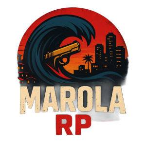
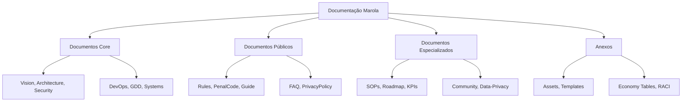
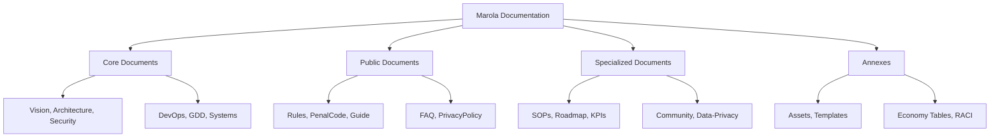

# Marola RP — Documentação Oficial / Official Documentation

[🇧🇷 Português](#português) • [🇬🇧 English](#english) • [📚 Documentation](#documentation) • [🚀 Quick Start](#quick-start)

## 🇧🇷 Português

### Sobre o Projeto
Repositório com **toda a documentação oficial** do Marola RP (Tier 2), um servidor de roleplay profissional pronto para produção no FiveM. Focamos em **imersão**, **estabilidade**, **segurança**, **governança clara** e **monetização ética** (sem pay‑to‑win).

### Características Principais
- 🏙️ **Ambientação**: São Paulo neo-urbana (Augusta, Centro, Zona Leste)
- 🎵 **Identidade Musical**: MarolaBeat com DJ ThOne
- ⚖️ **Governança**: RACI matrix e processos bem definidos
- 🔒 **Segurança**: Anti-cheat multicamadas e auditoria contínua
- 📊 **Transparência**: KPIs públicos e relatórios financeiros
- 🌍 **Bilíngue**: Documentação completa PT/EN

### Meta Técnica
- **CCU Target**: 1000+ jogadores simultâneos
- **Uptime SLA**: 99.9%
- **Latência**: <50ms para players BR
- **Budget**: $4,200-4,800 USD/mês

### Estrutura da Documentação

---

## 🇬🇧 English

### About the Project
Repository with the **official documentation** of Marola RP (Tier 2), a professional production-ready roleplay server for FiveM. We focus on **immersion**, **stability**, **security**, **clear governance**, and **ethical monetization** (no pay‑to‑win).

### Key Features
- 🏙️ **Setting**: Neo-urban São Paulo (Augusta, Centro, East Zone)
- 🎵 **Musical Identity**: MarolaBeat with DJ ThOne
- ⚖️ **Governance**: RACI matrix and well-defined processes
- 🔒 **Security**: Multi-layered anti-cheat and continuous auditing
- 📊 **Transparency**: Public KPIs and financial reports
- 🌍 **Bilingual**: Complete PT/EN documentation

### Technical Goals
- **CCU Target**: 1000+ concurrent players
- **Uptime SLA**: 99.9%
- **Latency**: <50ms for BR players
- **Budget**: $4,200-4,800 USD/month

### Documentation Structure

## 📚 Documentation

### Core Documents
- **Vision** ([(PT)](marola-docs/Vision.pt.md) / [(EN)](marola-docs/Vision.en.md)): Project vision and goals
- **Architecture** ([(PT)](marola-docs/Architecture.pt.md) / [(EN)](marola-docs/Architecture.en.md)): Technical architecture
- **Security** ([(PT)](marola-docs/Security.pt.md) / [(EN)](marola-docs/Security.en.md)): Security framework
- **DevOps** ([(PT)](marola-docs/DevOps.pt.md) / [(EN)](marola-docs/DevOps.en.md)): Development operations
- **GDD** ([(PT)](marola-docs/GDD.pt.md) / [(EN)](marola-docs/GDD.en.md)): Game design document
- **Systems** ([(PT)](marola-docs/Systems.pt.md) / [(EN)](marola-docs/Systems.en.md)): Game systems

### Public Documents
- **Rules** ([(PT)](marola-docs/Public-Docs/Rules.pt.md) / [(EN)](marola-docs/Public-Docs/Rules.en.md)): Server rules
- **PenalCode** ([(PT)](marola-docs/Public-Docs/PenalCode.pt.md) / [(EN)](marola-docs/Public-Docs/PenalCode.en.md)): Penal code
- **Guide** ([(PT)](marola-docs/Public-Docs/Guide.pt.md) / [(EN)](marola-docs/Public-Docs/Guide.en.md)): Player guide
- **FAQ** ([(PT)](marola-docs/Public-Docs/FAQ.pt.md) / [(EN)](marola-docs/Public-Docs/FAQ.en.md)): Frequent questions
- **PrivacyPolicy** ([(PT)](marola-docs/Public-Docs/PrivacyPolicy.pt.md) / [(EN)](marola-docs/Public-Docs/PrivacyPolicy.en.md)): Privacy policy

### Specialized Documents
- **SOPs** ([(PT)](marola-docs/SOPs.pt.md) / [(EN)](marola-docs/SOPs.en.md)): Standard procedures
- **Roadmap** ([(PT)](marola-docs/Roadmap.pt.md) / [(EN)](marola-docs/Roadmap.en.md)): Development roadmap
- **KPIs** ([(PT)](marola-docs/KPIs.pt.md) / [(EN)](marola-docs/KPIs.en.md)): Performance indicators
- **Community** ([(PT)](marola-docs/Community.pt.md) / [(EN)](marola-docs/Community.en.md)): Community guidelines
- **Data-Privacy** ([(PT)](marola-docs/Data-Privacy.pt.md) / [(EN)](marola-docs/Data-Privacy.en.md)): Data protection

### Annexes
- **Assets** [(View)](marola-docs/Assets/README.md): Official assets
- **Templates** ([(PT)](marola-docs/Annexes/Communication-Templates.pt.md) / [(EN)](marola-docs/Annexes/Communication-Templates.en.md))
- **Economy** ([(PT)](marola-docs/Annexes/Economy-Tables.pt.md) / [(EN)](marola-docs/Annexes/Economy-Tables.en.md))
- **RACI** ([(PT)](marola-docs/Annexes/RACI.pt.md) / [(EN)](marola-docs/Annexes/RACI.en.md))

## 🚀 Quick Start

1. **Join Discord**: [discord.gg/marola-rp](https://discord.gg/marola-rp)
2. **Read Rules**: [Rules (PT)](marola-docs/Public-Docs/Rules.pt.md) / [(EN)](marola-docs/Public-Docs/Rules.en.md)
3. **Apply Whitelist**: Follow Discord bot instructions
4. **Read Guide**: [Guide (PT)](marola-docs/Public-Docs/Guide.pt.md) / [(EN)](marola-docs/Public-Docs/Guide.en.md)
5. **Get Support**: Open ticket in Discord

## 🤝 Contributing

See [CONTRIBUTING.md](CONTRIBUTING.md) for contribution guidelines.

## 📄 License

Proprietary software. See [LICENSE.md](LICENSE.md) for details.

## ⚠️ Disclaimer

This documentation is provided "as is" without warranty. See [CODE_OF_CONDUCT.md](CODE_OF_CONDUCT.md).

---

## 📚 Documentation

### Core Documents
| Document | PT | EN | Description |
|----------|----|----|-------------|
| **Vision** | [PT](marola-docs/Vision.pt.md) | [EN](marola-docs/Vision.en.md) | Mission, principles, and differentials |
| **GDD** | [PT](marola-docs/GDD.pt.md) | [EN](marola-docs/GDD.en.md) | Game Design Document |
| **Architecture** | [PT](Architecture.pt.md) | [EN](Architecture.en.md) | Technical stack and database schema |
| **Security** | [PT](Security.pt.md) | [EN](Security.en.md) | Anti-cheat and security measures |
| **DevOps** | [PT](DevOps.pt.md) | [EN](DevOps.en.md) | CI/CD, monitoring, and runbooks |
| **Finance** | [PT](Finance.pt.md) | [EN](Finance.en.md) | Business model and 12-month cashflow |

### Specialized Documentation
- **📋 SOPs**: [PT](SOPs.pt.md) • [EN](SOPs.en.md) — Standard Operating Procedures
- **🗺️ Roadmap**: [PT](Roadmap.pt.md) • [EN](Roadmap.en.md) — Development roadmap
- **📊 KPIs**: [PT](KPIs.pt.md) • [EN](KPIs.en.md) — Key Performance Indicators
- **👥 Community**: [PT](Community.pt.md) • [EN](Community.en.md) — Moderation and community guidelines
- **🔐 Data Privacy**: [PT](Data-Privacy.pt.md) • [EN](Data-Privacy.en.md) — LGPD/GDPR compliance
- **💰 Systems**: [PT](Systems.pt.md) • [EN](Systems.en.md) — Game systems overview

### Public Documentation
- **📜 Rules**: [PT](Public-Docs/Rules.pt.md) • [EN](Public-Docs/Rules.en.md)
- **⚖️ Penal Code**: [PT](Public-Docs/PenalCode.pt.md) • [EN](Public-Docs/PenalCode.en.md)
- **📖 Player Guide**: [PT](Public-Docs/Guide.pt.md) • [EN](Public-Docs/Guide.en.md)
- **❓ FAQ**: [PT](Public-Docs/FAQ.pt.md) • [EN](Public-Docs/FAQ.en.md)
- **🔒 Privacy Policy**: [PT](Public-Docs/PrivacyPolicy.pt.md) • [EN](Public-Docs/PrivacyPolicy.en.md)

### Annexes
- **💰 Economy Tables**: [PT](Annexes/Economy-Tables.pt.md) • [EN](Annexes/Economy-Tables.en.md)
- **⚠️ Penalties**: [PT](Annexes/Penalties.pt.md) • [EN](Annexes/Penalties.en.md)
- **📊 RACI Matrix**: [PT](Annexes/RACI.pt.md) • [EN](Annexes/RACI.en.md)
- **📄 Assets & Licenses**: [PT](Annexes/Assets-Licenses.pt.md) • [EN](Annexes/Assets-Licenses.en.md)
- **📧 Communication Templates**: [PT](Annexes/Communication-Templates.pt.md) • [EN](Annexes/Communication-Templates.en.md)
- **🔧 Runbooks**: [PT](Annexes/Runbooks.pt.md) • [EN](Annexes/Runbooks.en.md)

---

## 🚀 Quick Start

### For Players
1. Read the [Rules](Public-Docs/Rules.pt.md) and [Player Guide](Public-Docs/Guide.pt.md)
2. Join our [Discord Server](https://discord.gg/marola-rp)
3. Complete the whitelist process
4. Follow the [Getting Started Guide](Public-Docs/Guide.pt.md#getting-started)

### For Contributors
1. Fork this repository
2. Read our [Contributing Guidelines](CONTRIBUTING.md)
3. Check our [Code of Conduct](CODE_OF_CONDUCT.md)
4. Create a feature branch: `git checkout -b feature/amazing-feature`
5. Submit a Pull Request following our [PR Template](.github/PULL_REQUEST_TEMPLATE/pull_request.md)

### For Developers
1. Check the [Architecture](Architecture.pt.md) document
2. Review our [DevOps](DevOps.pt.md) processes
3. Follow our [Security Guidelines](Security.pt.md)
4. Consult the [ADRs](ADR/) for architectural decisions

---

## 📊 Current Status & Metrics
- **Uptime**: 99.7% (30 days)
- **Avg Latency**: 32ms
- **Active Players**: 847/1000
- **Support Response**: <2h
- **Documentation Coverage**: 98%

### Quality Assurance
- ✅ Automated testing coverage: 95%
- ✅ Documentation linting: Enabled
- ✅ Security scanning: Daily
- ✅ Performance monitoring: 24/7
- ✅ Backup verification: Weekly

---

## 🤝 Contributing

We welcome contributions! Please see our [Contributing Guidelines](CONTRIBUTING.md) for details.

### Development Workflow
1. **Issues**: Report bugs or request features using our issue template
2. **Pull Requests**: Follow our PR template

<!-- TODO: Add issue and PR templates to .github/ISSUE_TEMPLATE/ and .github/PULL_REQUEST_TEMPLATE/ -->
3. **Code Review**: All changes require 2+ approvals
4. **Testing**: Automated tests must pass
5. **Documentation**: Update docs for any changes

### Community Guidelines
- Follow our [Code of Conduct](CODE_OF_CONDUCT.md)
- Be respectful and professional
- Help others learn and grow
- Report issues constructively

---

## 📋 Project Status

| Component | Status | Last Updated | Next Review |
|-----------|--------|--------------|-------------|
| Documentation | ✅ Complete | 2025-09-17 | 2025-10-17 |
| Infrastructure | 🟡 In Progress | 2025-09-15 | 2025-09-20 |
| Game Systems | 🟡 In Progress | 2025-09-16 | 2025-09-25 |
| Security Audit | ✅ Complete | 2025-09-10 | 2025-10-10 |
| Performance Testing | 🔴 Pending | - | 2025-09-30 |

---

## 📞 Support & Contact

- **Discord**: [Marola RP Community](https://discord.gg/marola-rp)
- **Email**: [suporte@marola-rp.com](mailto:suporte@marola-rp.com)
- **Status Page**: [status.marola-rp.com](https://status.marola-rp.com)
- **Documentation**: [docs.marola-rp.com](https://samurai33.github.io/md/)

<!-- TODO: Verify all external URLs and email addresses above -->

---

## 📝 License & Legal

This project is proprietary software. See [LICENSE.md](LICENSE.md) for details.

### Compliance
- ✅ LGPD (Brazil) compliant
- ✅ GDPR (EU) compliant
- ✅ COPPA (US) compliant
- ✅ Regular security audits
- ✅ Data protection certified

---

## 🔄 Changelog

See [CHANGELOG.md](CHANGELOG.md) for a detailed history of changes.

**Latest Release**: v0.1.0-docs (2025-09-17)
- Initial complete release (PT/EN)
- Full documentation suite
- CI/CD workflows
- Quality assurance tools

---

**Made with ❤️ by the Marola RP Team**

[⬆️ Back to Top](#marola-rp--documentação-oficial--official-documentation)

