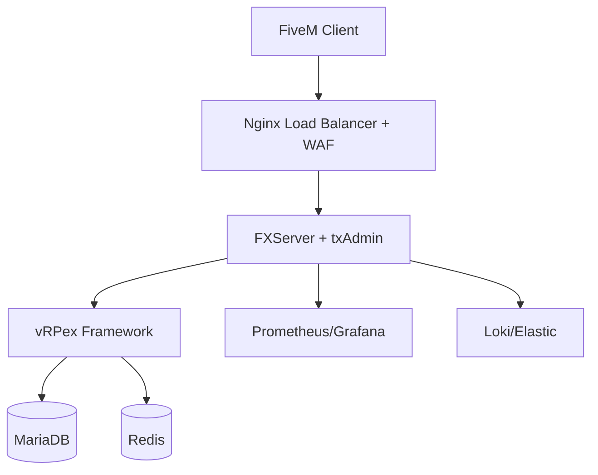
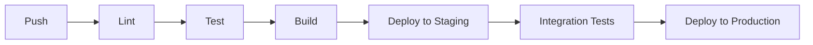

# System Architecture


## Overview
This document details the technical architecture of Marola RP, including infrastructure, data flow, security measures, and development standards.

## Infrastructure Stack

### Core Systems


### Component Details

#### Game Server
- **FXServer + txAdmin**
  - Version: Latest Stable
  - Capacity: 256 players
  - High availability setup
  - Auto-scaling support

#### Framework
- **Custom vRPex**
  - Modular architecture
  - Event-driven design
  - Custom extensions
  - Performance optimizations

#### Database
- **MariaDB**
  - Version: 10.11+
  - HA configuration
  - Automated backups
  - Performance tuning

#### Caching
- **Redis**
  - Session management
  - Temporary data
  - Rate limiting
  - Real-time features

### Monitoring Stack
- **Metrics**
  - Prometheus collection
  - Grafana dashboards
  - Custom alerts
  - Performance tracking

- **Logging**
  - Loki aggregation
  - Elastic search
  - Structured logging
  - Retention policies

## Data Architecture

### Database Schema
```sql
-- Core User Management
CREATE TABLE vrp_users (
    id BIGINT PRIMARY KEY AUTO_INCREMENT,
    steam_id VARCHAR(21) UNIQUE,
    whitelisted BOOLEAN DEFAULT FALSE,
    banned BOOLEAN DEFAULT FALSE,
    created_at TIMESTAMP DEFAULT CURRENT_TIMESTAMP
);

CREATE TABLE vrp_characters (
    id BIGINT PRIMARY KEY AUTO_INCREMENT,
    user_id BIGINT,
    name VARCHAR(50),
    data JSON,
    position JSON,
    FOREIGN KEY (user_id) REFERENCES vrp_users(id)
);

-- Game Systems
CREATE TABLE vrp_jobs (
    id BIGINT PRIMARY KEY AUTO_INCREMENT,
    name VARCHAR(50),
    config JSON,
    requirements JSON
);

CREATE TABLE vrp_factions (
    id BIGINT PRIMARY KEY AUTO_INCREMENT,
    name VARCHAR(50),
    type VARCHAR(20),
    data JSON
);

-- Assets and Economy
CREATE TABLE vrp_vehicles (
    id BIGINT PRIMARY KEY AUTO_INCREMENT,
    owner_id BIGINT,
    model VARCHAR(50),
    data JSON,
    FOREIGN KEY (owner_id) REFERENCES vrp_characters(id)
);

CREATE TABLE vrp_properties (
    id BIGINT PRIMARY KEY AUTO_INCREMENT,
    owner_id BIGINT,
    type VARCHAR(20),
    position JSON,
    data JSON,
    FOREIGN KEY (owner_id) REFERENCES vrp_characters(id)
);

-- Inventory System
CREATE TABLE vrp_inventories (
    id BIGINT PRIMARY KEY AUTO_INCREMENT,
    owner_type VARCHAR(20),
    owner_id BIGINT,
    data JSON
);

CREATE TABLE vrp_items (
    id BIGINT PRIMARY KEY AUTO_INCREMENT,
    name VARCHAR(50),
    type VARCHAR(20),
    data JSON
);

-- Economy and Logs
CREATE TABLE vrp_transactions (
    id BIGINT PRIMARY KEY AUTO_INCREMENT,
    from_id BIGINT,
    to_id BIGINT,
    amount DECIMAL(15,2),
    type VARCHAR(20),
    created_at TIMESTAMP DEFAULT CURRENT_TIMESTAMP
);

CREATE TABLE vrp_logs (
    id BIGINT PRIMARY KEY AUTO_INCREMENT,
    type VARCHAR(20),
    data JSON,
    created_at TIMESTAMP DEFAULT CURRENT_TIMESTAMP
);
```

### Data Flow
1. **Client Request Flow**
   ```mermaid
   sequenceDiagram
       Client->>Load Balancer: Request
       Load Balancer->>Game Server: Route Request
       Game Server->>Cache: Check Cache
       Game Server->>Database: Query if needed
       Game Server->>Client: Response
   ```

2. **Event Processing Flow**
   ```mermaid
   sequenceDiagram
       Client->>Server: Event Trigger
       Server->>Validator: Validate Event
       Validator->>Handler: Process Event
       Handler->>Database: Update State
       Handler->>Cache: Update Cache
       Server->>Client: Event Response
   ```

## Security Architecture

### Network Security
- WAF configuration
- DDoS protection
- Rate limiting
- IP filtering

### Application Security
- Input validation
- Anti-cheat measures
- Session management
- Encryption standards

### Data Security
- Backup strategy
- Encryption at rest
- Access controls
- Audit logging

## Development Standards

### Code Organization
```
marola/
├── client/
│   ├── modules/
│   ├── ui/
│   └── events/
├── server/
│   ├── modules/
│   ├── services/
│   └── database/
├── shared/
│   ├── config/
│   ├── utils/
│   └── types/
└── resources/
    ├── maps/
    ├── assets/
    └── scripts/
```

### Coding Standards
- ESLint configuration
- Prettier formatting
- TypeScript types
- Documentation requirements

### Version Control
- Semantic versioning
- Branch strategy
- PR requirements
- Code review process

### CI/CD Pipeline


## Performance Optimization

### Server Optimization
| Component | Target | Current | Action |
|-----------|---------|---------|---------|
| CPU Usage | <60% | 55% | Monitor |
| Memory | <8GB | 6.5GB | Monitor |
| Network | <100Mbps | 75Mbps | Monitor |
| Tick Rate | 30/s | 30/s | Stable |

### Client Optimization
| Metric | Target | Action |
|--------|--------|--------|
| FPS | 60+ | Optimize assets |
| Loading Time | <30s | Cache management |
| Network Usage | <1MB/s | Compression |
| Memory | <4GB | Resource cleanup |

## Scalability Strategy

### Horizontal Scaling
- Load balancer configuration
- Server instance management
- Database replication
- Cache distribution

### Vertical Scaling
- Resource allocation
- Performance tuning
- Capacity planning
- Upgrade paths

## Monitoring and Alerts

### Key Metrics
| Metric | Warning | Critical | Action |
|--------|----------|----------|--------|
| Player Count | 200 | 240 | Scale up |
| CPU Usage | 70% | 85% | Optimize |
| Memory Usage | 75% | 90% | Clean up |
| Error Rate | 1% | 5% | Investigate |

### Alert Channels
1. Discord notifications
2. Email alerts
3. SMS (critical)
4. Dashboard warnings

## Documentation Requirements

### Technical Documentation
- Architecture updates
- API documentation
- Database schemas
- Security protocols

### Operational Documentation
- Deployment guides
- Troubleshooting
- Maintenance procedures
- Emergency responses

## Version Control
- Last Updated: 2025-09-17
- Next Review: 2025-10-17
- Review Frequency: Monthly
