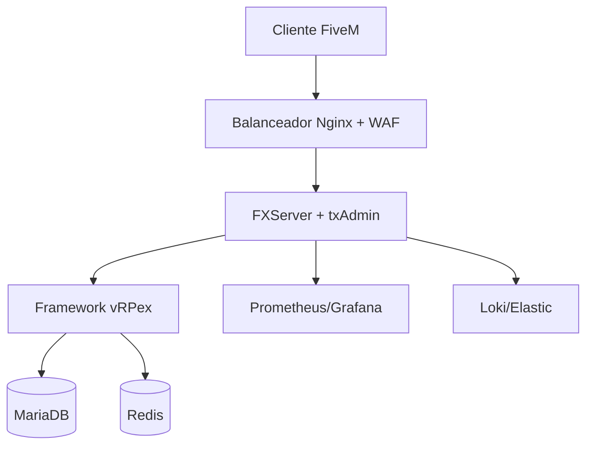
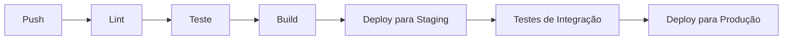

# Arquitetura do Sistema


## Visão Geral
Este documento detalha a arquitetura técnica do Marola RP, incluindo infraestrutura, fluxo de dados, medidas de segurança e padrões de desenvolvimento.

## Stack de Infraestrutura

### Sistemas Core


### Detalhes dos Componentes

#### Servidor de Jogo
- **FXServer + txAdmin**
  - Versão: Última Estável
  - Capacidade: 256 jogadores
  - Configuração de alta disponibilidade
  - Suporte a auto-scaling

#### Framework
- **vRPex Customizado**
  - Arquitetura modular
  - Design orientado a eventos
  - Extensões customizadas
  - Otimizações de performance

#### Banco de Dados
- **MariaDB**
  - Versão: 10.11+
  - Configuração HA
  - Backups automatizados
  - Ajustes de performance

#### Cache
- **Redis**
  - Gerenciamento de sessão
  - Dados temporários
  - Limitação de taxa
  - Recursos em tempo real

### Stack de Monitoramento
- **Métricas**
  - Coleta Prometheus
  - Dashboards Grafana
  - Alertas customizados
  - Rastreamento de performance

- **Logging**
  - Agregação Loki
  - Busca Elastic
  - Logging estruturado
  - Políticas de retenção

## Arquitetura de Dados

### Esquema do Banco de Dados
```sql
-- Gerenciamento Core de Usuários
CREATE TABLE vrp_users (
    id BIGINT PRIMARY KEY AUTO_INCREMENT,
    steam_id VARCHAR(21) UNIQUE,
    whitelisted BOOLEAN DEFAULT FALSE,
    banned BOOLEAN DEFAULT FALSE,
    created_at TIMESTAMP DEFAULT CURRENT_TIMESTAMP
);

CREATE TABLE vrp_characters (
    id BIGINT PRIMARY KEY AUTO_INCREMENT,
    user_id BIGINT,
    name VARCHAR(50),
    data JSON,
    position JSON,
    FOREIGN KEY (user_id) REFERENCES vrp_users(id)
);

-- Sistemas do Jogo
CREATE TABLE vrp_jobs (
    id BIGINT PRIMARY KEY AUTO_INCREMENT,
    name VARCHAR(50),
    config JSON,
    requirements JSON
);

CREATE TABLE vrp_factions (
    id BIGINT PRIMARY KEY AUTO_INCREMENT,
    name VARCHAR(50),
    type VARCHAR(20),
    data JSON
);

-- Assets e Economia
CREATE TABLE vrp_vehicles (
    id BIGINT PRIMARY KEY AUTO_INCREMENT,
    owner_id BIGINT,
    model VARCHAR(50),
    data JSON,
    FOREIGN KEY (owner_id) REFERENCES vrp_characters(id)
);

CREATE TABLE vrp_properties (
    id BIGINT PRIMARY KEY AUTO_INCREMENT,
    owner_id BIGINT,
    type VARCHAR(20),
    position JSON,
    data JSON,
    FOREIGN KEY (owner_id) REFERENCES vrp_characters(id)
);

-- Sistema de Inventário
CREATE TABLE vrp_inventories (
    id BIGINT PRIMARY KEY AUTO_INCREMENT,
    owner_type VARCHAR(20),
    owner_id BIGINT,
    data JSON
);

CREATE TABLE vrp_items (
    id BIGINT PRIMARY KEY AUTO_INCREMENT,
    name VARCHAR(50),
    type VARCHAR(20),
    data JSON
);

-- Economia e Logs
CREATE TABLE vrp_transactions (
    id BIGINT PRIMARY KEY AUTO_INCREMENT,
    from_id BIGINT,
    to_id BIGINT,
    amount DECIMAL(15,2),
    type VARCHAR(20),
    created_at TIMESTAMP DEFAULT CURRENT_TIMESTAMP
);

CREATE TABLE vrp_logs (
    id BIGINT PRIMARY KEY AUTO_INCREMENT,
    type VARCHAR(20),
    data JSON,
    created_at TIMESTAMP DEFAULT CURRENT_TIMESTAMP
);
```

### Fluxo de Dados
1. **Fluxo de Requisição do Cliente**
   ```mermaid
   sequenceDiagram
       Client->>Load Balancer: Requisição
       Load Balancer->>Game Server: Rotear Requisição
       Game Server->>Cache: Verificar Cache
       Game Server->>Database: Consultar se necessário
       Game Server->>Client: Resposta
   ```

2. **Fluxo de Processamento de Eventos**
   ```mermaid
   sequenceDiagram
       Client->>Server: Disparo do Evento
       Server->>Validator: Validar Evento
       Validator->>Handler: Processar Evento
       Handler->>Database: Atualizar Estado
       Handler->>Cache: Atualizar Cache
       Server->>Client: Resposta do Evento
   ```

## Arquitetura de Segurança

### Segurança de Rede
- Configuração WAF
- Proteção DDoS
- Limitação de taxa
- Filtragem de IP

### Segurança da Aplicação
- Validação de entrada
- Medidas anti-trapaça
- Gerenciamento de sessão
- Padrões de criptografia

### Segurança de Dados
- Estratégia de backup
- Criptografia em repouso
- Controles de acesso
- Registro de auditoria

## Padrões de Desenvolvimento

### Organização do Código
```
marola/
├── client/
│   ├── modules/
│   ├── ui/
│   └── events/
├── server/
│   ├── modules/
│   ├── services/
│   └── database/
├── shared/
│   ├── config/
│   ├── utils/
│   └── types/
└── resources/
    ├── maps/
    ├── assets/
    └── scripts/
```

### Padrões de Código
- Configuração ESLint
- Formatação Prettier
- Tipos TypeScript
- Requisitos de documentação

### Controle de Versão
- Versionamento semântico
- Estratégia de branches
- Requisitos de PR
- Processo de revisão de código

### Pipeline CI/CD


## Otimização de Performance

### Otimização do Servidor
| Componente | Meta | Atual | Ação |
|------------|------|--------|-------|
| Uso de CPU | <60% | 55% | Monitorar |
| Memória | <8GB | 6,5GB | Monitorar |
| Rede | <100Mbps | 75Mbps | Monitorar |
| Taxa de Tick | 30/s | 30/s | Estável |

### Otimização do Cliente
| Métrica | Meta | Ação |
|---------|------|-------|
| FPS | 60+ | Otimizar assets |
| Tempo de Carregamento | <30s | Gerenciamento de cache |
| Uso de Rede | <1MB/s | Compressão |
| Memória | <4GB | Limpeza de recursos |

## Estratégia de Escalabilidade

### Escalabilidade Horizontal
- Configuração do balanceador
- Gerenciamento de instâncias
- Replicação de banco de dados
- Distribuição de cache

### Escalabilidade Vertical
- Alocação de recursos
- Ajuste de performance
- Planejamento de capacidade
- Caminhos de upgrade

## Monitoramento e Alertas

### Métricas Principais
| Métrica | Aviso | Crítico | Ação |
|---------|-------|----------|-------|
| Contagem de Jogadores | 200 | 240 | Escalar |
| Uso de CPU | 70% | 85% | Otimizar |
| Uso de Memória | 75% | 90% | Limpar |
| Taxa de Erro | 1% | 5% | Investigar |

### Canais de Alerta
1. Notificações Discord
2. Alertas por email
3. SMS (crítico)
4. Avisos no dashboard

## Requisitos de Documentação

### Documentação Técnica
- Atualizações de arquitetura
- Documentação de API
- Esquemas de banco de dados
- Protocolos de segurança

### Documentação Operacional
- Guias de implantação
- Solução de problemas
- Procedimentos de manutenção
- Respostas de emergência

## Controle de Versão
- Última Atualização: 2025-09-17
- Próxima Revisão: 2025-10-17
- Frequência de Revisão: Mensal
