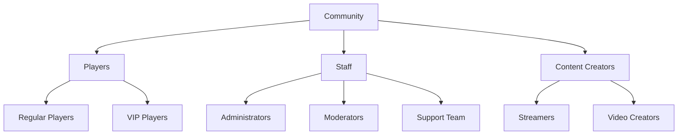
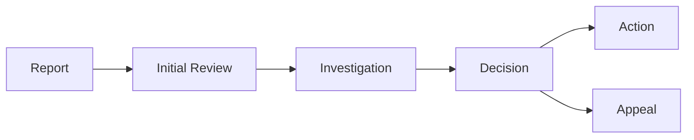
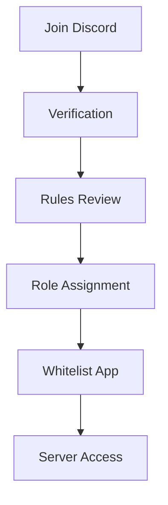
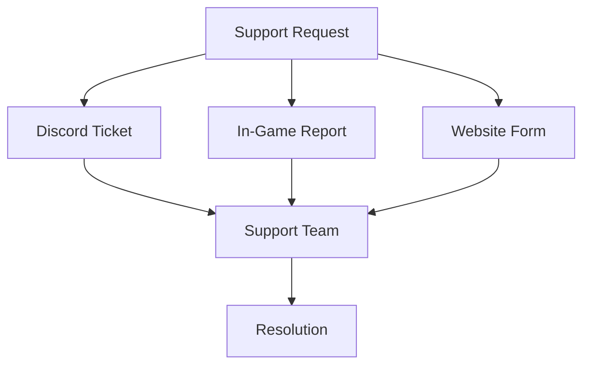

# Community Guidelines & Moderation

## Community Structure

### Organization Overview

## Community Standards

### Code of Conduct
| Behavior | Policy | Enforcement |
|----------|---------|-------------|
| Harassment | Zero Tolerance | Immediate Ban |
| Hate Speech | Zero Tolerance | Immediate Ban |
| Toxicity | Three Strikes | Progressive Action |
| Trolling | Warning System | Temporary Mute |
| Spam | Auto-Detection | Auto-Moderation |

### Player Rights & Responsibilities
1. **Rights**
   - Fair treatment
   - Appeal process
   - Privacy protection
   - Support access

2. **Responsibilities**
   - Follow rules
   - Report violations
   - Maintain civility
   - Help newcomers

## Moderation System

### Moderation Structure

### Response Times
| Priority | Issue Type | Response Time | Resolution Time |
|----------|------------|---------------|-----------------|
| P0 | Serious Violations | 15min | 1h |
| P1 | Regular Reports | 1h | 4h |
| P2 | Minor Issues | 4h | 24h |
| P3 | General Queries | 12h | 48h |

## Community Programs

### Player Recognition
1. **Achievement System**
   - Community helper badges
   - Event participation awards
   - Longevity recognition
   - Special contributions

2. **VIP Program**
   - Eligibility criteria
   - Benefits package
   - Responsibilities
   - Review process

### Content Creator Program
| Level | Requirements | Benefits | Responsibilities |
|-------|--------------|----------|------------------|
| Partner | 1000+ viewers | Custom items | Weekly content |
| Verified | 500+ viewers | Special badge | Bi-weekly content |
| Creator | 100+ viewers | Recognition | Monthly content |
| Aspiring | Starting out | Basic support | Regular activity |

## Discord Integration

### Onboarding Process

### Discord Structure
1. **Information Channels**
   - Announcements
   - Rules
   - FAQs
   - Updates

2. **Community Channels**
   - General chat
   - Support tickets
   - Suggestions
   - Event planning

3. **Special Access**
   - VIP lounge
   - Creator corner
   - Staff channels
   - Department specific

## Event Management

### Event Types
| Category | Frequency | Participation | Rewards |
|----------|-----------|---------------|----------|
| Community | Weekly | Open | Social |
| Competition | Monthly | Registration | Prizes |
| Special | Quarterly | Invitation | Exclusive |
| Holiday | Seasonal | Open | Themed |

### Event Planning
1. **Preparation**
   - Schedule announcement
   - Staff assignments
   - Resource allocation
   - Backup plans

2. **Execution**
   - Staff coordination
   - Live management
   - Issue resolution
   - Documentation

## Support System

### Support Channels

### SLA Commitments
| Type | First Response | Resolution | Follow-up |
|------|---------------|------------|-----------|
| Technical | <30min | <4h | 24h |
| Account | <1h | <8h | 48h |
| Billing | <2h | <12h | 72h |
| General | <4h | <24h | 96h |

## Version Information
- Last Update: 2025-09-17
- Version: 2.0
- Review Frequency: Monthly
- Next Review: 2025-10-17
