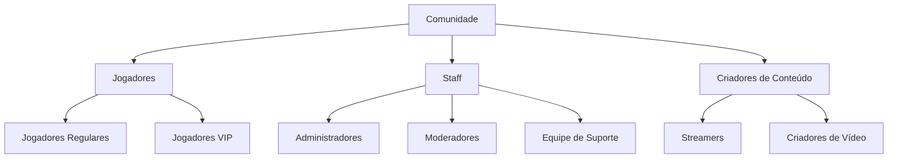
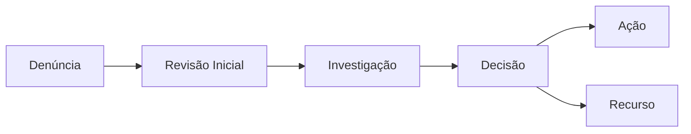
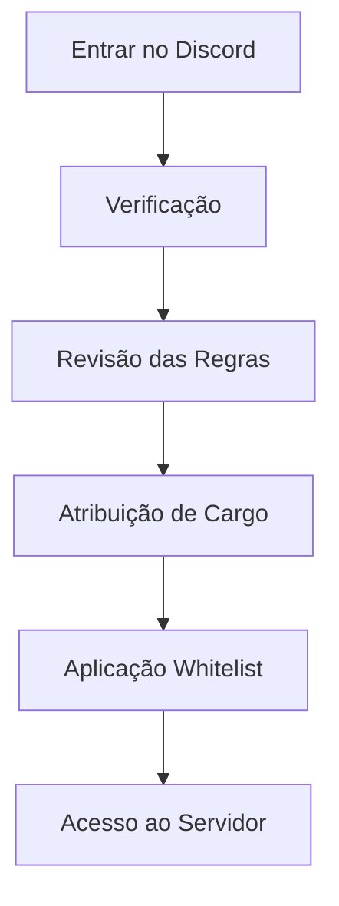
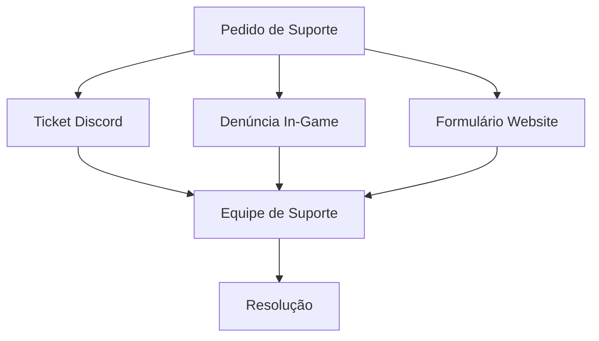

# Diretrizes da Comunidade & Moderação

## Estrutura da Comunidade

### Visão Geral da Organização

## Padrões da Comunidade

### Código de Conduta
| Comportamento | Política | Aplicação |
|--------------|----------|-----------|
| Assédio | Tolerância Zero | Ban Imediato |
| Discurso de Ódio | Tolerância Zero | Ban Imediato |
| Toxicidade | Três Strikes | Ação Progressiva |
| Trolling | Sistema de Advertência | Mute Temporário |
| Spam | Detecção Automática | Auto-Moderação |

### Direitos & Responsabilidades dos Jogadores
1. **Direitos**
   - Tratamento justo
   - Processo de recurso
   - Proteção de privacidade
   - Acesso ao suporte

2. **Responsabilidades**
   - Seguir regras
   - Reportar violações
   - Manter civilidade
   - Ajudar novatos

## Sistema de Moderação

### Estrutura de Moderação

### Tempos de Resposta
| Prioridade | Tipo de Problema | Tempo de Resposta | Tempo de Resolução |
|------------|------------------|-------------------|-------------------|
| P0 | Violações Graves | 15min | 1h |
| P1 | Denúncias Regulares | 1h | 4h |
| P2 | Problemas Menores | 4h | 24h |
| P3 | Consultas Gerais | 12h | 48h |

## Programas da Comunidade

### Reconhecimento de Jogadores
1. **Sistema de Conquistas**
   - Distintivos de ajudante
   - Prêmios de participação
   - Reconhecimento de tempo
   - Contribuições especiais

2. **Programa VIP**
   - Critérios de elegibilidade
   - Pacote de benefícios
   - Responsabilidades
   - Processo de revisão

### Programa de Criadores de Conteúdo
| Nível | Requisitos | Benefícios | Responsabilidades |
|-------|------------|------------|-------------------|
| Parceiro | 1000+ viewers | Itens exclusivos | Conteúdo semanal |
| Verificado | 500+ viewers | Distintivo especial | Conteúdo quinzenal |
| Criador | 100+ viewers | Reconhecimento | Conteúdo mensal |
| Aspirante | Iniciante | Suporte básico | Atividade regular |

## Integração Discord

### Processo de Entrada

### Estrutura do Discord
1. **Canais de Informação**
   - Anúncios
   - Regras
   - FAQs
   - Atualizações

2. **Canais da Comunidade**
   - Chat geral
   - Tickets de suporte
   - Sugestões
   - Planejamento de eventos

3. **Acesso Especial**
   - Sala VIP
   - Canto dos criadores
   - Canais da staff
   - Específicos por departamento

## Gestão de Eventos

### Tipos de Eventos
| Categoria | Frequência | Participação | Recompensas |
|-----------|------------|--------------|-------------|
| Comunidade | Semanal | Aberto | Social |
| Competição | Mensal | Registro | Prêmios |
| Especial | Trimestral | Convite | Exclusivo |
| Feriados | Sazonal | Aberto | Temático |

### Planejamento de Eventos
1. **Preparação**
   - Anúncio de cronograma
   - Designações da staff
   - Alocação de recursos
   - Planos de contingência

2. **Execução**
   - Coordenação da staff
   - Gerenciamento ao vivo
   - Resolução de problemas
   - Documentação

## Sistema de Suporte

### Canais de Suporte

### Compromissos de SLA
| Tipo | Primeira Resposta | Resolução | Acompanhamento |
|------|------------------|------------|----------------|
| Técnico | <30min | <4h | 24h |
| Conta | <1h | <8h | 48h |
| Pagamento | <2h | <12h | 72h |
| Geral | <4h | <24h | 96h |

## Informações de Versão
- Última Atualização: 2025-09-17
- Versão: 2.0
- Frequência de Revisão: Mensal
- Próxima Revisão: 2025-10-17
