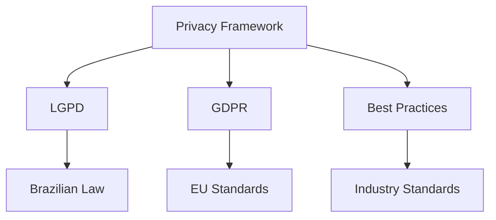
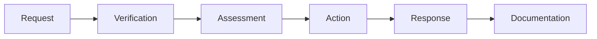
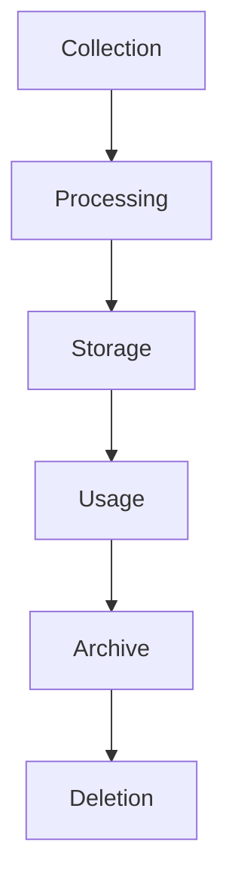
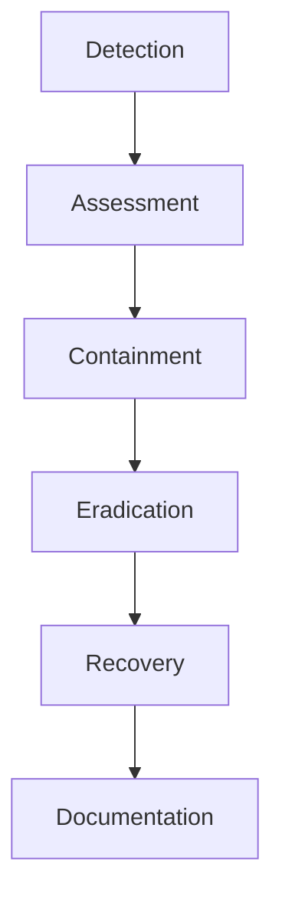

# Data Protection & Privacy Framework

## Regulatory Compliance

### Framework Overview

## Data Collection & Processing

### Data Categories
| Category | Purpose | Legal Basis | Retention |
|----------|---------|-------------|-----------|
| Account | Authentication | Contract | Account + 2y |
| Profile | Game Services | Contract | Account + 2y |
| Technical | Security | Legitimate Interest | 90 days |
| Usage | Analytics | Legitimate Interest | 12 months |
| Communications | Support | Contract | 5 years |

### Processing Principles
1. **Minimization**
   - Essential data only
   - Purpose limitation
   - Storage limitation
   - Data accuracy

2. **Legal Basis**
   - Contract performance
   - Legitimate interest
   - Legal obligation
   - Consent (when required)

## Data Subject Rights

### Rights Management

### Rights Framework
| Right | Response Time | Process | Exceptions |
|-------|---------------|----------|------------|
| Access | 15 days | Full export | None |
| Rectification | 7 days | Verification | None |
| Deletion | 30 days | Staged deletion | Legal holds |
| Portability | 15 days | Standard format | Technical limits |
| Restriction | 7 days | Processing pause | Security needs |

## Security Measures

### Technical Controls
1. **Encryption**
   - In-transit (TLS 1.3)
   - At-rest (AES-256)
   - Backup encryption
   - Key management

2. **Access Control**
   - Role-based access
   - Principle of least privilege
   - Multi-factor auth
   - Session management

### Security Framework
| Control | Implementation | Monitoring | Review |
|---------|----------------|------------|---------|
| Authentication | MFA | Real-time | Monthly |
| Authorization | RBAC | Daily | Weekly |
| Encryption | Industry standard | Continuous | Quarterly |
| Logging | Comprehensive | Real-time | Monthly |

## Data Management

### Data Lifecycle

### Retention Schedule
| Data Type | Active Period | Archive Period | Deletion |
|-----------|---------------|----------------|----------|
| Account | While active | 2 years | Automated |
| Activity | 12 months | 1 year | Automated |
| Security | 90 days | 1 year | Automated |
| Financial | 5 years | 5 years | Manual |
| Legal | 5 years | 5 years | Manual |

## International Transfers

### Transfer Framework
1. **Mechanisms**
   - Standard contractual clauses
   - Adequacy decisions
   - Binding corporate rules
   - Consent based

2. **Safeguards**
   - Data protection addenda
   - Technical measures
   - Security assessments
   - Monitoring

### Transfer Requirements
| Region | Mechanism | Documentation | Review |
|--------|-----------|---------------|---------|
| EU | SCCs | Complete set | Annual |
| Brazil | SCCs | Complete set | Annual |
| Others | Assessment | Case by case | Bi-annual |

## Incident Management

### Response Process

### Notification Framework
| Severity | Internal Notice | Authority Notice | Subject Notice |
|----------|----------------|------------------|----------------|
| Critical | Immediate | 72 hours | 7 days |
| High | 4 hours | 72 hours | 14 days |
| Medium | 24 hours | Assessment | Assessment |
| Low | 48 hours | Not required | Not required |

## Documentation & Training

### Documentation Requirements
1. **Policies**
   - Privacy notices
   - Consent records
   - Processing records
   - Transfer mechanisms

2. **Procedures**
   - Rights requests
   - Breach response
   - Data lifecycle
   - Security controls

### Training Program
| Topic | Frequency | Audience | Validation |
|-------|-----------|----------|------------|
| Privacy Basics | Annual | All Staff | Quiz |
| Data Handling | Quarterly | Data Handlers | Practical |
| Security | Monthly | Technical Staff | Assessment |
| Incidents | Bi-annual | Response Team | Simulation |

## Version Information
- Last Update: 2025-09-17
- Version: 2.0
- Review Frequency: Quarterly
- Next Review: 2025-12-17
- Regulatory Alignment: LGPD, GDPR
