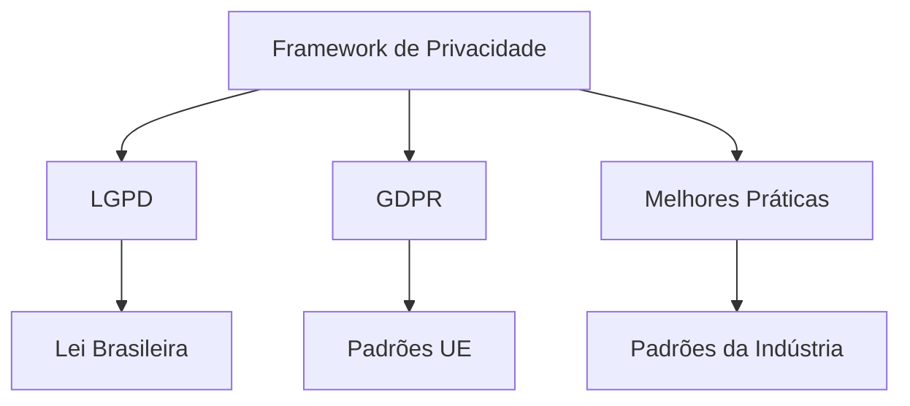
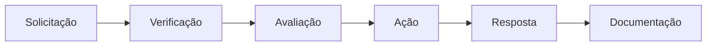
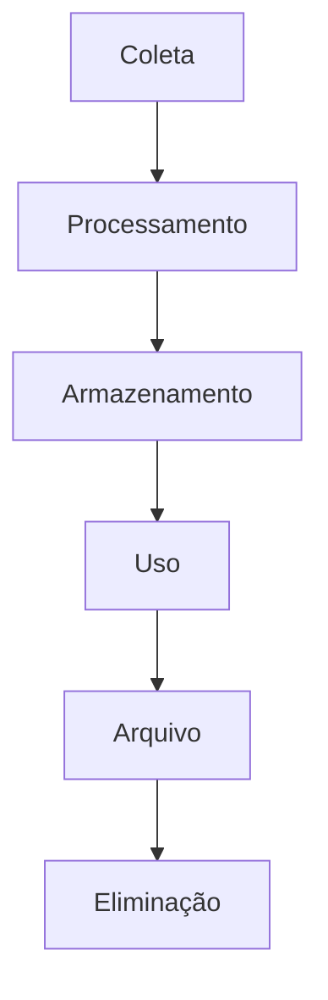
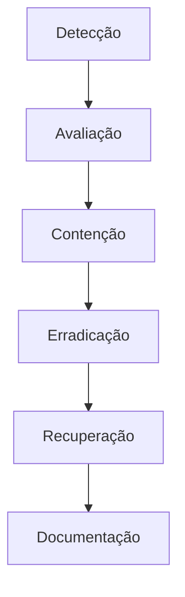

# Framework de Proteção de Dados & Privacidade

## Conformidade Regulatória

### Visão Geral do Framework

## Coleta & Processamento de Dados

### Categorias de Dados
| Categoria | Finalidade | Base Legal | Retenção |
|-----------|------------|------------|-----------|
| Conta | Autenticação | Contrato | Conta + 2a |
| Perfil | Serviços do Jogo | Contrato | Conta + 2a |
| Técnico | Segurança | Interesse Legítimo | 90 dias |
| Uso | Analytics | Interesse Legítimo | 12 meses |
| Comunicações | Suporte | Contrato | 5 anos |

### Princípios de Processamento
1. **Minimização**
   - Apenas dados essenciais
   - Limitação de finalidade
   - Limitação de armazenamento
   - Precisão dos dados

2. **Base Legal**
   - Execução de contrato
   - Interesse legítimo
   - Obrigação legal
   - Consentimento (quando necessário)

## Direitos do Titular

### Gestão de Direitos

### Framework de Direitos
| Direito | Tempo de Resposta | Processo | Exceções |
|---------|-------------------|----------|-----------|
| Acesso | 15 dias | Exportação completa | Nenhuma |
| Retificação | 7 dias | Verificação | Nenhuma |
| Eliminação | 30 dias | Exclusão em etapas | Retenção legal |
| Portabilidade | 15 dias | Formato padrão | Limites técnicos |
| Restrição | 7 dias | Pausa no processamento | Necessidades de segurança |

## Medidas de Segurança

### Controles Técnicos
1. **Criptografia**
   - Em trânsito (TLS 1.3)
   - Em repouso (AES-256)
   - Criptografia de backup
   - Gestão de chaves

2. **Controle de Acesso**
   - Acesso baseado em função
   - Princípio do menor privilégio
   - Autenticação multifator
   - Gestão de sessão

### Framework de Segurança
| Controle | Implementação | Monitoramento | Revisão |
|----------|---------------|---------------|----------|
| Autenticação | MFA | Tempo real | Mensal |
| Autorização | RBAC | Diário | Semanal |
| Criptografia | Padrão da indústria | Contínuo | Trimestral |
| Logs | Abrangente | Tempo real | Mensal |

## Gestão de Dados

### Ciclo de Vida dos Dados

### Cronograma de Retenção
| Tipo de Dado | Período Ativo | Período de Arquivo | Eliminação |
|--------------|---------------|-------------------|------------|
| Conta | Enquanto ativo | 2 anos | Automatizada |
| Atividade | 12 meses | 1 ano | Automatizada |
| Segurança | 90 dias | 1 ano | Automatizada |
| Financeiro | 5 anos | 5 anos | Manual |
| Legal | 5 anos | 5 anos | Manual |

## Transferências Internacionais

### Framework de Transferência
1. **Mecanismos**
   - Cláusulas contratuais padrão
   - Decisões de adequação
   - Normas corporativas vinculantes
   - Baseado em consentimento

2. **Salvaguardas**
   - Adendos de proteção de dados
   - Medidas técnicas
   - Avaliações de segurança
   - Monitoramento

### Requisitos de Transferência
| Região | Mecanismo | Documentação | Revisão |
|--------|-----------|--------------|----------|
| UE | CCPs | Conjunto completo | Anual |
| Brasil | CCPs | Conjunto completo | Anual |
| Outros | Avaliação | Caso a caso | Semestral |

## Gestão de Incidentes

### Processo de Resposta

### Framework de Notificação
| Severidade | Aviso Interno | Aviso Autoridade | Aviso Titular |
|------------|---------------|------------------|---------------|
| Crítica | Imediato | 72 horas | 7 dias |
| Alta | 4 horas | 72 horas | 14 dias |
| Média | 24 horas | Avaliação | Avaliação |
| Baixa | 48 horas | Não necessário | Não necessário |

## Documentação & Treinamento

### Requisitos de Documentação
1. **Políticas**
   - Avisos de privacidade
   - Registros de consentimento
   - Registros de processamento
   - Mecanismos de transferência

2. **Procedimentos**
   - Solicitações de direitos
   - Resposta a violações
   - Ciclo de vida dos dados
   - Controles de segurança

### Programa de Treinamento
| Tópico | Frequência | Público | Validação |
|--------|------------|---------|-----------|
| Noções de Privacidade | Anual | Toda Equipe | Quiz |
| Manuseio de Dados | Trimestral | Manipuladores de Dados | Prática |
| Segurança | Mensal | Equipe Técnica | Avaliação |
| Incidentes | Semestral | Equipe de Resposta | Simulação |

## Informações de Versão
- Última Atualização: 2025-09-17
- Versão: 2.0
- Frequência de Revisão: Trimestral
- Próxima Revisão: 2025-12-17
- Alinhamento Regulatório: LGPD, GDPR
