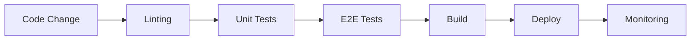
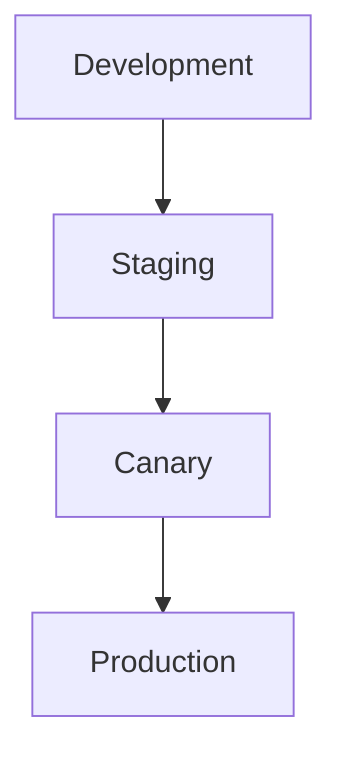
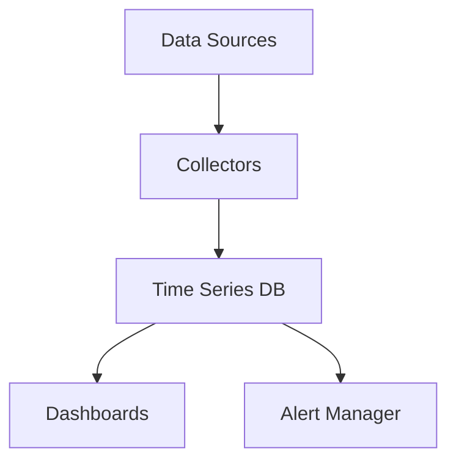
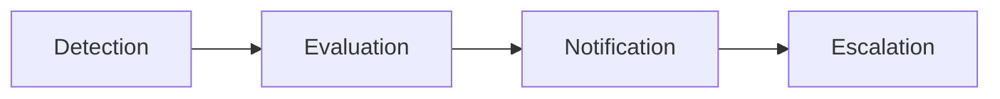

# DevOps & Site Reliability Engineering

## Overview
This document outlines our DevOps and Site Reliability Engineering practices, ensuring continuous delivery, system reliability, and operational excellence for Marola RP.

## CI/CD Pipeline

### Continuous Integration

#### Quality Gates
| Stage | Checks | SLA | Auto-Fix |
|-------|--------|-----|----------|
| Lint | Style, Format | 2min | Yes |
| Unit Tests | Core Logic | 5min | No |
| E2E Tests | Integration | 15min | No |
| Security | SAST, DAST | 10min | Partial |
| Build | Artifacts | 8min | No |

### Branch Protection
- **Main Branch**
  - Required Reviews: 2
  - Required Status Checks
  - No Direct Pushes
  - Up-to-date Before Merge

- **Release Branches**
  - Required Reviews: 1
  - Required Status Checks
  - Linear History
  - Auto-delete on Merge

### Deployment Strategy

#### Environment Configuration
| Environment | Auto-Deploy | Rollback | Scale |
|-------------|-------------|----------|--------|
| Development | Yes | Instant | 1x |
| Staging | Yes | Instant | 1x |
| Canary | Manual | 5min | 0.1x |
| Production | Manual | 15min | Full |

## Infrastructure Management

### Infrastructure as Code
- **Technologies**
  - Terraform for Cloud Resources
  - Ansible for Configuration
  - Docker for Containerization
  - Kubernetes for Orchestration

- **Version Control**
  - Infrastructure Code in Git
  - Change Management Process
  - State File Backups
  - Documentation as Code

### Backup Strategy

#### Backup Schedule
| Type | Frequency | Retention | Verification |
|------|-----------|-----------|--------------|
| Full | Daily | 30 days | Weekly |
| Incremental | Hourly | 7 days | Daily |
| Binary Logs | Real-time | 30 days | Hourly |
| Config | On Change | 90 days | On Change |

#### Restore Testing
- Weekly Restore Tests
- Monthly DR Exercises
- Quarterly Full Recovery
- Annual DR Simulation

## Observability Stack

### Metrics Collection

#### Key Metrics
| Category | Metrics | Threshold | Alert |
|----------|---------|-----------|-------|
| System | CPU, RAM, Disk | 80% | P2 |
| Network | Latency, Packet Loss | 100ms/1% | P1 |
| Application | Response Time | 200ms | P2 |
| Business | Players Online | <100 | P3 |

### Logging System
1. **Collection**
   - Structured JSON Logs
   - Contextual Information
   - Sampling Strategy
   - Retention Policy

2. **Processing**
   - Real-time Analysis
   - Pattern Detection
   - Anomaly Detection
   - Correlation Analysis

3. **Storage**
   - Hot Storage (7 days)
   - Warm Storage (30 days)
   - Cold Storage (1 year)
   - Compliance Archives

### Alerting System

#### Alert Priorities
| Level | Description | Response Time | Channel |
|-------|-------------|---------------|---------|
| P0 | Critical Outage | 15min | Call + Discord |
| P1 | Major Issue | 30min | Discord |
| P2 | Minor Issue | 2h | Discord |
| P3 | Warning | 24h | Email |

## Incident Management

### Response Procedure
1. **Detection**
   - Automated Monitoring
   - User Reports
   - System Alerts
   - Performance Degradation

2. **Classification**
   - Impact Assessment
   - Priority Assignment
   - Team Notification
   - Initial Response

3. **Resolution**
   - Investigation
   - Mitigation
   - Resolution
   - Documentation

4. **Post-Mortem**
   - Root Cause Analysis
   - Action Items
   - Process Improvements
   - Knowledge Sharing

### Runbooks
See detailed procedures in [Annexes/Runbooks](../marola-docs/Annexes/Runbooks.en.md)

#### Quick Reference
| Scenario | Priority | First Response | Documentation |
|----------|----------|----------------|---------------|
| Service Down | P0 | Health Check | Runbooks#outage |
| DDoS Attack | P1 | Traffic Analysis | Runbooks#ddos |
| Exploit Found | P2 | Service Block | Runbooks#exploit |
| Game Bug | P3 | Impact Analysis | Runbooks#bug |

## SRE Practices

### Service Level Objectives
| Service | Availability | Latency | Error Rate |
|---------|-------------|----------|------------|
| Game Servers | 99.9% | <100ms | <0.1% |
| Web Services | 99.5% | <200ms | <0.5% |
| Database | 99.99% | <50ms | <0.01% |
| CDN | 99.9% | <50ms | <0.1% |

### Error Budgets
- Monthly Calculation
- Automated Tracking
- Impact Analysis
- Improvement Plans

### Capacity Planning
1. **Resource Monitoring**
   - Usage Patterns
   - Growth Trends
   - Peak Analysis
   - Seasonal Factors

2. **Scaling Strategy**
   - Auto-scaling Rules
   - Manual Triggers
   - Cost Optimization
   - Performance Targets

## Documentation

### Required Documentation
- Incident Reports
- Change Logs
- Runbooks
- Architecture Diagrams
- Recovery Plans
- SLA Reports

### Knowledge Base
- Technical Guides
- Best Practices
- Lessons Learned
- Process Maps
- Training Materials

## Version Control
- Last Update: 2025-09-17
- Next Review: 2025-09-24
- Review Frequency: Weekly
