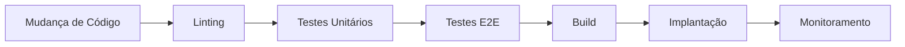
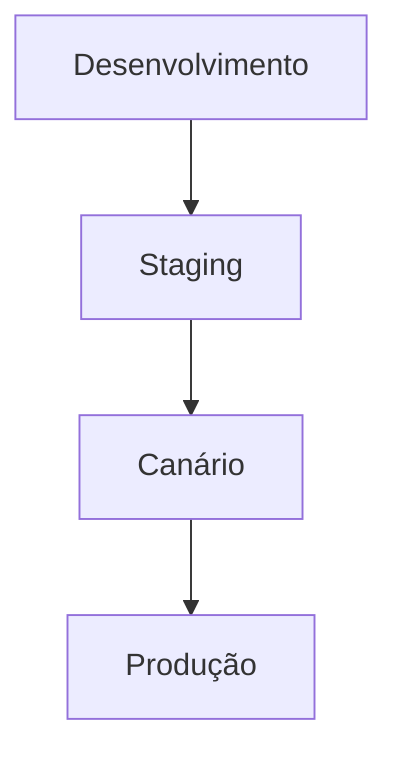
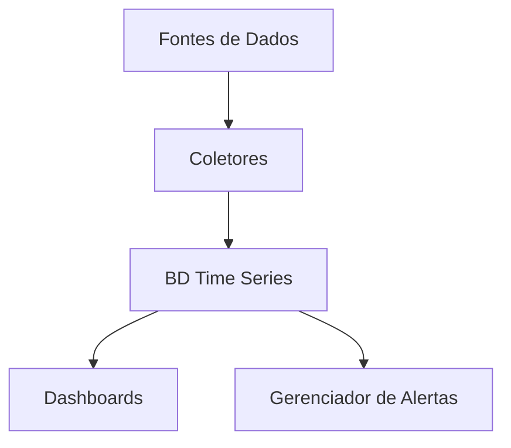
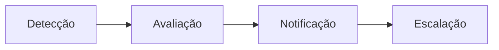

# DevOps & Engenharia de Confiabilidade de Site

## Visão Geral
Este documento descreve nossas práticas de DevOps e Engenharia de Confiabilidade de Site (SRE), garantindo entrega contínua, confiabilidade do sistema e excelência operacional para o Marola RP.

## Pipeline de CI/CD

### Integração Contínua

#### Portões de Qualidade
| Estágio | Verificações | SLA | Auto-Correção |
|---------|--------------|-----|---------------|
| Lint | Estilo, Formato | 2min | Sim |
| Testes Unitários | Lógica Core | 5min | Não |
| Testes E2E | Integração | 15min | Não |
| Segurança | SAST, DAST | 10min | Parcial |
| Build | Artefatos | 8min | Não |

### Proteção de Branches
- **Branch Principal**
  - Revisões Necessárias: 2
  - Verificações de Status Obrigatórias
  - Sem Pushes Diretos
  - Atualizado Antes do Merge

- **Branches de Release**
  - Revisões Necessárias: 1
  - Verificações de Status Obrigatórias
  - Histórico Linear
  - Auto-deleção após Merge

### Estratégia de Implantação

#### Configuração de Ambiente
| Ambiente | Auto-Deploy | Rollback | Escala |
|----------|-------------|----------|---------|
| Desenvolvimento | Sim | Instantâneo | 1x |
| Staging | Sim | Instantâneo | 1x |
| Canário | Manual | 5min | 0.1x |
| Produção | Manual | 15min | Total |

## Gerenciamento de Infraestrutura

### Infraestrutura como Código
- **Tecnologias**
  - Terraform para Recursos em Nuvem
  - Ansible para Configuração
  - Docker para Containerização
  - Kubernetes para Orquestração

- **Controle de Versão**
  - Código de Infraestrutura no Git
  - Processo de Gestão de Mudanças
  - Backup de Arquivos de Estado
  - Documentação como Código

### Estratégia de Backup

#### Agenda de Backup
| Tipo | Frequência | Retenção | Verificação |
|------|------------|-----------|-------------|
| Completo | Diário | 30 dias | Semanal |
| Incremental | Horário | 7 dias | Diário |
| Logs Binários | Tempo Real | 30 dias | Horário |
| Configuração | Na Mudança | 90 dias | Na Mudança |

#### Testes de Restauração
- Testes de Restore Semanais
- Exercícios de DR Mensais
- Recuperação Total Trimestral
- Simulação de DR Anual

## Stack de Observabilidade

### Coleta de Métricas

#### Métricas Principais
| Categoria | Métricas | Limite | Alerta |
|-----------|----------|---------|--------|
| Sistema | CPU, RAM, Disco | 80% | P2 |
| Rede | Latência, Perda de Pacotes | 100ms/1% | P1 |
| Aplicação | Tempo de Resposta | 200ms | P2 |
| Negócio | Jogadores Online | <100 | P3 |

### Sistema de Logging
1. **Coleta**
   - Logs JSON Estruturados
   - Informação Contextual
   - Estratégia de Amostragem
   - Política de Retenção

2. **Processamento**
   - Análise em Tempo Real
   - Detecção de Padrões
   - Detecção de Anomalias
   - Análise de Correlação

3. **Armazenamento**
   - Storage Quente (7 dias)
   - Storage Morno (30 dias)
   - Storage Frio (1 ano)
   - Arquivos de Conformidade

### Sistema de Alertas

#### Prioridades de Alerta
| Nível | Descrição | Tempo de Resposta | Canal |
|-------|-----------|-------------------|--------|
| P0 | Queda Crítica | 15min | Ligação + Discord |
| P1 | Problema Maior | 30min | Discord |
| P2 | Problema Menor | 2h | Discord |
| P3 | Aviso | 24h | Email |

## Gestão de Incidentes

### Procedimento de Resposta
1. **Detecção**
   - Monitoramento Automatizado
   - Relatos de Usuários
   - Alertas do Sistema
   - Degradação de Performance

2. **Classificação**
   - Avaliação de Impacto
   - Atribuição de Prioridade
   - Notificação da Equipe
   - Resposta Inicial

3. **Resolução**
   - Investigação
   - Mitigação
   - Resolução
   - Documentação

4. **Pós-Mortem**
   - Análise de Causa Raiz
   - Itens de Ação
   - Melhorias de Processo
   - Compartilhamento de Conhecimento

### Runbooks
Veja procedimentos detalhados em [Annexes/Runbooks](../marola-docs/Annexes/Runbooks.pt.md)

#### Referência Rápida
| Cenário | Prioridade | Primeira Resposta | Documentação |
|---------|------------|-------------------|--------------|
| Serviço Fora | P0 | Verificação de Saúde | Runbooks#queda |
| Ataque DDoS | P1 | Análise de Tráfego | Runbooks#ddos |
| Exploit Encontrado | P2 | Bloqueio de Serviço | Runbooks#exploit |
| Bug no Jogo | P3 | Análise de Impacto | Runbooks#bug |

## Práticas SRE

### Objetivos de Nível de Serviço
| Serviço | Disponibilidade | Latência | Taxa de Erro |
|---------|----------------|-----------|--------------|
| Servidores de Jogo | 99,9% | <100ms | <0,1% |
| Serviços Web | 99,5% | <200ms | <0,5% |
| Banco de Dados | 99,99% | <50ms | <0,01% |
| CDN | 99,9% | <50ms | <0,1% |

### Orçamentos de Erro
- Cálculo Mensal
- Rastreamento Automatizado
- Análise de Impacto
- Planos de Melhoria

### Planejamento de Capacidade
1. **Monitoramento de Recursos**
   - Padrões de Uso
   - Tendências de Crescimento
   - Análise de Picos
   - Fatores Sazonais

2. **Estratégia de Escala**
   - Regras de Auto-escala
   - Gatilhos Manuais
   - Otimização de Custos
   - Metas de Performance

## Documentação

### Documentação Necessária
- Relatórios de Incidentes
- Logs de Mudanças
- Runbooks
- Diagramas de Arquitetura
- Planos de Recuperação
- Relatórios de SLA

### Base de Conhecimento
- Guias Técnicos
- Melhores Práticas
- Lições Aprendidas
- Mapas de Processo
- Materiais de Treinamento

## Controle de Versão
- Última Atualização: 2025-09-17
- Próxima Revisão: 2025-09-24
- Frequência de Revisão: Semanal
