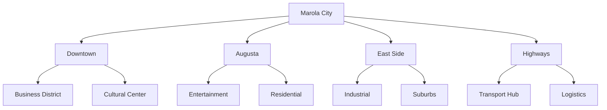
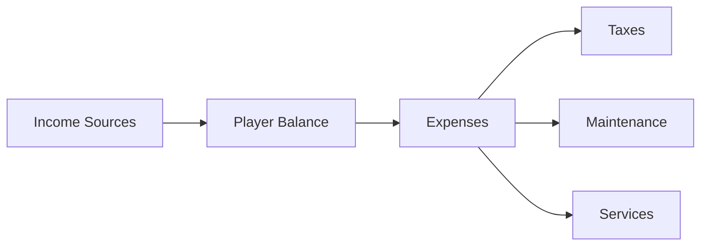
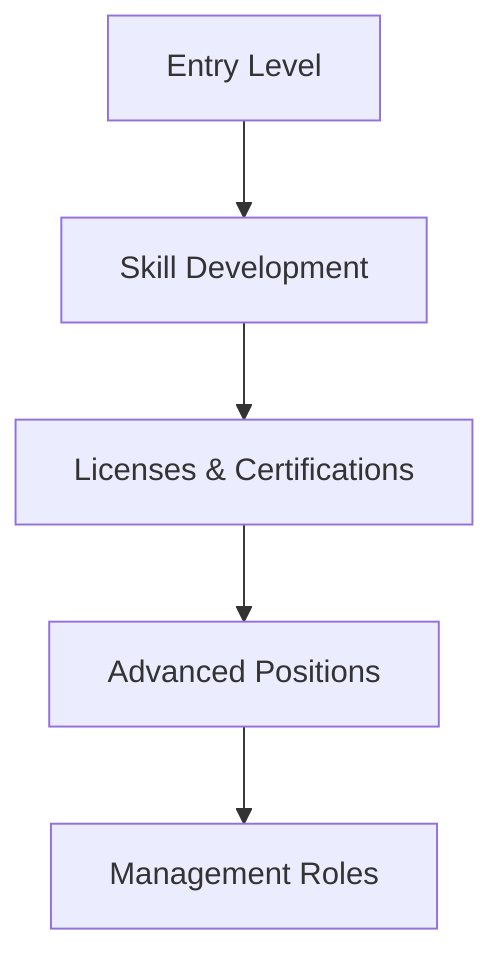
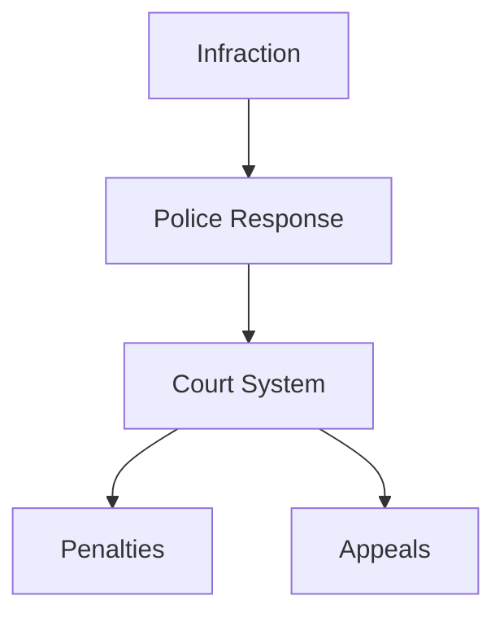

# Game Design Document (GDD)

## Game Overview

### Concept
Marola RP is a realistic roleplay experience set in a neo-urban São Paulo, where players navigate life, career, and society in a dynamic metropolitan environment.

### Core Pillars
1. **Authentic Brazilian Experience**
2. **Economic Realism**
3. **Social Interactions**
4. **Progression & Achievement**
5. **Community Building**

## World Design

### Setting

#### Districts & Landmarks
| District | Key Locations | Activities | Atmosphere |
|----------|--------------|------------|------------|
| Downtown | City Hall, Banks | Business, Gov | Corporate |
| Augusta | Clubs, Cafes | Entertainment | Bohemian |
| East Side | Factories, Housing | Industry | Working Class |
| Highways | Truck Stops, Warehouses | Transport | Industrial |

### Environment
- Dynamic Weather System
- Day/Night Cycle
- Traffic Simulation
- Pedestrian AI
- Environmental Events

## Game Systems

### Economic System

#### Economy Features
| Feature | Description | Impact |
|---------|-------------|---------|
| Taxes | Income, Property, Vehicle | Economic Balance |
| Maintenance | Regular Upkeep Costs | Resource Management |
| Market | Supply & Demand | Dynamic Pricing |
| Banking | Loans, Savings | Financial Planning |

### Career System

#### Job Types
1. **Formal Employment**
   - Corporate Jobs
   - Government Positions
   - Licensed Professions
   - Service Industry

2. **Informal Work**
   - Freelance
   - Street Vendors
   - Gig Economy
   - Side Hustles

#### Career Progression

### Property System

#### Property Types
| Type | Features | Requirements | Benefits |
|------|----------|--------------|-----------|
| Apartment | Basic Living | Low Cost | Starter Home |
| House | Customization | Mid-Range | Privacy |
| Business | Operations | High Cost | Income |
| Warehouse | Storage | Commercial | Logistics |

### Vehicle System

#### Vehicle Categories
1. **Personal Vehicles**
   - Cars
   - Motorcycles
   - Bicycles
   - Scooters

2. **Commercial Vehicles**
   - Trucks
   - Vans
   - Buses
   - Special Vehicles

#### Vehicle Features
- Maintenance System
- Customization
- Licensing Requirements
- Insurance System

### Justice System

#### Law Enforcement

#### Legal Framework
| Offense Level | Processing | Penalties | Appeals |
|--------------|------------|-----------|----------|
| Minor | Quick Process | Fines | Simple |
| Medium | Standard Trial | Detention | Standard |
| Major | Full Trial | Prison | Complex |

### Health System

#### Health Features
- Vitals Monitoring
- Injury System
- Medical Treatment
- Insurance Plans
- Emergency Services

### Inventory System

#### Item Categories
1. **Personal Items**
   - Clothing
   - Electronics
   - Tools
   - Consumables

2. **Professional Equipment**
   - Work Tools
   - Uniforms
   - Licenses
   - Certificates

### Events System

#### Event Types
| Type | Frequency | Scale | Rewards |
|------|-----------|-------|----------|
| City Events | Weekly | Large | High |
| Community | Daily | Medium | Medium |
| Personal | Hourly | Small | Low |

#### MarolaBeat Radio
- Live DJ Sessions
- News Updates
- Event Announcements
- Community Interaction

## Player Experience

### Character Creation

### Onboarding Flow
1. Character Creation
2. Tutorial District
3. Job Center Registration
4. Discord Integration
5. First Job Assignment
6. Community Introduction

### Progression System

#### Skill Development
| Skill Type | Learning Method | Application | Benefits |
|------------|----------------|-------------|-----------|
| Technical | Training | Jobs | Higher Pay |
| Social | Interaction | Networking | Opportunities |
| Physical | Practice | Performance | Capabilities |
| Knowledge | Study | Certifications | Advancement |

## Game Balance

### Economic Balance
1. **Income Targets**
   - Entry Level: $2,000/hr
   - Mid Level: $5,000/hr
   - Expert Level: $10,000/hr

2. **Economic Sinks**
   - Property Costs
   - Vehicle Maintenance
   - Taxes
   - Services

### Progression Gates
| Level | Requirements | Unlocks | Time Investment |
|-------|--------------|---------|-----------------|
| Beginner | None | Basic Jobs | 0-10 hours |
| Intermediate | Skills + License | Better Jobs | 20-30 hours |
| Advanced | Experience + Cert | Career Jobs | 50+ hours |

## Technical Implementation

### Core Systems
- Player Data Management
- Economy Engine
- Physics System
- AI System
- Networking

### Performance Targets
| Platform | FPS | Load Time | Capacity |
|----------|-----|-----------|-----------|
| High-End | 60+ | <30s | 100% |
| Mid-Range | 45+ | <45s | 75% |
| Low-End | 30+ | <60s | 50% |

## Documentation & Support

### Player Resources
- In-Game Tutorial
- Knowledge Base
- Community Guides
- Support Tickets
- FAQ System

### Development Resources
- API Documentation
- System Flowcharts
- Balance Sheets
- Update Logs

## Version Control
- Last Update: 2025-09-17
- Next Review: 2025-09-24
- Review Frequency: Weekly
