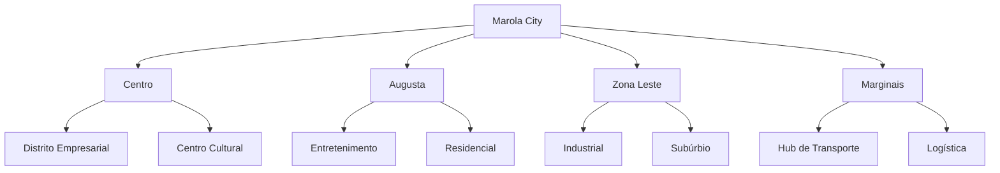
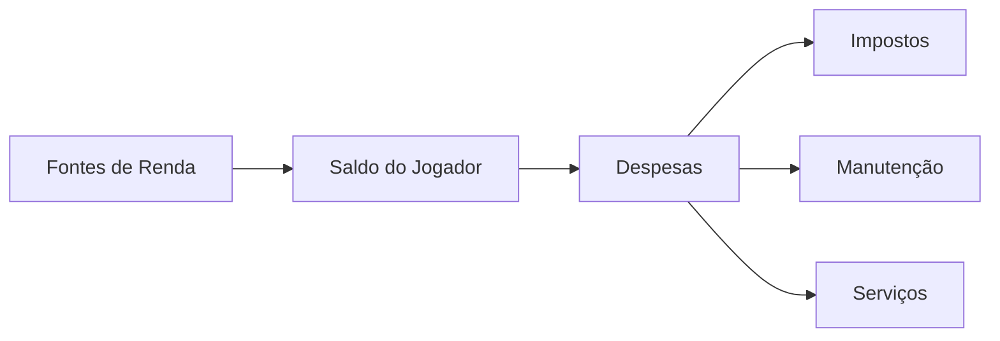
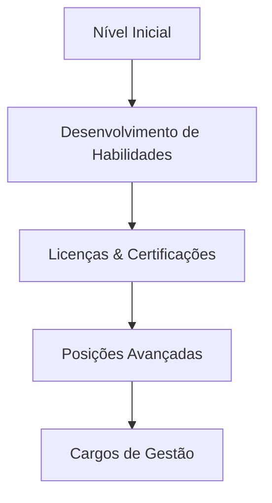
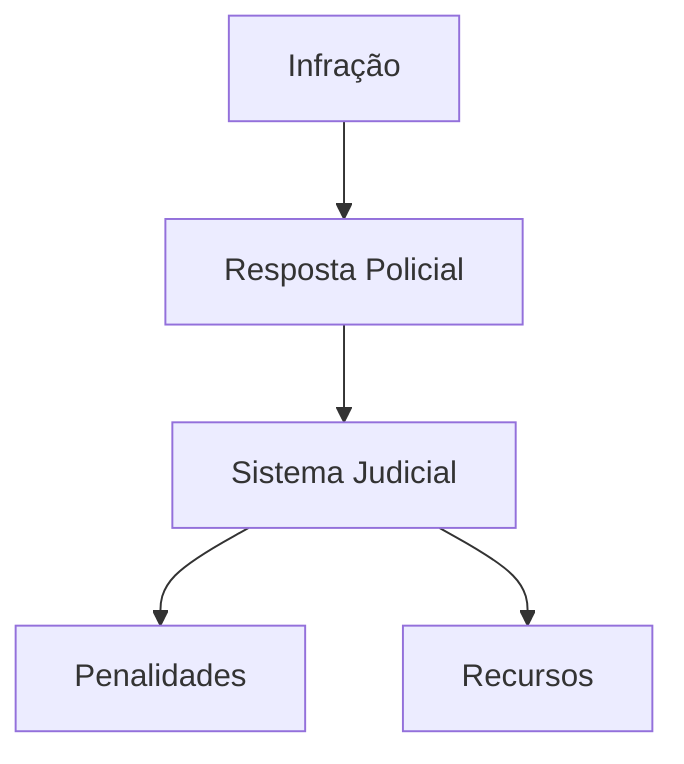
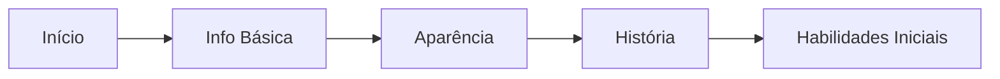

# Documento de Design do Jogo (GDD)

## Visão Geral do Jogo

### Conceito
Marola RP é uma experiência realista de roleplay ambientada em uma São Paulo neo-urbana, onde os jogadores navegam pela vida, carreira e sociedade em um ambiente metropolitano dinâmico.

### Pilares Fundamentais
1. **Experiência Brasileira Autêntica**
2. **Realismo Econômico**
3. **Interações Sociais**
4. **Progressão & Conquistas**
5. **Construção de Comunidade**

## Design do Mundo

### Ambientação

#### Distritos & Pontos de Referência
| Distrito | Locais Principais | Atividades | Atmosfera |
|----------|------------------|------------|-----------|
| Centro | Prefeitura, Bancos | Negócios, Gov | Corporativa |
| Augusta | Casas Noturnas, Cafés | Entretenimento | Boêmia |
| Zona Leste | Fábricas, Habitação | Indústria | Classe Trabalhadora |
| Marginais | Postos de Caminhão, Armazéns | Transporte | Industrial |

### Ambiente
- Sistema Dinâmico de Clima
- Ciclo Dia/Noite
- Simulação de Tráfego
- IA de Pedestres
- Eventos Ambientais

## Sistemas do Jogo

### Sistema Econômico

#### Recursos da Economia
| Recurso | Descrição | Impacto |
|---------|-----------|---------|
| Impostos | Renda, Propriedade, Veículo | Balanço Econômico |
| Manutenção | Custos Regulares | Gestão de Recursos |
| Mercado | Oferta & Demanda | Preços Dinâmicos |
| Sistema Bancário | Empréstimos, Poupança | Planejamento Financeiro |

### Sistema de Carreira

#### Tipos de Emprego
1. **Emprego Formal**
   - Empregos Corporativos
   - Cargos Governamentais
   - Profissões Licenciadas
   - Setor de Serviços

2. **Trabalho Informal**
   - Freelance
   - Vendedores Ambulantes
   - Economia de Bicos
   - Trabalhos Extras

#### Progressão de Carreira

### Sistema de Propriedades

#### Tipos de Propriedade
| Tipo | Recursos | Requisitos | Benefícios |
|------|----------|------------|------------|
| Apartamento | Moradia Básica | Baixo Custo | Casa Inicial |
| Casa | Personalização | Médio Custo | Privacidade |
| Negócio | Operações | Alto Custo | Renda |
| Armazém | Armazenamento | Comercial | Logística |

### Sistema de Veículos

#### Categorias de Veículos
1. **Veículos Pessoais**
   - Carros
   - Motos
   - Bicicletas
   - Patinetes

2. **Veículos Comerciais**
   - Caminhões
   - Vans
   - Ônibus
   - Veículos Especiais

#### Recursos de Veículos
- Sistema de Manutenção
- Personalização
- Requisitos de Licença
- Sistema de Seguro

### Sistema Judicial

#### Aplicação da Lei

#### Estrutura Legal
| Nível da Ofensa | Processamento | Penalidades | Recursos |
|-----------------|---------------|-------------|----------|
| Leve | Processo Rápido | Multas | Simples |
| Médio | Julgamento Padrão | Detenção | Padrão |
| Grave | Julgamento Completo | Prisão | Complexo |

### Sistema de Saúde

#### Recursos de Saúde
- Monitoramento de Sinais Vitais
- Sistema de Ferimentos
- Tratamento Médico
- Planos de Saúde
- Serviços de Emergência

### Sistema de Inventário

#### Categorias de Itens
1. **Itens Pessoais**
   - Vestuário
   - Eletrônicos
   - Ferramentas
   - Consumíveis

2. **Equipamento Profissional**
   - Ferramentas de Trabalho
   - Uniformes
   - Licenças
   - Certificados

### Sistema de Eventos

#### Tipos de Eventos
| Tipo | Frequência | Escala | Recompensas |
|------|------------|--------|-------------|
| Eventos da Cidade | Semanal | Grande | Alta |
| Comunidade | Diário | Média | Média |
| Pessoal | Horário | Pequena | Baixa |

#### Rádio MarolaBeat
- Sessões de DJ ao Vivo
- Atualizações de Notícias
- Anúncios de Eventos
- Interação com a Comunidade

## Experiência do Jogador

### Criação de Personagem

### Fluxo de Introdução
1. Criação de Personagem
2. Distrito Tutorial
3. Registro no Centro de Empregos
4. Integração com Discord
5. Primeiro Emprego
6. Introdução à Comunidade

### Sistema de Progressão

#### Desenvolvimento de Habilidades
| Tipo de Habilidade | Método de Aprendizado | Aplicação | Benefícios |
|-------------------|----------------------|------------|------------|
| Técnica | Treinamento | Empregos | Salário Maior |
| Social | Interação | Networking | Oportunidades |
| Física | Prática | Performance | Capacidades |
| Conhecimento | Estudo | Certificações | Avanço |

## Balanceamento do Jogo

### Balanço Econômico
1. **Metas de Renda**
   - Nível Inicial: R$2.000/h
   - Nível Médio: R$5.000/h
   - Nível Especialista: R$10.000/h

2. **Sumidouros Econômicos**
   - Custos de Propriedade
   - Manutenção de Veículos
   - Impostos
   - Serviços

### Portões de Progressão
| Nível | Requisitos | Desbloqueios | Tempo Investido |
|-------|------------|--------------|-----------------|
| Iniciante | Nenhum | Empregos Básicos | 0-10 horas |
| Intermediário | Habilidades + Licença | Melhores Empregos | 20-30 horas |
| Avançado | Experiência + Cert | Empregos de Carreira | 50+ horas |

## Implementação Técnica

### Sistemas Core
- Gestão de Dados do Jogador
- Motor Econômico
- Sistema de Física
- Sistema de IA
- Rede

### Metas de Performance
| Plataforma | FPS | Tempo de Carregamento | Capacidade |
|------------|-----|----------------------|------------|
| Alto Desempenho | 60+ | <30s | 100% |
| Médio Desempenho | 45+ | <45s | 75% |
| Baixo Desempenho | 30+ | <60s | 50% |

## Documentação & Suporte

### Recursos para Jogadores
- Tutorial In-Game
- Base de Conhecimento
- Guias da Comunidade
- Tickets de Suporte
- Sistema de FAQ

### Recursos para Desenvolvimento
- Documentação da API
- Fluxogramas de Sistema
- Planilhas de Balanço
- Logs de Atualização

## Controle de Versão
- Última Atualização: 2025-09-17
- Próxima Revisão: 2025-09-24
- Frequência de Revisão: Semanal
