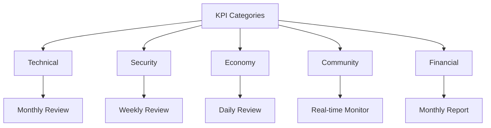
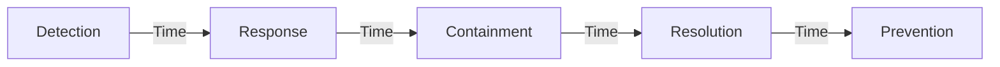
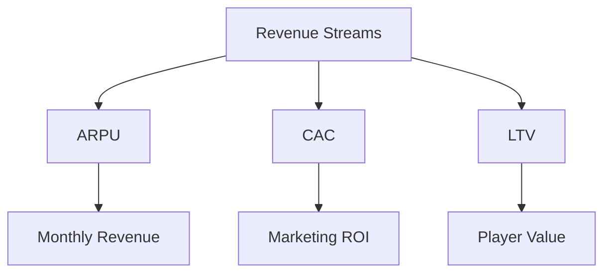

# Key Performance Indicators (KPIs)


## Performance Overview



## Technical Metrics

### Server Performance
| Metric | Target | Warning | Critical | Frequency |
|--------|---------|----------|-----------|------------|
| Uptime | >99.9% | <99.5% | <99% | Real-time |
| Tick Rate | >60/s | <50/s | <30/s | Real-time |
| CPU Usage | <60% | >70% | >85% | Minute |
| RAM Usage | <70% | >80% | >90% | Minute |
| Latency | <100ms | >150ms | >200ms | Real-time |

### Infrastructure Health
1. **Network Metrics**
   - Packet Loss: <0.1%
   - Bandwidth Usage: <80%
   - Connection Stability: >99%
   - DNS Resolution: <50ms

2. **Resource Utilization**
   - Disk I/O: <70%
   - Network I/O: <60%
   - Database Load: <65%
   - Cache Hit Rate: >90%

## Security Metrics

### Incident Tracking


### Security KPIs
| Category | Metric | Target | Warning | Critical |
|----------|--------|---------|----------|-----------|
| Incidents | Per Month | <5 | 5-10 | >10 |
| Response | Time | <15min | >30min | >1h |
| Containment | Time | <1h | >2h | >4h |
| Resolution | Time | <24h | >48h | >72h |
| Appeals | % Reversed | <5% | 5-10% | >10% |

## Economy Metrics

### Economic Health
| Indicator | Description | Target | Frequency |
|-----------|-------------|---------|-----------|
| Inflation | Price Index Change | 2-4% | Daily |
| Gini Coefficient | Wealth Distribution | <0.4 | Weekly |
| Income/Hour | By Job Category | >$1000 | Daily |
| Money Supply | Total Currency | ±5% | Daily |

### Economic Monitoring
1. **Market Metrics**
   - Trade Volume
   - Price Stability
   - Market Liquidity
   - Transaction Count

2. **Job Economy**
   ```mermaid
   pie title Job Income Distribution
       "Legal Jobs" : 70
       "Criminal Activities" : 20
       "Business Income" : 10
   ```

## Community Metrics

### Engagement Statistics
| Metric | Description | Target | Current |
|--------|-------------|---------|----------|
| CCU | Concurrent Users | >500 | Tracked |
| D1 | Day 1 Retention | >40% | Tracked |
| D7 | Week 1 Retention | >20% | Tracked |
| D30 | Month 1 Retention | >10% | Tracked |
| NPS | Net Promoter Score | >50 | Monthly |

### Community Health
1. **Player Behavior**
   - Reports/1k Players: <5
   - Active Players: >1000
   - New Players/Day: >50
   - Chat Activity: >1000/h

2. **Support Metrics**
   - Ticket Resolution: <24h
   - First Response: <1h
   - Player Satisfaction: >4.5/5
   - Support Coverage: 20h/day

## Financial Metrics

### Revenue Metrics


### Financial KPIs
| Metric | Target | Warning | Critical |
|--------|---------|----------|-----------|
| ARPU | >$5.00 | <$3.00 | <$2.00 |
| CAC | <$2.00 | >$3.00 | >$4.00 |
| LTV | >$50.00 | <$30.00 | <$20.00 |
| Payback | <3 months | >4 months | >6 months |
| Margin | >60% | <50% | <40% |

## Reporting & Analysis

### Data Collection
1. **Methods**
   - Automated logging
   - Player surveys
   - System metrics
   - Manual review

2. **Analysis Frequency**
   - Real-time: Technical metrics
   - Daily: Economy & players
   - Weekly: Security & community
   - Monthly: Financial & strategic

### Dashboards
| Dashboard | Updates | Access Level | Purpose |
|-----------|---------|--------------|----------|
| Technical | Real-time | Admin | Performance |
| Community | Daily | Mod+ | Engagement |
| Economy | Hourly | Admin | Balance |
| Security | Real-time | Security | Monitoring |
| Financial | Daily | Management | Business |

## Version Information
- Last Update: 2025-09-17
- Version: 2.0
- Review Frequency: Weekly
- Next Review: 2025-09-24
