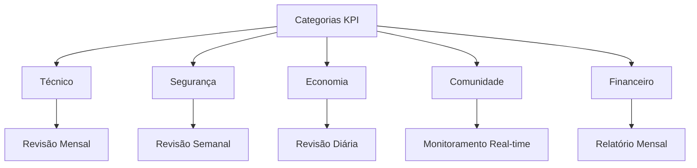
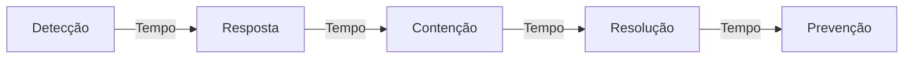
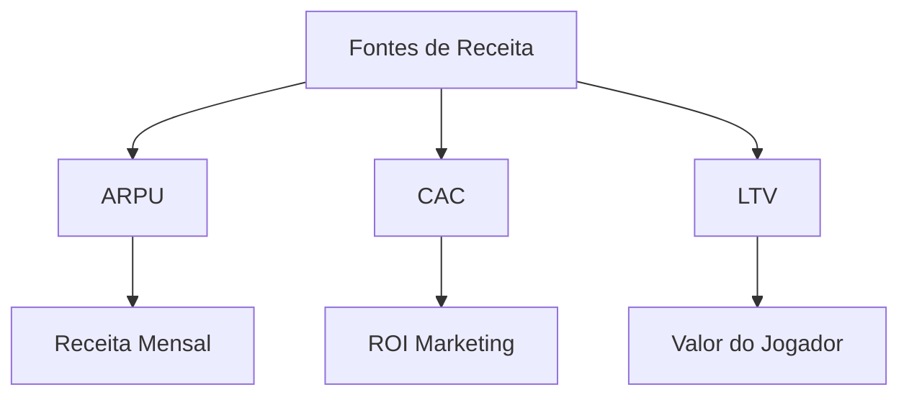

# Indicadores-Chave de Desempenho (KPIs)


## Visão Geral do Desempenho



## Métricas Técnicas

### Desempenho do Servidor
| Métrica | Meta | Alerta | Crítico | Frequência |
|---------|------|---------|----------|------------|
| Uptime | >99.9% | <99.5% | <99% | Tempo real |
| Taxa de Tick | >60/s | <50/s | <30/s | Tempo real |
| Uso de CPU | <60% | >70% | >85% | Minuto |
| Uso de RAM | <70% | >80% | >90% | Minuto |
| Latência | <100ms | >150ms | >200ms | Tempo real |

### Saúde da Infraestrutura
1. **Métricas de Rede**
   - Perda de Pacotes: <0.1%
   - Uso de Banda: <80%
   - Estabilidade de Conexão: >99%
   - Resolução DNS: <50ms

2. **Utilização de Recursos**
   - I/O de Disco: <70%
   - I/O de Rede: <60%
   - Carga do Banco de Dados: <65%
   - Taxa de Hit do Cache: >90%

## Métricas de Segurança

### Rastreamento de Incidentes


### KPIs de Segurança
| Categoria | Métrica | Meta | Alerta | Crítico |
|-----------|---------|------|---------|----------|
| Incidentes | Por Mês | <5 | 5-10 | >10 |
| Resposta | Tempo | <15min | >30min | >1h |
| Contenção | Tempo | <1h | >2h | >4h |
| Resolução | Tempo | <24h | >48h | >72h |
| Recursos | % Revertidos | <5% | 5-10% | >10% |

## Métricas Econômicas

### Saúde Econômica
| Indicador | Descrição | Meta | Frequência |
|-----------|-----------|------|------------|
| Inflação | Mudança no Índice de Preços | 2-4% | Diário |
| Coeficiente Gini | Distribuição de Riqueza | <0.4 | Semanal |
| Renda/Hora | Por Categoria de Emprego | >$1000 | Diário |
| Oferta Monetária | Moeda Total | ±5% | Diário |

### Monitoramento Econômico
1. **Métricas de Mercado**
   - Volume de Negociações
   - Estabilidade de Preços
   - Liquidez do Mercado
   - Contagem de Transações

2. **Economia de Empregos**
   ```mermaid
   pie title Distribuição de Renda por Emprego
       "Empregos Legais" : 70
       "Atividades Criminosas" : 20
       "Renda Empresarial" : 10
   ```

## Métricas da Comunidade

### Estatísticas de Engajamento
| Métrica | Descrição | Meta | Atual |
|---------|-----------|------|--------|
| CCU | Usuários Simultâneos | >500 | Monitorado |
| D1 | Retenção Dia 1 | >40% | Monitorado |
| D7 | Retenção Semana 1 | >20% | Monitorado |
| D30 | Retenção Mês 1 | >10% | Monitorado |
| NPS | Net Promoter Score | >50 | Mensal |

### Saúde da Comunidade
1. **Comportamento do Jogador**
   - Denúncias/1k Jogadores: <5
   - Jogadores Ativos: >1000
   - Novos Jogadores/Dia: >50
   - Atividade no Chat: >1000/h

2. **Métricas de Suporte**
   - Resolução de Tickets: <24h
   - Primeira Resposta: <1h
   - Satisfação do Jogador: >4.5/5
   - Cobertura de Suporte: 20h/dia

## Métricas Financeiras

### Métricas de Receita


### KPIs Financeiros
| Métrica | Meta | Alerta | Crítico |
|---------|------|---------|----------|
| ARPU | >$5.00 | <$3.00 | <$2.00 |
| CAC | <$2.00 | >$3.00 | >$4.00 |
| LTV | >$50.00 | <$30.00 | <$20.00 |
| Payback | <3 meses | >4 meses | >6 meses |
| Margem | >60% | <50% | <40% |

## Relatórios & Análises

### Coleta de Dados
1. **Métodos**
   - Logging automatizado
   - Pesquisas com jogadores
   - Métricas do sistema
   - Revisão manual

2. **Frequência de Análise**
   - Tempo real: Métricas técnicas
   - Diário: Economia e jogadores
   - Semanal: Segurança e comunidade
   - Mensal: Financeiro e estratégico

### Painéis
| Painel | Atualizações | Nível de Acesso | Propósito |
|--------|--------------|------------------|-----------|
| Técnico | Tempo real | Admin | Performance |
| Comunidade | Diário | Mod+ | Engajamento |
| Economia | Horário | Admin | Balanceamento |
| Segurança | Tempo real | Segurança | Monitoramento |
| Financeiro | Diário | Gestão | Negócios |

## Informações de Versão
- Última Atualização: 2025-09-17
- Versão: 2.0
- Frequência de Revisão: Semanal
- Próxima Revisão: 2025-09-24
