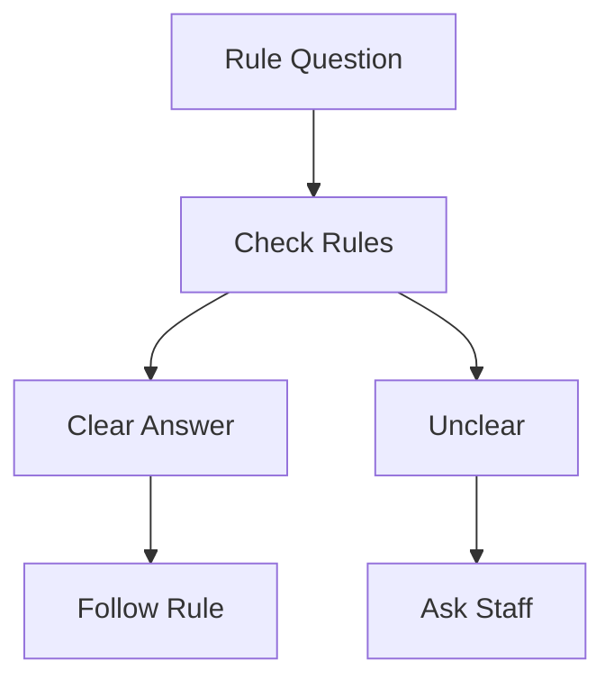
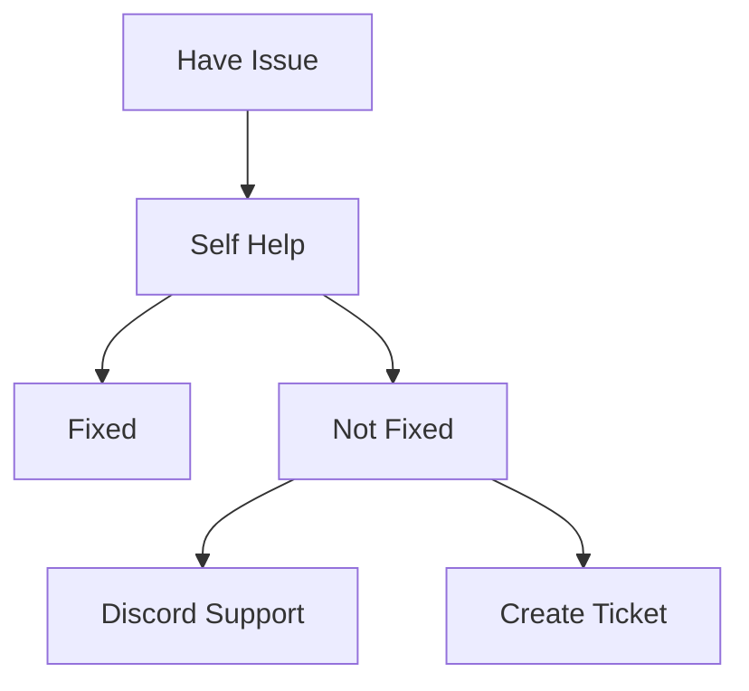

# Frequently Asked Questions (FAQ)

## 📋 Quick Navigation
- [General Questions](#general-questions)
- [Getting Started](#getting-started)
- [Technical Issues](#technical-issues)
- [Gameplay Questions](#gameplay-questions)
- [Rules & Policies](#rules--policies)
- [Character & RP](#character--rp)
- [Economy & Jobs](#economy--jobs)
- [Support & Help](#support--help)

## General Questions

### What is Marola RP?
Marola RP is a realistic Brazilian roleplay server set in a neo-urban São Paulo environment, focusing on authentic experiences, economic simulation, and community interaction.

### What makes Marola RP unique?
- Authentic Brazilian setting
- Advanced economic system
- Professional staff team
- Active community
- Regular updates

### Server Requirements
| Component | Minimum | Recommended |
|-----------|---------|-------------|
| CPU | i5 4-core | i7 6-core |
| RAM | 8GB | 16GB |
| Storage | 50GB | 100GB SSD |
| Internet | 10Mbps | 25Mbps |

## Getting Started

### How do I join the server?

#### Step-by-Step Process
1. Join Discord: discord.gg/marola-rp
2. Complete whitelist application
3. Pass rules test
4. Await approval (24-48h)
5. Connect via FiveM

### Essential Downloads
| Software | Purpose | Required |
|----------|----------|----------|
| FiveM | Game Client | Yes |
| Voice Mod | Communication | Yes |
| Teamspeak | Voice Backup | No |
| Discord | Community | Yes |

## Technical Issues

### Common Problems & Solutions

#### Voice Issues
1. **No Voice**
   - Check voice activation
   - Verify microphone
   - Reinstall voice mod
   - Clear cache

2. **Poor Quality**
   - Check bandwidth
   - Update drivers
   - Adjust settings
   - Use wired connection

#### Performance Issues
| Issue | Quick Fix | Long-term Solution |
|-------|-----------|-------------------|
| Low FPS | Lower settings | Upgrade hardware |
| Stuttering | Clear cache | SSD installation |
| Crashes | Verify files | Clean installation |
| Loading | Close programs | Increase RAM |

### Optimization Tips
- Update graphics drivers
- Close background apps
- Use performance mode
- Regular maintenance
- SSD recommended

## Gameplay Questions

### Basic Mechanics
#### Essential Commands
| Command | Function | Example |
|---------|----------|---------|
| /help | Show commands | /help |
| /me | Actions | /me checks phone |
| /do | Environment | /do Time shows 3PM |
| /report | Call staff | /report Need help |

### Character Development
1. **Creating a Character**
   - Choose background
   - Select skills
   - Plan career
   - Define goals

2. **Progression System**
   - Gain experience
   - Learn skills
   - Build reputation
   - Earn licenses

## Rules & Policies

### Common Rule Questions

### Penalty Appeals
1. **Appeal Process**
   - Wait 24 hours
   - Gather evidence
   - Submit appeal
   - Await response

2. **Appeal Tips**
   - Be honest
   - Show remorse
   - Provide context
   - Be respectful

## Character & RP

### Roleplay Guidelines
#### Do's and Don'ts
| Do | Don't |
|----|-------|
| Stay in character | Break character |
| Use realistic scenarios | Use unrealistic actions |
| Respect others' RP | Force RP on others |
| Accept consequences | Combat log |

### Common RP Scenarios
1. **Interactions**
   - Police encounters
   - Business deals
   - Social events
   - Medical emergencies

2. **Conflict Resolution**
   - Negotiation
   - Legal system
   - Mediation
   - Staff assistance

## Economy & Jobs

### Money Making
#### Job Progression
| Level | Income | Requirements |
|-------|---------|--------------|
| Entry | M$2k/h | None |
| Mid | M$5k/h | Experience |
| Expert | M$10k/h | Skills |

### Business System
1. **Starting a Business**
   - Requirements
   - Licensing
   - Location
   - Investment

2. **Management**
   - Staff hiring
   - Stock control
   - Finances
   - Marketing

## Support & Help

### Getting Assistance

### Contact Methods
| Method | Use For | Response Time |
|--------|---------|---------------|
| /report | In-game issues | 5-15 min |
| Discord | General help | 1-24 hours |
| Ticket | Serious issues | 24-48 hours |
| Appeal | Ban appeals | 48-72 hours |

## Additional Resources

### Useful Links
- Server Website: marola-rp.com
- Discord: discord.gg/marola-rp
- Rules: marola-rp.com/rules
- Guides: marola-rp.com/guides

### Community Resources
- Tutorial videos
- Player guides
- Community forums
- Support channels

## Version Information
- Last Update: 2025-09-17
- Version: 2.0
- Review: Weekly
- Updates: As needed

### What are the minimum PC requirements?
- CPU: Intel i5-4670K or AMD equivalent
- RAM: 16GB
- GPU: NVIDIA GTX 1060 6GB or better
- Storage: 100GB free space
- Internet: 10Mbps stable connection

### How do I get started once I'm in?
1. Complete the tutorial at spawn
2. Visit the job center for initial employment
3. Open a bank account
4. Get your driver's license
5. Start working legal jobs to build capital

## Technical Issues

### How do I fix lag/low FPS?
1. **Graphics Settings**:
   - Lower visual distance
   - Reduce shadow quality
   - Disable anti-aliasing
   - Set texture quality to normal
   - Disable advanced graphics options

2. **Performance Improvements**:
   - Close background applications
   - Update graphics drivers
   - Clear FiveM cache
   - Verify game files
   - Use wired internet connection

3. **Server-side Lag**:
   - Check your ping in-game
   - Test connection stability
   - Use resource monitor to check network
   - Try different DNS servers
   - Contact your ISP if issues persist

### Common Connection Issues
1. **Error 'Failed to connect'**:
   - Restart FiveM client
   - Clear FiveM cache
   - Verify Steam is running
   - Check firewall settings
   - Reinstall FiveM if persistent

2. **'Timed out' errors**:
   - Check internet connection
   - Verify server status
   - Use network troubleshooter
   - Contact support if persistent

## Gameplay Questions

### How do I make money as a new player?
1. **Legal Jobs**:
   - Delivery driver: M$1,000-2,000/hour
   - Taxi driver: M$1,500-3,000/hour
   - Garbage collector: M$1,200-2,200/hour
   - Store clerk: M$1,000-2,000/hour
   - Mechanic apprentice: M$1,500-2,500/hour

2. **Tips for Success**:
   - Complete job training fully
   - Network with other players
   - Save money for vehicle
   - Learn the city layout
   - Join a legal business

### How do I buy a car/house?
1. **Vehicles**:
   - Visit dealerships
   - Need valid driver's license
   - Minimum M$30,000 for basic car
   - Insurance required
   - Financing available

2. **Properties**:
   - Check real estate listings
   - Need minimum M$75,000
   - Property tax applies
   - Maintenance costs
   - Roommate system available

### How does the phone system work?
1. **Basic Features**:
   - Calls and messages
   - Contact list
   - GPS navigation
   - Banking app
   - Job listings

2. **Advanced Features**:
   - Business management
   - Property control
   - Dark web access
   - Radio channels
   - Event scheduling

## Rules and Regulations

### What actions can get me banned?
1. **Instant Ban Offenses**:
   - Cheating/hacking
   - Hate speech
   - Real money trading
   - Extreme harassment
   - Exploiting bugs

2. **Progressive Ban Offenses**:
   - RDM/VDM
   - Combat logging
   - Metagaming
   - Powergaming
   - Breaking character

### How do I report someone?
1. Open a ticket in Discord with:
   - Your ID and offender's ID
   - Time and date
   - Description of incident
   - Video/screenshot evidence
   - Witness information

2. Staff will respond within:
   - Priority 1 (severe): 1 hour
   - Priority 2 (moderate): 4 hours
   - Priority 3 (minor): 24 hours

### How do I appeal a ban?
1. **Appeal Process**:
   - Wait minimum 7 days
   - Fill appeal form on website
   - Provide evidence of reform
   - Be honest about violation
   - Show understanding of rules

2. **Response Times**:
   - Temporary bans: 3-5 days
   - Permanent bans: 7-14 days
   - Special cases: Up to 30 days

## Community and Support

### How do I join a faction/gang?
1. **Legal Factions**:
   - Apply through faction leader
   - Need clean record
   - Minimum 50 hours played
   - Pass faction interview
   - Complete training

2. **Illegal Organizations**:
   - Build street reputation
   - Network with members
   - Prove loyalty
   - Follow hierarchy
   - Maintain discretion

### How do I start a business?
1. **Requirements**:
   - Minimum M$500,000 capital
   - Business license
   - Property lease/purchase
   - Employee structure
   - Business plan

2. **Process**:
   - Submit business proposal
   - Meet with city officials
   - Pay licensing fees
   - Setup property
   - Hire employees

### How do I become staff?
1. **Requirements**:
   - Minimum 500 hours played
   - Clean record
   - Age 18+
   - Active Discord presence
   - Strong English/Portuguese

2. **Application Process**:
   - Submit staff application
   - Pass interview
   - Complete training
   - Shadow senior staff
   - Regular performance review

## Events and Activities

### How do I participate in events?
1. **Official Events**:
   - Check events calendar
   - Register in Discord
   - Arrive on time
   - Follow event rules
   - Stay in character

2. **Player Events**:
   - Get event permit
   - Submit event plan
   - Advertise properly
   - Follow guidelines
   - Staff supervision required

### How do racing events work?
1. **Legal Races**:
   - Register at track
   - Pay entry fee
   - Use legal vehicle
   - Follow race rules
   - Prize distribution

2. **Street Races**:
   - Find race organizer
   - High risk/reward
   - Avoid police
   - Car requirements
   - Entry fee required

## Contact Information

### How do I get help?
1. **In-game Support**:
   - Press F8 for commands
   - Use /help command
   - Contact online staff
   - Call emergency services
   - Use help channel

2. **Discord Support**:
   - #support-tickets
   - #technical-help
   - #general-questions
   - Staff DMs (when allowed)
   - Community helpers

3. **Website Support**:
   - support@marola-rp.com
   - Live chat (business hours)
   - Knowledge base
   - Bug report form
   - Suggestion box
