# Perguntas Frequentes (FAQ)

## 📋 Navegação Rápida
- [Questões Gerais](#questões-gerais)
- [Primeiros Passos](#primeiros-passos)
- [Problemas Técnicos](#problemas-técnicos)
- [Questões de Gameplay](#questões-de-gameplay)
- [Regras & Políticas](#regras--políticas)
- [Personagem & RP](#personagem--rp)
- [Economia & Empregos](#economia--empregos)
- [Suporte & Ajuda](#suporte--ajuda)

## Questões Gerais

### O que é Marola RP?
Marola RP é um servidor de roleplay brasileiro realista ambientado em uma São Paulo neo-urbana, focando em experiências autênticas, simulação econômica e interação comunitária.

### O que torna o Marola RP único?
- Ambientação brasileira autêntica
- Sistema econômico avançado
- Equipe staff profissional
- Comunidade ativa
- Atualizações regulares

### Requisitos do Servidor
| Componente | Mínimo | Recomendado |
|------------|---------|-------------|
| CPU | i5 4-core | i7 6-core |
| RAM | 8GB | 16GB |
| Armazenamento | 50GB | 100GB SSD |
| Internet | 10Mbps | 25Mbps |

## Primeiros Passos

### Como entro no servidor?

#### Processo Passo a Passo
1. Entre no Discord: discord.gg/marola-rp
2. Complete a aplicação whitelist
3. Passe no teste de regras
4. Aguarde aprovação (24-48h)
5. Conecte via FiveM

### Downloads Essenciais
| Software | Propósito | Obrigatório |
|----------|-----------|-------------|
| FiveM | Cliente do Jogo | Sim |
| Voice Mod | Comunicação | Sim |
| Teamspeak | Backup de Voz | Não |
| Discord | Comunidade | Sim |

## Problemas Técnicos

### Problemas Comuns & Soluções

#### Problemas de Voz
1. **Sem Voz**
   - Verifique ativação de voz
   - Verifique microfone
   - Reinstale voice mod
   - Limpe cache

2. **Qualidade Ruim**
   - Verifique banda
   - Atualize drivers
   - Ajuste configurações
   - Use conexão cabeada

#### Problemas de Performance
| Problema | Solução Rápida | Solução Definitiva |
|----------|----------------|-------------------|
| FPS Baixo | Baixar config | Upgrade hardware |
| Travamentos | Limpar cache | Instalação SSD |
| Crashes | Verificar arquivos | Instalação limpa |
| Carregamento | Fechar programas | Aumentar RAM |

### Dicas de Otimização
- Atualizar drivers gráficos
- Fechar apps em background
- Usar modo performance
- Manutenção regular
- SSD recomendado

## Questões de Gameplay

### Mecânicas Básicas
#### Comandos Essenciais
| Comando | Função | Exemplo |
|---------|---------|---------|
| /help | Mostrar comandos | /help |
| /me | Ações | /me checa celular |
| /do | Ambiente | /do Relógio marca 15h |
| /report | Chamar staff | /report Preciso de ajuda |

### Desenvolvimento do Personagem
1. **Criando um Personagem**
   - Escolher background
   - Selecionar habilidades
   - Planejar carreira
   - Definir objetivos

2. **Sistema de Progressão**
   - Ganhar experiência
   - Aprender habilidades
   - Construir reputação
   - Obter licenças

## Regras & Políticas

### Questões Comuns sobre Regras

```mermaid
graph TB
    Question[Dúvida de Regra] --> Check[Checar Regras]
    Check --> Clear[Resposta Clara]
    Check --> Unclear[Não Clara]
    Unclear --> Staff[Perguntar Staff]
    Clear --> Follow[Seguir Regra]
```

### Recursos de Penalidades
1. **Processo de Recurso**
   - Aguarde 24 horas
   - Reúna evidências
   - Envie recurso
   - Aguarde resposta

2. **Dicas de Recurso**
   - Seja honesto
   - Mostre arrependimento
   - Forneça contexto
   - Seja respeitoso

## Personagem & RP

### Diretrizes de Roleplay
#### O que Fazer e Não Fazer
| Fazer | Não Fazer |
|-------|-----------|
| Manter personagem | Quebrar personagem |
| Usar cenários realistas | Usar ações irrealistas |
| Respeitar RP dos outros | Forçar RP nos outros |
| Aceitar consequências | Combat logging |

### Cenários Comuns de RP
1. **Interações**
   - Encontros policiais
   - Negócios
   - Eventos sociais
   - Emergências médicas

2. **Resolução de Conflitos**
   - Negociação
   - Sistema legal
   - Mediação
   - Assistência staff

## Economia & Empregos

### Ganhando Dinheiro
#### Progressão de Emprego
| Nível | Renda | Requisitos |
|-------|--------|------------|
| Entrada | M$2k/h | Nenhum |
| Médio | M$5k/h | Experiência |
| Especialista | M$10k/h | Habilidades |

### Sistema de Negócios
1. **Iniciando um Negócio**
   - Requisitos
   - Licenciamento
   - Localização
   - Investimento

2. **Gestão**
   - Contratação
   - Controle de estoque
   - Finanças
   - Marketing

## Suporte & Ajuda

### Obtendo Assistência

### Métodos de Contato
| Método | Usar Para | Tempo de Resposta |
|--------|-----------|-------------------|
| /report | Problemas in-game | 5-15 min |
| Discord | Ajuda geral | 1-24 horas |
| Ticket | Problemas sérios | 24-48 horas |
| Recurso | Recursos de ban | 48-72 horas |

## Recursos Adicionais

### Links Úteis
- Site do Servidor: marola-rp.com
- Discord: discord.gg/marola-rp
- Regras: marola-rp.com/rules
- Guias: marola-rp.com/guides

### Recursos da Comunidade
- Vídeos tutoriais
- Guias de jogadores
- Fóruns da comunidade
- Canais de suporte

## Informações de Versão
- Última Atualização: 2025-09-17
- Versão: 2.0
- Revisão: Semanal
- Atualizações: Conforme necessário
- [Regras e Condutas](#regras-e-condutas)
- [Suporte e Denúncias](#suporte-e-denúncias)
- [Economia e Progressão](#economia-e-progressão)
- [Eventos e Comunidade](#eventos-e-comunidade)

## Questões Gerais

### O que é o Marola RP?
O Marola RP é um servidor de roleplay imersivo ambientado em uma versão neo-urbana de São Paulo, com foco em experiência realista, governança clara e monetização ética (sem pay-to-win). Nosso objetivo é proporcionar uma experiência de roleplay consistente e de alta qualidade.

### O servidor é gratuito?
Sim, o acesso ao servidor é completamente gratuito. Temos uma loja com itens cosméticos que não afetam o gameplay para quem desejar apoiar o projeto.

### Qual é o foco do servidor?
Nosso foco principal é imersão, estabilidade, segurança e uma comunidade forte. Temos identidade musical própria (MarolaBeat/DJ ThOne) e destaque para a cultura paulistana.

## Whitelist e Processo de Entrada

### Como faço para entrar no servidor?
1. Entre no [Discord oficial do Marola RP](https://discord.gg/marola-rp)
2. Acesse o canal #whitelist
3. Siga as instruções para preencher o formulário
4. Aguarde a aprovação (geralmente em até 48 horas)

### Minha whitelist foi recusada, posso tentar novamente?
Sim, você pode tentar novamente após 7 dias. Recomendamos revisar as regras e entender melhor o conceito de roleplay antes de uma nova tentativa.

### Preciso ter experiência prévia em RP?
Não é obrigatório, mas é recomendado. Caso seja novato, sugerimos assistir aos tutoriais disponíveis em nosso Discord e YouTube antes de fazer a whitelist.

## Desempenho e Problemas Técnicos

### Estou enfrentando lag, o que fazer?
1. Feche aplicativos em segundo plano que consomem recursos
2. Reduza configurações gráficas no FiveM (ajustes em Documents/Rockstar Games/GTA V/settings.xml)
3. Verifique sua conexão (use cabos em vez de Wi-Fi quando possível)
4. Teste rotas diferentes para o servidor usando programas como WTFast ou ExitLag

### O jogo fecha repentinamente, como resolver?
1. Verifique se seu PC atende aos requisitos mínimos
2. Atualize drivers de vídeo para a versão mais recente
3. Aumente a memória virtual do sistema
4. Limpe o cache do FiveM (Settings > Game Cache > Clear Cache)

### Qual é a configuração recomendada para jogar?
* Processador: Intel i5 8ª geração ou equivalente
* Memória: 16GB RAM
* Placa de vídeo: NVIDIA GTX 1060 6GB ou equivalente
* Armazenamento: SSD (recomendado)
* Internet: 15 Mbps ou superior, latência <100ms

## Regras e Condutas

### O que é RDM e por que é proibido?
RDM (Random Deathmatch) é matar outros jogadores sem motivação de roleplay válida. É proibido porque quebra a imersão e prejudica a experiência dos outros jogadores.

### O que é considerado metagaming?
Metagaming é usar informações obtidas fora do jogo (como Discord, transmissões) dentro do roleplay. Exemplo: ver algo em uma stream e utilizar esse conhecimento no jogo.

### Posso usar mods no servidor?
Mods visuais que não dão vantagem são permitidos. Mods de gameplay, cheats ou qualquer modificação que dê vantagem competitiva resultarão em ban permanente.

## Suporte e Denúncias

### Como faço para reportar um jogador?
1. Abra um ticket no canal #denúncias do Discord
2. Forneça: ID do jogador, data/hora, descrição detalhada
3. Anexe evidências (clipes, screenshots)
4. Aguarde a análise da equipe de moderação

### Fui banido injustamente, como recorrer?
1. Acesse o canal #appeals no Discord
2. Preencha o formulário com todas as informações solicitadas
3. Anexe evidências que suportem seu recurso
4. A equipe analisará em até 7 dias (SLA)

### Como entro em contato com o suporte?
Para dúvidas gerais, use o canal #dúvidas no Discord. Para questões específicas ou sensíveis, crie um ticket no canal #suporte.

## Economia e Progressão

### Como ganho dinheiro no início?
1. Empregos iniciais: entregador, motorista de ônibus, gari, pescador
2. Missões de cidadãos (NPCs) espalhadas pela cidade
3. Trabalhos temporários no porto e construção civil
4. App de tarefas rápidas no celular in-game

### Como compro uma casa ou veículo?
Casas: Visite uma imobiliária e fale com o corretor (NPC ou player)
Veículos: Concessionárias espalhadas pela cidade (novos) ou mercado de usados

### Quais são as formas de renda passiva?
1. Aluguel de propriedades
2. Investimentos em empresas
3. Ações na bolsa de valores
4. Aluguel de veículos para outros jogadores

## Eventos e Comunidade

### Como participo dos eventos musicais MarolaBeat?
Os eventos são anunciados com antecedência no Discord e in-game. Compareça no horário e local indicados. Alguns eventos são gratuitos, outros podem exigir ingresso.

### Posso sugerir ideias para o servidor?
Sim, use o canal #sugestões no Discord. Sugestões bem elaboradas e que estejam alinhadas com a visão do servidor têm mais chance de implementação.

### Como me torno DJ ou produtor no servidor?
Envie suas mixagens/produções no canal #casting-dj do Discord. Nossa equipe avaliará e entrará em contato se aprovado. DJs ativos recebem benefícios in-game.

---

**Nota**: Esta FAQ é atualizada regularmente. Última atualização em 17/09/2025.

Para informações mais detalhadas, consulte nosso [Guia Completo](Guide.pt.md) ou entre em contato pelo [Discord](https://discord.gg/marola-rp).
