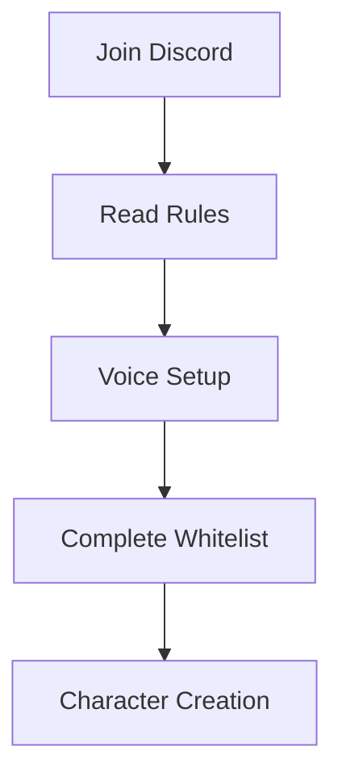
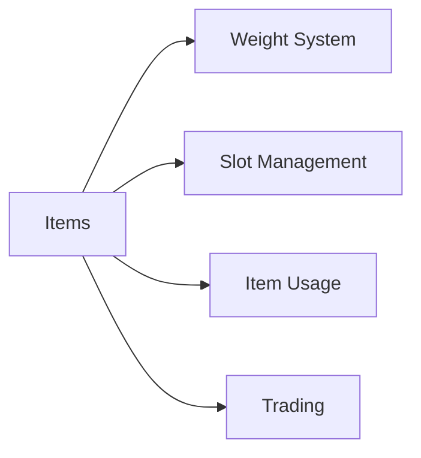
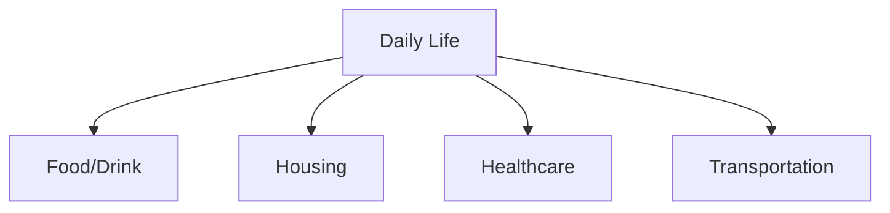
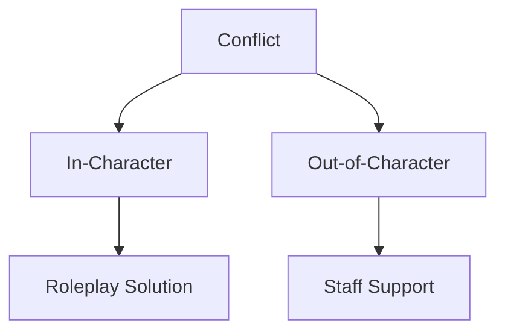

# Marola RP Beginner's Guide

## Getting Started

### Pre-Join Checklist

#### Required Steps
1. **Discord Setup**
   - Join official Discord
   - Verify account
   - Read announcements
   - Set up notifications

2. **Voice Configuration**
   - Install required voice mod
   - Configure microphone
   - Test audio settings
   - Set up keybinds

3. **Whitelist Process**
   - Read server rules
   - Complete application
   - Pass interview
   - Await approval

## First Steps in the City

### Character Creation
| Category | Options | Tips |
|----------|---------|------|
| Appearance | Customizable features | Keep it realistic |
| Background | Character history | Be creative but plausible |
| Skills | Starting abilities | Choose based on goals |
| Name | First and last name | Follow naming rules |

### Tutorial District
1. **Orientation**
   - Basic controls
   - Essential commands
   - Map navigation
   - Phone usage

2. **Basic Systems**
   - Inventory management
   - Radio communication
   - Money handling
   - Health system

## Essential Game Systems

### Communication
#### Commands
| Command | Use | Example |
|---------|-----|---------|
| /me | Physical actions | /me checks wallet |
| /do | Environmental | /do Wallet contains $50 |
| /ooc | Technical issues | /ooc Having audio problems |
| /report | Call staff | /report Need assistance |

### Inventory System

#### Key Features
- Weight limits
- Item durability
- Storage options
- Trading system

### Radio Communication
1. **Basic Usage**
   - Channel selection
   - Push-to-talk
   - Radio etiquette
   - Emergency channels

2. **Advanced Features**
   - Channel scanning
   - Privacy settings
   - Range limitations
   - Signal strength

## Making Money

### Job Center
| Job Type | Requirements | Income | Difficulty |
|----------|--------------|---------|------------|
| Delivery | None | Low | Easy |
| Taxi | Driver's License | Medium | Easy |
| Security | Clean Record | Medium | Medium |
| Mechanic | Training | High | Medium |

### Business Opportunities
1. **Legal Business**
   - Store ownership
   - Service provider
   - Restaurant management
   - Property investment

2. **Entrepreneurship**
   - Business planning
   - License acquisition
   - Staff management
   - Financial management

## Life in the City

### Basic Necessities

### Property Management
1. **Housing**
   - Apartment rental
   - House purchase
   - Property maintenance
   - Security systems

2. **Vehicles**
   - Purchase/rental
   - Maintenance
   - Insurance
   - Parking

## Community Integration

### Social Activities
- Community events
- Club memberships
- Sports activities
- Social gatherings

### Faction System
| Type | Requirements | Benefits | Responsibilities |
|------|--------------|----------|------------------|
| Police | Clean record | Authority | Law enforcement |
| Medical | Training | Respect | Healthcare |
| Business | Investment | Income | Services |
| Gang | Invitation | Protection | Loyalty |

## Roleplay Tips

### Quality Roleplay
1. **Character Development**
   - Consistent personality
   - Realistic reactions
   - Character growth
   - Background integration

2. **Interaction Guidelines**
   - Stay in character
   - Respect others' RP
   - Accept consequences
   - Create stories

### Conflict Resolution

## Technical Support

### Common Issues
| Issue | First Step | Next Step | When to Report |
|-------|------------|-----------|----------------|
| Voice | Check Settings | Reinstall | If Persistent |
| Performance | Lower Settings | Update Drivers | If Unresolved |
| Connection | Check Internet | Clear Cache | If Continuous |
| Bugs | Screenshot | Record Video | Immediately |

### Getting Help
1. **In-Game Support**
   - Use /report
   - Contact staff
   - Submit ticket
   - Provide evidence

2. **Discord Support**
   - Help channels
   - Support tickets
   - Bug reports
   - Feedback system

## Additional Resources

### Useful Links
- Server website
- Discord server
- Community forum
- Knowledge base
- Tutorial videos

### Documentation
1. **Essential Reading**
   - Server rules
   - Penal code
   - Job guides
   - Economy guide

2. **Additional Guides**
   - Faction manuals
   - Business guides
   - Crafting guides
   - Vehicle guides

## Version Information
- Last Update: 2025-09-17
- Version: 2.0
- Review: Weekly
- Updates: As needed
