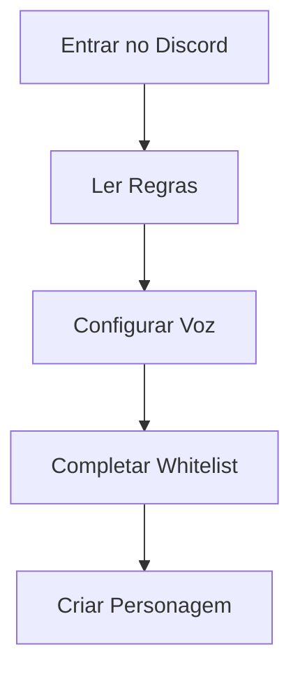
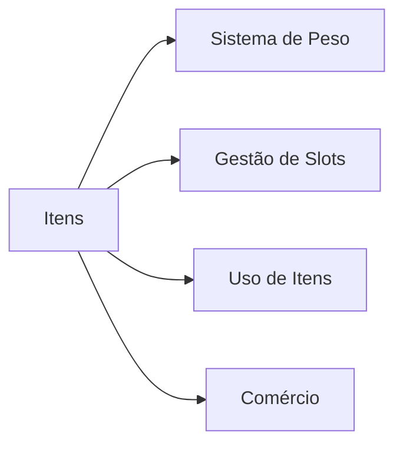
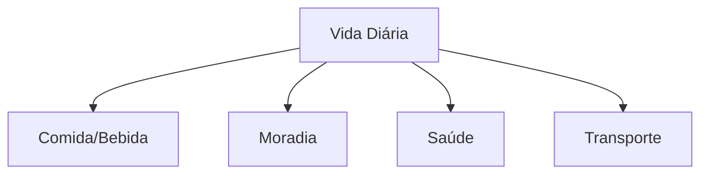
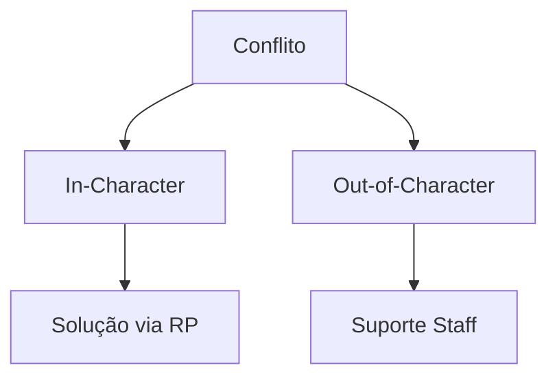

# Guia do Iniciante Marola RP

## Primeiros Passos

### Checklist Inicial

#### Etapas Necessárias
1. **Configuração do Discord**
   - Entrar no Discord oficial
   - Verificar conta
   - Ler anúncios
   - Configurar notificações

2. **Configuração de Voz**
   - Instalar mod de voz necessário
   - Configurar microfone
   - Testar configurações de áudio
   - Configurar teclas de atalho

3. **Processo de Whitelist**
   - Ler regras do servidor
   - Completar aplicação
   - Passar na entrevista
   - Aguardar aprovação

## Primeiros Passos na Cidade

### Criação de Personagem
| Categoria | Opções | Dicas |
|-----------|---------|-------|
| Aparência | Características customizáveis | Mantenha realista |
| História | História do personagem | Seja criativo mas plausível |
| Habilidades | Habilidades iniciais | Escolha baseado em objetivos |
| Nome | Nome e sobrenome | Siga regras de nomes |

### Distrito Tutorial
1. **Orientação**
   - Controles básicos
   - Comandos essenciais
   - Navegação no mapa
   - Uso do celular

2. **Sistemas Básicos**
   - Gerenciamento de inventário
   - Comunicação via rádio
   - Manuseio de dinheiro
   - Sistema de saúde

## Sistemas Essenciais do Jogo

### Comunicação
#### Comandos
| Comando | Uso | Exemplo |
|---------|-----|---------|
| /me | Ações físicas | /me checa carteira |
| /do | Ambiental | /do Carteira contém $50 |
| /ooc | Problemas técnicos | /ooc Problemas de áudio |
| /report | Chamar staff | /report Preciso de ajuda |

### Sistema de Inventário

#### Características Principais
- Limites de peso
- Durabilidade de itens
- Opções de armazenamento
- Sistema de trocas

### Comunicação via Rádio
1. **Uso Básico**
   - Seleção de canal
   - Push-to-talk
   - Etiqueta no rádio
   - Canais de emergência

2. **Recursos Avançados**
   - Varredura de canais
   - Configurações de privacidade
   - Limitações de alcance
   - Força do sinal

## Ganhando Dinheiro

### Centro de Empregos
| Tipo de Emprego | Requisitos | Renda | Dificuldade |
|-----------------|------------|--------|-------------|
| Entrega | Nenhum | Baixa | Fácil |
| Táxi | CNH | Média | Fácil |
| Segurança | Ficha limpa | Média | Médio |
| Mecânico | Treinamento | Alta | Médio |

### Oportunidades de Negócio
1. **Negócios Legais**
   - Propriedade de loja
   - Prestador de serviços
   - Gestão de restaurante
   - Investimento imobiliário

2. **Empreendedorismo**
   - Planejamento de negócios
   - Aquisição de licenças
   - Gestão de funcionários
   - Gestão financeira

## Vida na Cidade

### Necessidades Básicas

### Gestão de Propriedades
1. **Moradia**
   - Aluguel de apartamento
   - Compra de casa
   - Manutenção de propriedade
   - Sistemas de segurança

2. **Veículos**
   - Compra/aluguel
   - Manutenção
   - Seguro
   - Estacionamento

## Integração com a Comunidade

### Atividades Sociais
- Eventos comunitários
- Associação a clubes
- Atividades esportivas
- Encontros sociais

### Sistema de Facções
| Tipo | Requisitos | Benefícios | Responsabilidades |
|------|------------|------------|-------------------|
| Polícia | Ficha limpa | Autoridade | Aplicação da lei |
| Médico | Treinamento | Respeito | Saúde |
| Negócios | Investimento | Renda | Serviços |
| Gangue | Convite | Proteção | Lealdade |

## Dicas de Roleplay

### Roleplay de Qualidade
1. **Desenvolvimento do Personagem**
   - Personalidade consistente
   - Reações realistas
   - Crescimento do personagem
   - Integração do background

2. **Diretrizes de Interação**
   - Mantenha o personagem
   - Respeite o RP dos outros
   - Aceite consequências
   - Crie histórias

### Resolução de Conflitos

## Suporte Técnico

### Problemas Comuns
| Problema | Primeiro Passo | Próximo Passo | Quando Reportar |
|----------|----------------|---------------|-----------------|
| Voz | Verificar Configurações | Reinstalar | Se Persistir |
| Performance | Baixar Configurações | Atualizar Drivers | Se Não Resolver |
| Conexão | Verificar Internet | Limpar Cache | Se Continuar |
| Bugs | Screenshot | Gravar Vídeo | Imediatamente |

### Obtendo Ajuda
1. **Suporte In-Game**
   - Use /report
   - Contate staff
   - Abra ticket
   - Forneça evidências

2. **Suporte Discord**
   - Canais de ajuda
   - Tickets de suporte
   - Relatórios de bugs
   - Sistema de feedback

## Recursos Adicionais

### Links Úteis
- Site do servidor
- Servidor Discord
- Fórum da comunidade
- Base de conhecimento
- Vídeos tutoriais

### Documentação
1. **Leitura Essencial**
   - Regras do servidor
   - Código penal
   - Guias de emprego
   - Guia da economia

2. **Guias Adicionais**
   - Manuais de facções
   - Guias de negócios
   - Guias de crafting
   - Guias de veículos

## Informações de Versão
- Última Atualização: 2025-09-17
- Versão: 2.0
- Revisão: Semanal
- Atualizações: Conforme necessário
