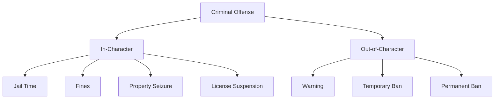

# Marola RP Penal Code

## General Provisions

### 1. Penalty Structure

### 2. Modifiers
#### Aggravating Factors
- Repeat offense (+25%)
- Premeditation (+50%)
- Position abuse (+75%)
- Multiple victims (+25% per victim)

#### Mitigating Factors
- First offense (-25%)
- Cooperation (-25%)
- Self-defense (-50%)
- Duress (-25%)

## Criminal Offenses

### 1. Crimes Against Life

#### Homicide
| Type | Jail Time | Fine | Admin Penalty |
|------|-----------|------|---------------|
| Intentional | 60-120m | M$50k-100k | 72h→perm |
| Negligent | 20-40m | M$20k-40k | Warning |
| RDM | 30-60m | M$30k-60k | 72h→perm |

#### Assault
| Type | Jail Time | Fine | Admin Penalty |
|------|-----------|------|---------------|
| Grievous | 30-60m | M$30k-60k | Warning→72h |
| Simple | 15-30m | M$15k-30k | Warning |
| Armed | 45-90m | M$45k-90k | 24h→72h |

### 2. Traffic Violations

#### Major Violations
| Offense | Jail Time | Fine | Admin Penalty |
|---------|-----------|------|---------------|
| VDM | 30-60m | M$30k-60k | 72h→perm |
| Reckless Driving | 10-20m | M$10k-20k | Warning |
| Evading Police | 15-30m | M$15k-30k | Warning→24h |

#### Vehicle-Related
| Offense | Jail Time | Fine | Additional |
|---------|-----------|------|------------|
| Racing | 20-40m | M$20k-40k | License Suspension |
| DUI | 15-30m | M$15k-30k | License Suspension |
| Hit and Run | 25-50m | M$25k-50k | License Suspension |

### 3. Property Crimes

#### Theft
| Type | Jail Time | Fine | Admin Penalty |
|------|-----------|------|---------------|
| Armed Robbery | 30-60m | M$40k-80k | Warning→72h |
| Burglary | 20-40m | M$20k-40k | Warning |
| Petty Theft | 10-20m | M$10k-20k | Warning |

#### Extortion
| Type | Jail Time | Fine | Admin Penalty |
|------|-----------|------|---------------|
| Kidnapping | 30-90m | M$50k-120k | 7d→perm |
| Blackmail | 20-40m | M$20k-40k | Warning→72h |
| Extortion | 25-50m | M$25k-50k | 72h→7d |

### 4. Administrative Offenses

#### Authority Resistance
| Offense | Jail Time | Fine | Admin Penalty |
|---------|-----------|------|---------------|
| Contempt | 10-20m | M$10k-20k | Warning |
| Obstruction | 15-30m | M$15k-30k | Warning→24h |
| False Statement | 20-40m | M$20k-40k | 24h→72h |

#### Corruption
| Offense | Jail Time | Fine | Additional |
|---------|-----------|------|------------|
| Bribery | 30-60m | M$30k-60k | Position Loss |
| Abuse of Power | 40-80m | M$40k-80k | Position Loss |
| Evidence Tampering | 25-50m | M$25k-50k | Position Loss |

### 5. Roleplay Violations

#### Gameplay Violations
| Offense | Jail Time | Admin Penalty | Appeals |
|---------|-----------|---------------|---------|
| Metagaming | 15-30m | 24h→30d | Yes |
| Powergaming | 15-30m | 24h→30d | Yes |
| Combat Logging | 30-60m | 72h→30d | Yes |
| Exploiting | N/A | 30d→perm | Special |

#### Community Violations
| Offense | Jail Time | Admin Penalty | Appeals |
|---------|-----------|---------------|---------|
| Harassment | N/A | 7d→perm | Special |
| Hate Speech | N/A | 7d→perm | No |
| Cheating | N/A | 30d→perm | No |
| Toxicity | N/A | 24h→7d | Yes |

## Quick Reference Guide

### Common Offenses
1. **RDM/VDM**
   - Jail: 30-60m
   - Fine: M$30k-60k
   - Admin: 72h→perm

2. **Metagaming/Powergaming**
   - Jail: 15-30m
   - Admin: 24h→30d
   - Appeals: Yes

3. **Kidnapping/Extortion**
   - Jail: 30-90m
   - Fine: M$50k-120k
   - Admin: 7d→perm

4. **Exploits/Cheating**
   - Admin: 30d→perm
   - Appeals: Special
   - Zero Tolerance

### Penalty Progression

## Administrative Information

### Appeals Process
1. Wait 24 hours
2. Submit evidence
3. Be truthful
4. Accept decision
5. Follow up

### Documentation
- Screenshot evidence
- Video clips
- Witness statements
- Admin reports
- Appeal forms

## Version Information
- Last Update: 2025-09-17
- Version: 2.0
- Review: Weekly
- Enforcement: Immediate
   - Criminal record points

2. **Out-of-Character (OOC) Penalties**
   - Warnings
   - Temporary bans
   - Permanent bans
   - Character wipes
   - Role restrictions

### Aggravating Factors
- Repeat offense (+50% penalty)
- Position of authority (+75% penalty)
- Premeditation (+25% penalty)
- Multiple victims (+25% per additional victim)
- Use of exploits (converts to OOC penalty)

### Mitigating Factors
- First offense (-25% penalty)
- Cooperation (-15% penalty)
- Self-defense (-50% penalty)
- Provocation (-30% penalty)
- Remorse/Restitution (-20% penalty)

## Criminal Code

### 1. Crimes Against Life

#### 1.1 Homicide
| Offense | Jail Time | Fine | Ban Duration |
|---------|-----------|------|--------------|
| First Degree Murder | 120m | M$100,000 | 72h → Perm |
| Second Degree Murder | 90m | M$75,000 | 24h → 30d |
| Manslaughter | 60m | M$50,000 | Warning → 72h |
| Attempted Murder | 45m | M$40,000 | 24h → 7d |
| Negligent Homicide | 30m | M$25,000 | Warning → 24h |

#### 1.2 Assault
| Offense | Jail Time | Fine | Ban Duration |
|---------|-----------|------|--------------|
| Aggravated Assault | 45m | M$35,000 | 24h → 7d |
| Battery | 30m | M$25,000 | Warning → 72h |
| Simple Assault | 20m | M$15,000 | Warning |
| Threatening Violence | 15m | M$10,000 | Warning |

### 2. Vehicle Crimes

#### 2.1 Traffic Violations
| Offense | Jail Time | Fine | Ban Duration |
|---------|-----------|------|--------------|
| VDM | 60m | M$50,000 | 72h → Perm |
| Reckless Driving | 30m | M$25,000 | Warning → 24h |
| DUI | 45m | M$35,000 | Warning → 72h |
| Hit and Run | 40m | M$30,000 | 24h → 7d |
| Speeding | 15m | M$5,000-15,000 | Warning |

#### 2.2 Vehicle-Related
| Offense | Jail Time | Fine | Ban Duration |
|---------|-----------|------|--------------|
| Grand Theft Auto | 45m | M$40,000 | 24h → 7d |
| Joyriding | 25m | M$20,000 | Warning → 24h |
| Vehicle Tampering | 20m | M$15,000 | Warning |
| Operating w/o License | 15m | M$10,000 | Warning |

### 3. Property Crimes

#### 3.1 Robbery
| Offense | Jail Time | Fine | Ban Duration |
|---------|-----------|------|--------------|
| Bank Robbery | 90m | M$80,000 | 24h → 30d |
| Armed Robbery | 60m | M$50,000 | 24h → 7d |
| Store Robbery | 45m | M$35,000 | Warning → 72h |
| Petty Theft | 20m | M$15,000 | Warning |

#### 3.2 Burglary
| Offense | Jail Time | Fine | Ban Duration |
|---------|-----------|------|--------------|
| Home Invasion | 75m | M$60,000 | 24h → 7d |
| Commercial Burglary | 60m | M$45,000 | 24h → 72h |
| Breaking & Entering | 30m | M$25,000 | Warning → 24h |

### 4. Drug Offenses

#### 4.1 Trafficking
| Offense | Jail Time | Fine | Ban Duration |
|---------|-----------|------|--------------|
| Major Trafficking | 90m | M$75,000 | 24h → 30d |
| Distribution | 60m | M$50,000 | 24h → 7d |
| Possession w/ Intent | 45m | M$35,000 | Warning → 72h |
| Simple Possession | 20m | M$15,000 | Warning |

### 5. Weapons Offenses

#### 5.1 Firearms
| Offense | Jail Time | Fine | Ban Duration |
|---------|-----------|------|--------------|
| Illegal Weapons Trade | 90m | M$70,000 | 24h → 30d |
| Possession of Class 2 | 60m | M$45,000 | 24h → 7d |
| Possession of Class 1 | 30m | M$25,000 | Warning → 72h |
| Brandishing | 20m | M$15,000 | Warning |

### 6. Public Order

#### 6.1 Disturbance
| Offense | Jail Time | Fine | Ban Duration |
|---------|-----------|------|--------------|
| Riot | 45m | M$35,000 | 24h → 7d |
| Public Nuisance | 20m | M$15,000 | Warning |
| Disturbing Peace | 15m | M$10,000 | Warning |

### 7. Administrative Crimes

#### 7.1 Justice System
| Offense | Jail Time | Fine | Ban Duration |
|---------|-----------|------|--------------|
| Corruption | 90m | M$70,000 | 7d → Perm |
| Perjury | 45m | M$35,000 | 24h → 7d |
| Contempt of Court | 30m | M$25,000 | Warning → 72h |
| Obstruction | 25m | M$20,000 | Warning → 24h |

### 8. Roleplay Violations

#### 8.1 Basic Violations
| Offense | Jail Time | Fine | Ban Duration |
|---------|-----------|------|--------------|
| RDM | 60m | M$50,000 | 72h → Perm |
| Combat Logging | 45m | M$35,000 | 72h → 30d |
| Metagaming | 30m | M$25,000 | 24h → 30d |
| Powergaming | 30m | M$25,000 | 24h → 30d |

#### 8.2 Server Violations
| Offense | Jail Time | Fine | Ban Duration |
|---------|-----------|------|--------------|
| Cheating/Exploits | N/A | N/A | 30d → Perm |
| Hate Speech | N/A | N/A | 7d → Perm |
| Harassment | N/A | N/A | 7d → Perm |
| Bug Abuse | 60m | M$50,000 | 7d → Perm |

## Special Provisions

### Multiple Offenses
- Maximum jail time: 180 minutes
- Maximum fine: M$250,000
- Penalties stack up to maximums
- Most severe ban applies

### Repeat Offenders
1. First Offense: Standard penalty
2. Second Offense: +50% penalty
3. Third Offense: +100% penalty
4. Fourth Offense: Next ban tier
5. Fifth+ Offense: Permanent ban review

### Time-Based Reductions
- Clean record 30 days: -1 offense level
- Clean record 90 days: Reset to first offense
- Exception: Server violations never reset

### Appeal Process
1. 7-day minimum wait period
2. Written appeal required
3. Evidence of reform needed
4. Admin review board
5. Decision within 72 hours
