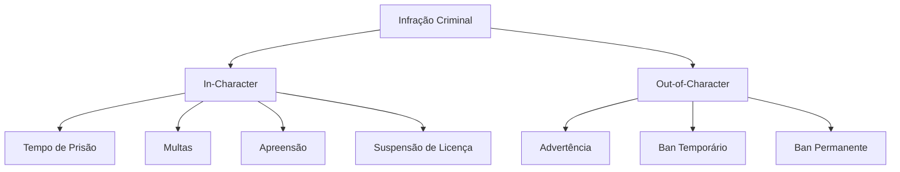
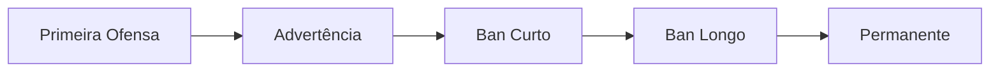

# Código Penal Marola RP

## Disposições Gerais

### 1. Estrutura das Penas

### 2. Modificadores
#### Agravantes
- Reincidência (+25%)
- Premeditação (+50%)
- Abuso de cargo (+75%)
- Múltiplas vítimas (+25% por vítima)

#### Atenuantes
- Primeira ofensa (-25%)
- Cooperação (-25%)
- Legítima defesa (-50%)
- Coação (-25%)

## Infrações Criminais

### 1. Crimes Contra a Vida

#### Homicídio
| Tipo | Prisão | Multa | Pena Admin |
|------|---------|-------|------------|
| Doloso | 60-120m | M$50k-100k | 72h→perm |
| Culposo | 20-40m | M$20k-40k | Advertência |
| RDM | 30-60m | M$30k-60k | 72h→perm |

#### Lesão Corporal
| Tipo | Prisão | Multa | Pena Admin |
|------|---------|-------|------------|
| Grave | 30-60m | M$30k-60k | Advertência→72h |
| Leve | 15-30m | M$15k-30k | Advertência |
| Armada | 45-90m | M$45k-90k | 24h→72h |

### 2. Infrações de Trânsito

#### Infrações Graves
| Infração | Prisão | Multa | Pena Admin |
|----------|---------|-------|------------|
| VDM | 30-60m | M$30k-60k | 72h→perm |
| Direção Perigosa | 10-20m | M$10k-20k | Advertência |
| Fuga da Polícia | 15-30m | M$15k-30k | Advertência→24h |

#### Relacionadas a Veículos
| Infração | Prisão | Multa | Adicional |
|----------|---------|-------|-----------|
| Racha | 20-40m | M$20k-40k | Suspensão CNH |
| Embriaguez | 15-30m | M$15k-30k | Suspensão CNH |
| Fuga do Local | 25-50m | M$25k-50k | Suspensão CNH |

### 3. Crimes Contra o Patrimônio

#### Furto e Roubo
| Tipo | Prisão | Multa | Pena Admin |
|------|---------|-------|------------|
| Roubo Armado | 30-60m | M$40k-80k | Advertência→72h |
| Invasão | 20-40m | M$20k-40k | Advertência |
| Furto Simples | 10-20m | M$10k-20k | Advertência |

#### Extorsão
| Tipo | Prisão | Multa | Pena Admin |
|------|---------|-------|------------|
| Sequestro | 30-90m | M$50k-120k | 7d→perm |
| Chantagem | 20-40m | M$20k-40k | Advertência→72h |
| Extorsão | 25-50m | M$25k-50k | 72h→7d |

### 4. Infrações Administrativas

#### Resistência à Autoridade
| Infração | Prisão | Multa | Pena Admin |
|----------|---------|-------|------------|
| Desacato | 10-20m | M$10k-20k | Advertência |
| Obstrução | 15-30m | M$15k-30k | Advertência→24h |
| Falso Testemunho | 20-40m | M$20k-40k | 24h→72h |

#### Corrupção
| Infração | Prisão | Multa | Adicional |
|----------|---------|-------|-----------|
| Suborno | 30-60m | M$30k-60k | Perda do Cargo |
| Abuso de Poder | 40-80m | M$40k-80k | Perda do Cargo |
| Adulteração de Provas | 25-50m | M$25k-50k | Perda do Cargo |

### 5. Violações de Roleplay

#### Violações de Gameplay
| Infração | Prisão | Pena Admin | Recursos |
|----------|---------|------------|----------|
| Metagaming | 15-30m | 24h→30d | Sim |
| Powergaming | 15-30m | 24h→30d | Sim |
| Combat Logging | 30-60m | 72h→30d | Sim |
| Exploit | N/A | 30d→perm | Especial |

#### Violações Comunitárias
| Infração | Prisão | Pena Admin | Recursos |
|----------|---------|------------|----------|
| Assédio | N/A | 7d→perm | Especial |
| Discurso de Ódio | N/A | 7d→perm | Não |
| Trapaça | N/A | 30d→perm | Não |
| Toxicidade | N/A | 24h→7d | Sim |

## Guia de Referência Rápida

### Infrações Comuns
1. **RDM/VDM**
   - Prisão: 30-60m
   - Multa: M$30k-60k
   - Admin: 72h→perm

2. **Metagaming/Powergaming**
   - Prisão: 15-30m
   - Admin: 24h→30d
   - Recursos: Sim

3. **Sequestro/Extorsão**
   - Prisão: 30-90m
   - Multa: M$50k-120k
   - Admin: 7d→perm

4. **Exploits/Trapaça**
   - Admin: 30d→perm
   - Recursos: Especial
   - Tolerância Zero

### Progressão de Penalidades

## Informações Administrativas

### Processo de Recurso
1. Aguarde 24 horas
2. Envie evidências
3. Seja verdadeiro
4. Aceite a decisão
5. Acompanhe

### Documentação
- Screenshots de evidência
- Clipes de vídeo
- Depoimentos
- Relatórios admin
- Formulários de recurso

## Informações de Versão
- Última Atualização: 2025-09-17
- Versão: 2.0
- Revisão: Semanal
- Aplicação: Imediata
