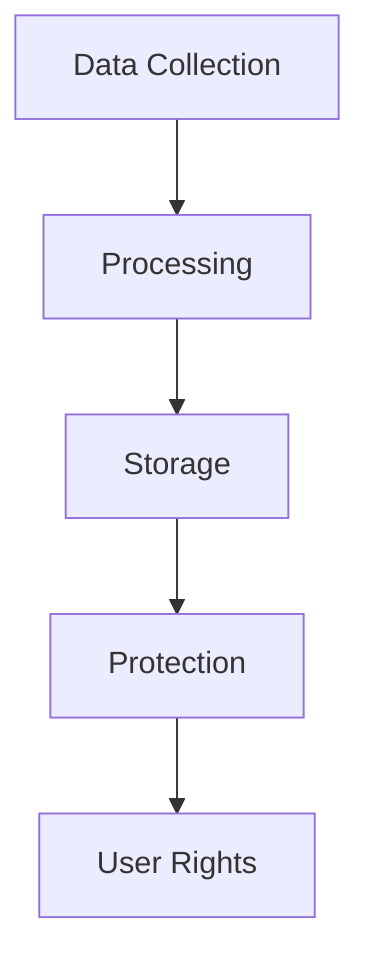
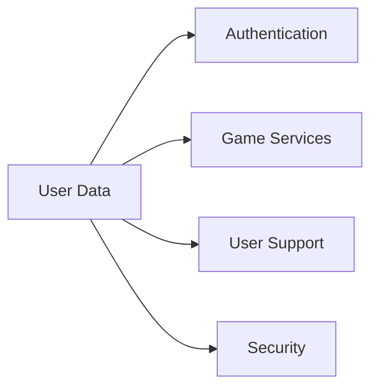
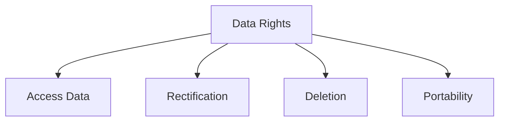
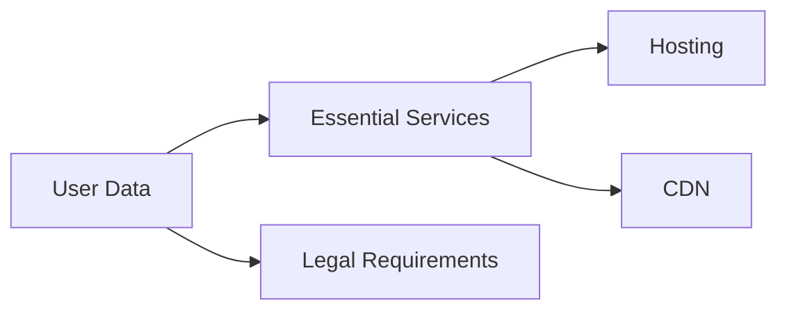
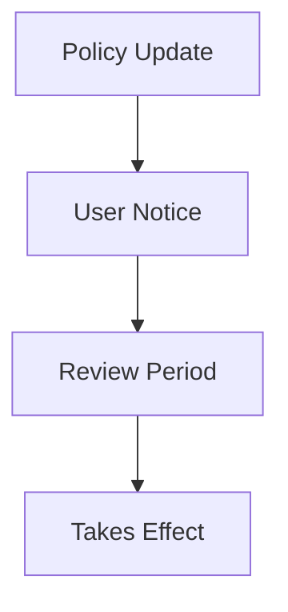

# Privacy Policy

## Introduction

### Overview
This Privacy Policy explains how Marola RP ("we", "us", "our") collects, uses, and protects your personal information. We are committed to protecting your privacy and ensuring transparency in our data practices.

### Scope

## Data Collection

### What We Collect
| Category | Data Types | Purpose | Legal Basis |
|----------|------------|---------|-------------|
| Account | Username, Email | Authentication | Contract |
| Game | Character Data, Stats | Gameplay | Contract |
| Technical | IP, Device Info | Security | Legitimate Interest |
| Communication | Chat Logs, Reports | Community Safety | Legitimate Interest |

### Collection Methods
1. **Direct Collection**
   - Account registration
   - Character creation
   - In-game activities
   - Support requests

2. **Automatic Collection**
   - Login information
   - Game metrics
   - Technical data
   - Performance stats

## Data Usage

### Primary Uses

### Processing Purposes
| Purpose | Description | Legal Basis |
|---------|-------------|-------------|
| Account Management | User authentication | Contract |
| Game Services | Character progression | Contract |
| Security | Fraud prevention | Legitimate Interest |
| Support | User assistance | Legitimate Interest |

## Data Storage

### Storage Practices
1. **Location**
   - Primary: Brazil
   - Backup: EU/US
   - CDN: Global

2. **Retention Periods**
   - Account data: Active + 2 years
   - Game data: Active + 1 year
   - Technical logs: 90 days
   - Chat logs: 30 days

### Security Measures
| Measure | Description | Review Frequency |
|---------|-------------|-----------------|
| Encryption | AES-256 | Monthly |
| Access Control | Role-based | Weekly |
| Monitoring | 24/7 | Real-time |
| Backups | Daily encrypted | Daily |

## User Rights

### Your Rights

### Exercise Your Rights
| Right | Response Time | Process |
|-------|---------------|---------|
| Access | 15 days | Submit request |
| Rectification | 7 days | Submit correction |
| Deletion | 30 days | Submit deletion |
| Portability | 15 days | Submit export |

## Data Protection

### Security Framework
1. **Technical Measures**
   - Encryption at rest
   - Encryption in transit
   - Access logging
   - Intrusion detection

2. **Organizational Measures**
   - Staff training
   - Access policies
   - Incident response
   - Regular audits

### Breach Response
| Severity | Response Time | Notification |
|----------|---------------|-------------|
| Critical | 1 hour | Immediate |
| High | 4 hours | 24 hours |
| Medium | 12 hours | 48 hours |
| Low | 24 hours | 72 hours |

## Third Parties

### Data Sharing

### Service Providers
| Provider | Purpose | Data Access |
|----------|---------|-------------|
| Hosting | Game servers | Limited |
| CDN | Content delivery | Minimal |
| Analytics | Performance | Aggregate |
| Support | User assistance | As needed |

## Cookies & Tracking

### Cookie Usage
1. **Essential Cookies**
   - Authentication
   - Session management
   - Security features
   - Preferences

2. **Analytics Cookies**
   - Performance metrics
   - User behavior
   - Error tracking
   - Optimization

### Tracking Controls
| Type | Control | Opt-out |
|------|---------|---------|
| Essential | Required | No |
| Analytics | Optional | Yes |
| Marketing | Optional | Yes |
| Third-party | Optional | Yes |

## Children's Privacy

### Age Restrictions
- Minimum age: 16 years
- Parental consent required: Under 16
- Age verification: Required
- Account removal: On request

### Special Protections
1. **Data Collection**
   - Minimal collection
   - No profiling
   - No marketing
   - No sharing

2. **Safety Measures**
   - Content filtering
   - Chat monitoring
   - Report system
   - Quick response

## Updates & Contact

### Policy Updates

### Contact Information
- Email: privacy@marola-rp.com
- Support: support.marola-rp.com
- Discord: discord.gg/marola-rp
- Response time: 24-48 hours

## Version Information
- Last Update: 2025-09-17
- Version: 2.0
- Review: Monthly
- Next Review: 2025-10-17
