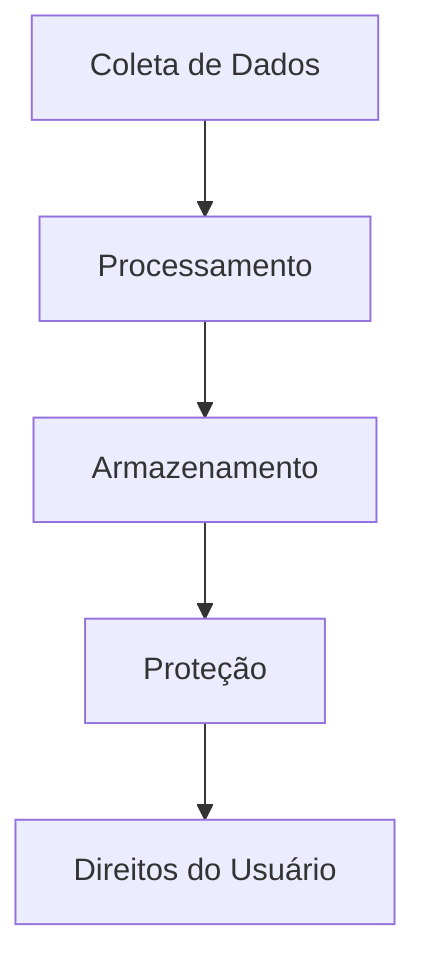
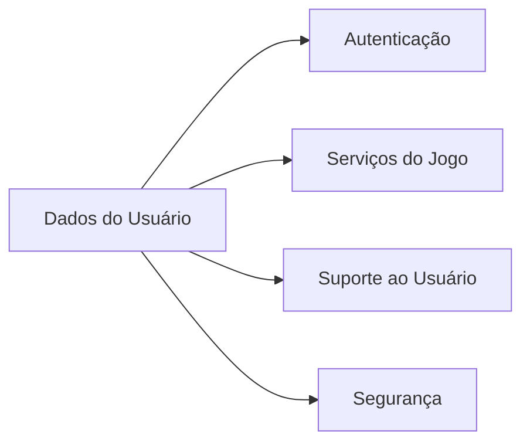
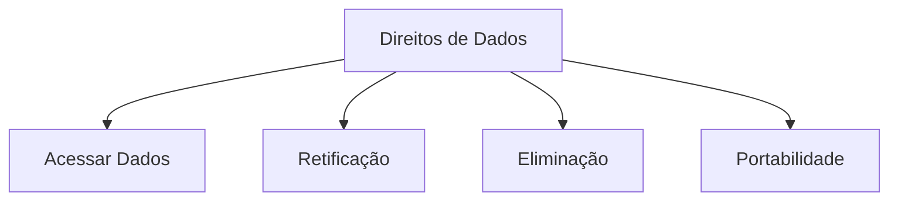
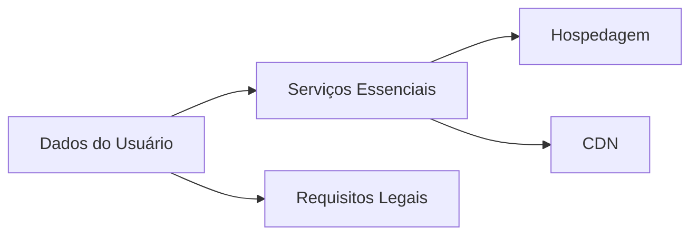
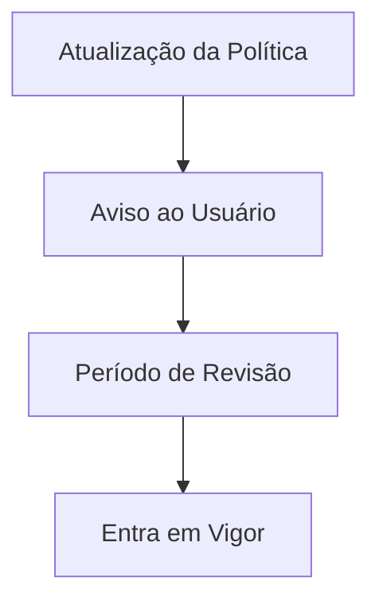

# Política de Privacidade

## Introdução

### Visão Geral
Esta Política de Privacidade explica como o Marola RP ("nós", "nos", "nosso") coleta, usa e protege suas informações pessoais. Estamos comprometidos em proteger sua privacidade e garantir transparência em nossas práticas de dados.

### Escopo

## Coleta de Dados

### O que Coletamos
| Categoria | Tipos de Dados | Finalidade | Base Legal |
|-----------|----------------|------------|------------|
| Conta | Nome de usuário, Email | Autenticação | Contrato |
| Jogo | Dados do Personagem, Stats | Gameplay | Contrato |
| Técnico | IP, Info do Dispositivo | Segurança | Interesse Legítimo |
| Comunicação | Logs de Chat, Denúncias | Segurança da Comunidade | Interesse Legítimo |

### Métodos de Coleta
1. **Coleta Direta**
   - Registro de conta
   - Criação de personagem
   - Atividades in-game
   - Pedidos de suporte

2. **Coleta Automática**
   - Informações de login
   - Métricas do jogo
   - Dados técnicos
   - Stats de performance

## Uso dos Dados

### Usos Principais

### Finalidades de Processamento
| Finalidade | Descrição | Base Legal |
|------------|-----------|------------|
| Gestão de Conta | Autenticação do usuário | Contrato |
| Serviços do Jogo | Progressão do personagem | Contrato |
| Segurança | Prevenção de fraudes | Interesse Legítimo |
| Suporte | Assistência ao usuário | Interesse Legítimo |

## Armazenamento de Dados

### Práticas de Armazenamento
1. **Localização**
   - Principal: Brasil
   - Backup: UE/EUA
   - CDN: Global

2. **Períodos de Retenção**
   - Dados da conta: Ativo + 2 anos
   - Dados do jogo: Ativo + 1 ano
   - Logs técnicos: 90 dias
   - Logs de chat: 30 dias

### Medidas de Segurança
| Medida | Descrição | Frequência de Revisão |
|--------|-----------|----------------------|
| Criptografia | AES-256 | Mensal |
| Controle de Acesso | Baseado em função | Semanal |
| Monitoramento | 24/7 | Tempo real |
| Backups | Criptografados diários | Diária |

## Direitos do Usuário

### Seus Direitos

### Exercício dos Direitos
| Direito | Tempo de Resposta | Processo |
|---------|-------------------|----------|
| Acesso | 15 dias | Enviar solicitação |
| Retificação | 7 dias | Enviar correção |
| Eliminação | 30 dias | Solicitar exclusão |
| Portabilidade | 15 dias | Solicitar exportação |

## Proteção de Dados

### Framework de Segurança
1. **Medidas Técnicas**
   - Criptografia em repouso
   - Criptografia em trânsito
   - Registro de acessos
   - Detecção de intrusão

2. **Medidas Organizacionais**
   - Treinamento da equipe
   - Políticas de acesso
   - Resposta a incidentes
   - Auditorias regulares

### Resposta a Vazamentos
| Severidade | Tempo de Resposta | Notificação |
|------------|-------------------|-------------|
| Crítica | 1 hora | Imediata |
| Alta | 4 horas | 24 horas |
| Média | 12 horas | 48 horas |
| Baixa | 24 horas | 72 horas |

## Terceiros

### Compartilhamento de Dados

### Prestadores de Serviço
| Prestador | Finalidade | Acesso aos Dados |
|-----------|------------|------------------|
| Hospedagem | Servidores do jogo | Limitado |
| CDN | Entrega de conteúdo | Mínimo |
| Analytics | Performance | Agregado |
| Suporte | Assistência ao usuário | Conforme necessário |

## Cookies & Rastreamento

### Uso de Cookies
1. **Cookies Essenciais**
   - Autenticação
   - Gestão de sessão
   - Recursos de segurança
   - Preferências

2. **Cookies Analíticos**
   - Métricas de performance
   - Comportamento do usuário
   - Rastreamento de erros
   - Otimização

### Controles de Rastreamento
| Tipo | Controle | Opt-out |
|------|----------|---------|
| Essencial | Obrigatório | Não |
| Analytics | Opcional | Sim |
| Marketing | Opcional | Sim |
| Terceiros | Opcional | Sim |

## Privacidade de Menores

### Restrições de Idade
- Idade mínima: 16 anos
- Consentimento parental: Menor de 16
- Verificação de idade: Obrigatória
- Remoção de conta: Sob solicitação

### Proteções Especiais
1. **Coleta de Dados**
   - Coleta mínima
   - Sem perfilamento
   - Sem marketing
   - Sem compartilhamento

2. **Medidas de Segurança**
   - Filtragem de conteúdo
   - Monitoramento de chat
   - Sistema de denúncias
   - Resposta rápida

## Atualizações & Contato

### Atualizações da Política

### Informações de Contato
- Email: privacidade@marola-rp.com
- Suporte: suporte.marola-rp.com
- Discord: discord.gg/marola-rp
- Tempo de resposta: 24-48 horas

## Informações de Versão
- Última Atualização: 2025-09-17
- Versão: 2.0
- Revisão: Mensal
- Próxima Revisão: 2025-10-17
