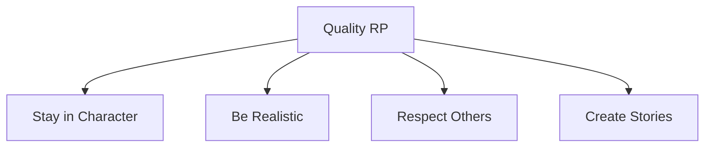
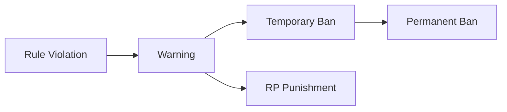

# Marola RP Server Rules

## Core Principles
1. **Roleplay First**: Maintain immersion and stay in character
2. **Mutual Respect**: Treat all players and staff with respect
3. **Common Sense**: Use realistic judgment in all situations
4. **Value Life**: Protect your character as you would yourself
5. **Positive Community**: No OOC toxicity or drama

## Essential Terminology

### Prohibited Behaviors
| Term | Definition | Example | Penalty |
|------|------------|---------|---------|
| RDM (Random Death Match) | Killing without RP motivation | Shooting random players | 72h Ban |
| VDM (Vehicle Death Match) | Using vehicles as weapons | Intentional ramming | 72h Ban |
| NVL (No Value of Life) | Unrealistic disregard for life | Jumping off buildings | 24h Ban |
| Metagaming | Using OOC info in-game | Using Discord info in-game | 24h Ban |
| Powergaming | Forcing actions on others | "Hits you without miss" | 24h Ban |
| Combat Logging | Disconnecting during RP | Leaving during arrest | 72h Ban |

## General Rules

### 1. Communication Rules
- **In-Character (IC)**
  - Use proper character voice
  - Maintain realistic reactions
  - Keep accent/personality consistent
  - No breaking character

- **Out-of-Character (OOC)**
  - Use /ooc for technical issues only
  - Keep OOC chat minimal
  - No OOC drama or arguments
  - Report issues to staff

### 2. Roleplay Quality

#### Standards
- Create meaningful interactions
- Develop character backstory
- Follow realistic scenarios
- Allow others to roleplay
- Accept consequences

### 3. Criminal Activities
| Activity | Requirements | Cooldown | Players |
|----------|--------------|----------|----------|
| Robbery | Proper planning | 2 hours | 2-4 |
| Kidnapping | Valid reason | 4 hours | 2-3 |
| Store Heist | Equipment | 6 hours | 3-5 |
| Bank Heist | Full plan | 12 hours | 4-6 |

### 4. Vehicle Usage
- Follow traffic laws
- Use appropriate vehicles
- Maintain realistic speeds
- Report vehicle bugs
- No vehicle exploits

### 5. Property Rules
- Respect private property
- No trespassing without RP
- Lock doors when leaving
- Report property issues
- Follow zoning laws

### 6. Combat Rules
#### Engagement Protocol
1. **Initiation**
   - Clear RP reason required
   - Verbal warning when appropriate
   - No surprise executions
   - Give fair chances

2. **Combat Conduct**
   - No combat logging
   - Realistic weapon usage
   - Appropriate force
   - Report bugs/exploits

### 7. Evidence and Reports
- Record serious incidents
- Keep clips for 7 days
- Report rule violations
- Provide clear evidence
- Follow report format

## Enforcement System

### Penalty Structure

### Penalty Levels
| Level | Action | Duration | Appeal |
|-------|--------|----------|--------|
| 1 | Warning | Immediate | No |
| 2 | RP Jail/Fine | 1-24 hours | Yes |
| 3 | Temporary Ban | 24h-30d | Yes |
| 4 | Permanent Ban | Infinite | Special |

### Appeal Process
1. Wait 24 hours after penalty
2. Use official appeal format
3. Provide all evidence
4. Be honest and respectful
5. Accept final decision

## Staff Interaction

### Staff Authority
- Follow staff instructions
- Respect staff decisions
- Use proper appeal process
- Report staff misconduct
- Maintain professionalism

### Communication Channels
1. In-Game Reports
2. Discord Tickets
3. Appeal Forum
4. Staff DMs (when allowed)
5. Emergency Contact

## Additional Guidelines

### Recording Policy
- Record serious RP
- Save clips of incidents
- Maintain evidence
- Share when requested
- Respect privacy

### Community Standards
- Be helpful to new players
- Report bugs and exploits
- Participate constructively
- Follow Discord rules
- Support positive RP

## Updates & Changes
- Rules updated regularly
- Changes announced in Discord
- Follow all current rules
- Read update notices
- Ask staff if unclear

## Version Information
- Last Update: 2025-09-17
- Version: 2.0
- Review: Weekly
- Enforcement: Immediate

### Basic RP Violations
- **RDM (Random Death Match)**: Killing without valid RP reason or initiation
- **VDM (Vehicle Death Match)**: Using vehicles as weapons without RP context
- **NVL (No Value of Life)**: Not acting as if your life has value (e.g., ignoring gun threats)
- **Metagaming**: Using out-of-game information in-game
- **Powergaming**: Forcing actions on others or doing unrealistic actions
- **Combat Logging**: Disconnecting during combat/police pursuit
- **Failrp**: Actions that break roleplay immersion or realism

### Character and Roleplay Rules

1. **Character Creation**
   - One main character per player
   - Realistic backstory required
   - No celebrity/famous person impersonation
   - No offensive/inappropriate names
   - Character appearance must match RP story

2. **Character Behavior**
   - Maintain consistent character personality
   - No switching characters to avoid consequences
   - Remember all past RP experiences
   - No "New Life Rule" - maintain character history
   - Injuries must be roleplayed appropriately

3. **Communication**
   - Stay in character when using local chat
   - No OOC in main chat except emergencies
   - Use /me for physical actions
   - Use /do for environmental descriptions
   - Radio communications must be realistic

4. **Life Value**
   - React appropriately to threats
   - No suicide missions or kamikaze actions
   - Seek medical attention for injuries
   - Don't return to active scenes after death
   - Maximum 4 lives per 24 hours

## Gameplay Rules

### 1. Criminal Activity
- Must have valid RP reason for crimes
- Proper planning required for major crimes
- Maximum 4 people per robbery
- 15-minute cooldown between crimes
- No camping illegal activity spots

### 2. Police Interactions
- Follow all legal police commands
- No interfering with arrests
- Must pull over for police lights
- Allow police RP during searches
- Respect police authority in scenes

### 3. Vehicle Usage
- Follow traffic laws unless in emergency
- No unrealistic vehicle modifications
- Must have valid license to drive
- Report vehicle theft to police
- No vehicle spam or trolling

### 4. Property Rules
- Respect private property
- No camping businesses
- Property raids need admin approval
- Business RP must be realistic
- No exploiting property mechanics

### 5. Combat Rules
- No combat storing or duping
- 15-minute cooldown after fights
- Must initiate before attacking
- No spawn camping
- Fair fight distances must be maintained

## New Player Guidelines

### 1. Getting Started
- Complete tutorial before RP
- Join new player orientation
- Find legal job first
- Learn basic commands
- Ask questions in help channel

### 2. First Week Rules
- No major crimes first 48 hours
- Must work legal job 2 hours
- Cannot join gangs first week
- Limited to basic vehicles
- Must attend RP training

## Evidence and Reporting

### 1. Clip Requirements
- F8 screenshots for bugs
- Video clips for rule violations
- Save all major incident clips
- Include chat logs if relevant
- Maintain evidence for 7 days

### 2. Report Process
- Use proper report format
- Include all relevant evidence
- Report within 24 hours
- No false reporting
- Follow up appropriately

## Administrative Guidelines

### 1. Staff Interaction
- Follow all staff instructions
- No arguing with staff decisions
- Use proper appeal process
- Respect staff privacy
- Report staff misconduct properly

### 2. Penalty System
- **Warnings**: For minor first offenses
- **RP Penalties**: Jail time and fines
- **Temporary Bans**: 24h → 72h → 7d → 30d
- **Permanent Bans**: Extreme violations or repeated offenses

### 3. Appeals Process
- 7-day wait before appeal
- Must use appeal template
- Include all evidence
- Be honest about violation
- Show understanding of rules

## Special Rules

### 1. Events
- Follow event coordinator instructions
- No interfering with events
- Maintain RP during events
- Report event issues properly
- Respect event boundaries

### 2. Businesses
- Must maintain realistic hours
- Follow business guidelines
- Keep proper records
- No artificial inflation
- Respect competition rules

### 3. Emergency Services
- Priority response required
- Must be properly trained
- Follow department SOPs
- Maintain professionalism
- No abuse of authority

## Technical Rules

### 1. Modifications
- No game modifications
- Approved graphics only
- No exploit scripts
- Report all bugs
- No macro use

### 2. Performance
- Maintain stable connection
- Report technical issues
- No intentional lag
- Optimize game settings
- Use proper voice settings

## Rule Changes
- Rules may be updated
- Changes will be announced
- Players must stay informed
- Old rules apply until update
- Questions welcome in Discord

## Contact Information
- Discord: discord.gg/marola-rp
- Support email: support@marola-rp.com
- Website: www.marola-rp.com
- Report form: report.marola-rp.com
- Appeal form: appeal.marola-rp.com
