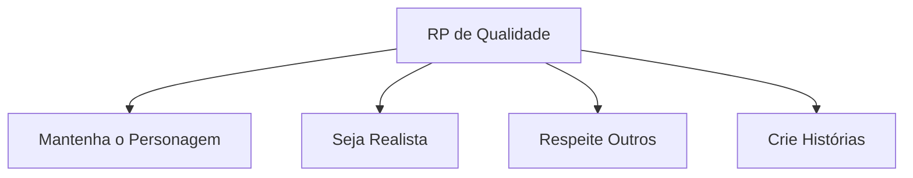
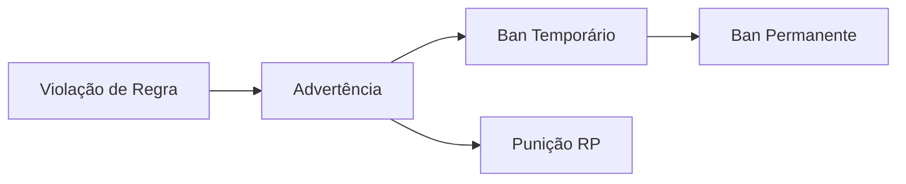

# Regras do Servidor Marola RP

## Princípios Fundamentais
1. **RP em Primeiro Lugar**: Mantenha a imersão e permaneça no personagem
2. **Respeito Mútuo**: Trate todos os jogadores e staff com respeito
3. **Bom Senso**: Use julgamento realista em todas as situações
4. **Valor à Vida**: Proteja seu personagem como você protegeria a si mesmo
5. **Comunidade Positiva**: Sem toxicidade ou drama OOC

## Terminologia Essencial

### Comportamentos Proibidos
| Termo | Definição | Exemplo | Penalidade |
|-------|-----------|---------|------------|
| RDM (Random Death Match) | Matar sem motivação RP | Atirar em jogadores aleatórios | Ban 72h |
| VDM (Vehicle Death Match) | Usar veículos como armas | Atropelar intencionalmente | Ban 72h |
| NVL (No Value of Life) | Desconsiderar a vida irrealisticamente | Pular de prédios | Ban 24h |
| Metagaming | Usar info OOC no jogo | Usar info do Discord no jogo | Ban 24h |
| Powergaming | Forçar ações em outros | "Acerta sem errar" | Ban 24h |
| Combat Logging | Desconectar durante RP | Sair durante prisão | Ban 72h |

## Regras Gerais

### 1. Regras de Comunicação
- **No Personagem (IC)**
  - Use voz apropriada do personagem
  - Mantenha reações realistas
  - Mantenha sotaque/personalidade consistente
  - Não quebre o personagem

- **Fora do Personagem (OOC)**
  - Use /ooc apenas para problemas técnicos
  - Mantenha chat OOC mínimo
  - Sem drama ou discussões OOC
  - Reporte problemas ao staff

### 2. Qualidade do Roleplay

#### Padrões
- Crie interações significativas
- Desenvolva história do personagem
- Siga cenários realistas
- Permita outros roleplayarem
- Aceite consequências

### 3. Atividades Criminais
| Atividade | Requisitos | Cooldown | Jogadores |
|-----------|------------|----------|-----------|
| Roubo | Planejamento adequado | 2 horas | 2-4 |
| Sequestro | Motivo válido | 4 horas | 2-3 |
| Assalto a Loja | Equipamento | 6 horas | 3-5 |
| Assalto a Banco | Plano completo | 12 horas | 4-6 |

### 4. Uso de Veículos
- Siga leis de trânsito
- Use veículos apropriados
- Mantenha velocidades realistas
- Reporte bugs de veículos
- Sem exploits de veículos

### 5. Regras de Propriedade
- Respeite propriedade privada
- Sem invasão sem RP
- Tranque portas ao sair
- Reporte problemas de propriedade
- Siga leis de zoneamento

### 6. Regras de Combate
#### Protocolo de Engajamento
1. **Iniciação**
   - Motivo RP claro necessário
   - Aviso verbal quando apropriado
   - Sem execuções surpresa
   - Dê chances justas

2. **Conduta em Combate**
   - Sem combat logging
   - Uso realista de armas
   - Força apropriada
   - Reporte bugs/exploits

### 7. Evidências e Relatórios
- Grave incidentes sérios
- Mantenha clipes por 7 dias
- Reporte violações de regras
- Forneça evidências claras
- Siga formato de relatório

## Sistema de Aplicação

### Estrutura de Penalidades

### Níveis de Penalidade
| Nível | Ação | Duração | Recurso |
|-------|------|---------|---------|
| 1 | Advertência | Imediato | Não |
| 2 | Prisão/Multa RP | 1-24 horas | Sim |
| 3 | Ban Temporário | 24h-30d | Sim |
| 4 | Ban Permanente | Infinito | Especial |

### Processo de Recurso
1. Aguarde 24 horas após penalidade
2. Use formato oficial de recurso
3. Forneça todas as evidências
4. Seja honesto e respeitoso
5. Aceite decisão final

## Interação com Staff

### Autoridade do Staff
- Siga instruções do staff
- Respeite decisões do staff
- Use processo adequado de recurso
- Reporte má conduta do staff
- Mantenha profissionalismo

### Canais de Comunicação
1. Denúncias In-Game
2. Tickets no Discord
3. Fórum de Recursos
4. DMs do Staff (quando permitido)
5. Contato de Emergência

## Diretrizes Adicionais

### Política de Gravação
- Grave RP sério
- Salve clipes de incidentes
- Mantenha evidências
- Compartilhe quando solicitado
- Respeite privacidade

### Padrões da Comunidade
- Ajude novos jogadores
- Reporte bugs e exploits
- Participe construtivamente
- Siga regras do Discord
- Apoie RP positivo

## Atualizações & Mudanças
- Regras atualizadas regularmente
- Mudanças anunciadas no Discord
- Siga todas as regras atuais
- Leia avisos de atualização
- Pergunte ao staff se tiver dúvidas

## Informações de Versão
- Última Atualização: 2025-09-17
- Versão: 2.0
- Revisão: Semanal
- Aplicação: Imediata
