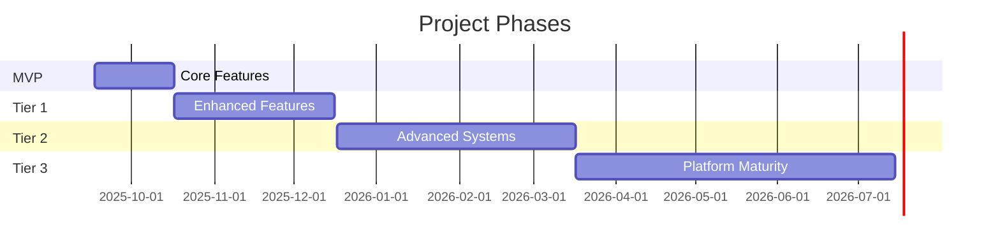
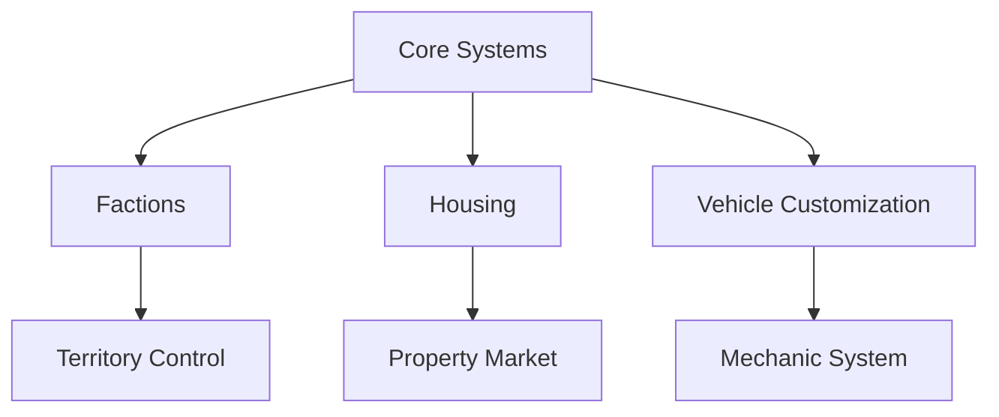
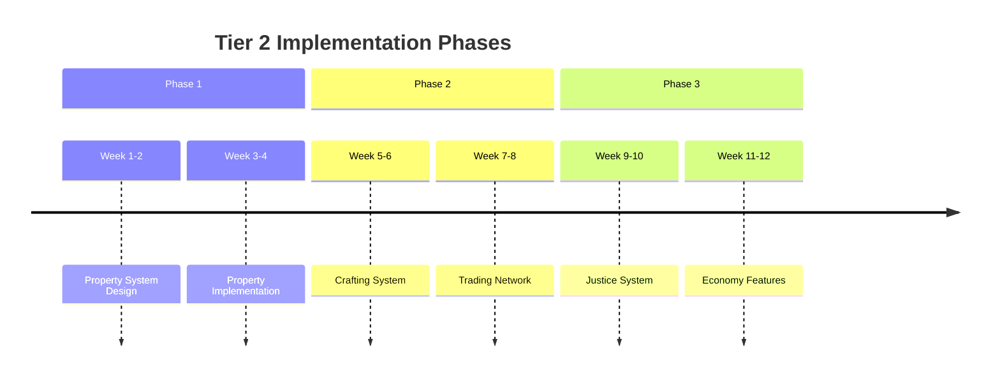

# Development Roadmap

## Project Timeline Overview

## MVP Phase (Launch)
Current Status: ✓ Active Development

### Core Features
| Feature | Description | Priority | Status |
|---------|-------------|----------|---------|
| Whitelist System | Application and approval process | P0 | In Progress |
| Basic Economy | Currency, transactions, basic jobs | P0 | In Progress |
| Initial Jobs | Taxi, delivery, mechanic | P1 | Planning |
| Core Systems | Inventory, garage, hospital | P1 | Planning |
| Police System | Basic law enforcement features | P2 | Planning |
| Public Rules | Server guidelines and regulations | P0 | Completed |

### Technical Goals
1. **Infrastructure**
   - Server stability
   - Basic monitoring
   - Backup systems
   - Security measures

2. **Performance**
   - 64 player capacity
   - <100ms latency
   - 99.9% uptime
   - Automated restarts

## Tier 1 (30-60 days)
Target Date: 2025-10-17 to 2025-11-17

### Feature Expansion

### Planned Features
| Category | Features | Dependencies | Priority |
|----------|----------|--------------|----------|
| Factions | Gang system, territory control | Core systems | High |
| Housing | Basic apartments, rentals | Economy system | High |
| Vehicles | Cosmetic tuning, custom paint | Mechanic job | Medium |
| Entertainment | Music events, radio stations | Basic systems | Low |
| Police | Advanced CRM, case management | Police system | Medium |

## Tier 2 (90-120 days)
Target Date: 2025-12-17 to 2026-01-17

### Advanced Systems
1. **Property System**
   - Business ownership
   - Custom interiors
   - Property management
   - Rental market

2. **Crafting System**
   - Resource gathering
   - Item crafting
   - Quality system
   - Trading network

3. **Justice System**
   - Court system
   - Legal framework
   - Prison system
   - Rehabilitation

4. **Economy Features**
   - P2P marketplace
   - Auction system
   - Business loans
   - Stock market

### Implementation Timeline

## Tier 3 (Future)
Target Date: 2026-02-17 to 2026-05-17

### Platform Maturity
| System | Features | Timeline | Priority |
|--------|----------|----------|----------|
| Events | Automated events, tournaments | Q1 2026 | Medium |
| Economy | Advanced financial instruments | Q1 2026 | High |
| Politics | City council, elections | Q2 2026 | Low |
| Organizations | Advanced faction features | Q2 2026 | High |

### Long-term Goals
1. **Community Development**
   - Regular events
   - Community councils
   - Content creator program
   - Partnership system

2. **Technical Excellence**
   - 128 player capacity
   - Custom game modes
   - Advanced anti-cheat
   - Performance optimization

3. **Economic Maturity**
   - Dynamic economy
   - Investment systems
   - Business ecosystems
   - Market analytics

## Risk Management

### Identified Risks
| Risk | Impact | Probability | Mitigation |
|------|---------|------------|------------|
| Technical Issues | High | Medium | Robust testing |
| Player Retention | High | Low | Engagement features |
| Economy Balance | Medium | High | Regular monitoring |
| Performance | Medium | Medium | Optimization sprints |

### Contingency Plans
1. **Technical Issues**
   - Backup systems
   - Rollback procedures
   - Emergency response
   - Communication plan

2. **Community Management**
   - Feedback systems
   - Community events
   - Content updates
   - Support channels

## Version Information
- Last Update: 2025-09-17
- Version: 2.0
- Review Frequency: Monthly
- Next Review: 2025-10-17
