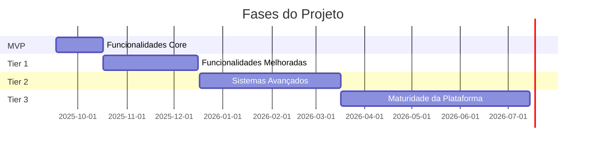
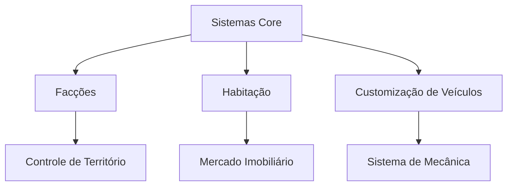
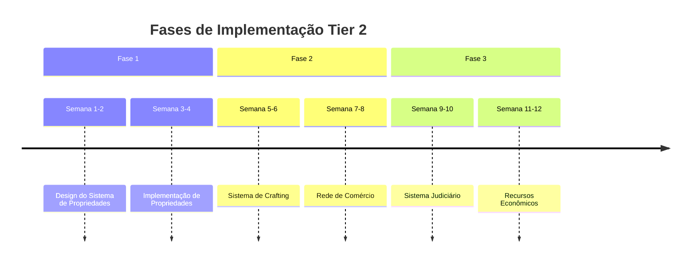

# Roadmap de Desenvolvimento

## Visão Geral do Cronograma

## Fase MVP (Lançamento)
Status Atual: ✓ Em Desenvolvimento

### Funcionalidades Core
| Funcionalidade | Descrição | Prioridade | Status |
|----------------|-----------|------------|---------|
| Sistema Whitelist | Processo de inscrição e aprovação | P0 | Em Andamento |
| Economia Básica | Moeda, transações, empregos básicos | P0 | Em Andamento |
| Empregos Iniciais | Taxi, entrega, mecânico | P1 | Planejamento |
| Sistemas Core | Inventário, garagem, hospital | P1 | Planejamento |
| Sistema Policial | Recursos básicos de policiamento | P2 | Planejamento |
| Regras Públicas | Diretrizes e regulamentos do servidor | P0 | Concluído |

### Objetivos Técnicos
1. **Infraestrutura**
   - Estabilidade do servidor
   - Monitoramento básico
   - Sistemas de backup
   - Medidas de segurança

2. **Performance**
   - Capacidade para 64 jogadores
   - Latência <100ms
   - 99.9% de uptime
   - Reinícios automatizados

## Tier 1 (30-60 dias)
Data Prevista: 2025-10-17 a 2025-11-17

### Expansão de Funcionalidades

### Funcionalidades Planejadas
| Categoria | Funcionalidades | Dependências | Prioridade |
|-----------|----------------|---------------|------------|
| Facções | Sistema de gangues, controle territorial | Sistemas core | Alta |
| Habitação | Apartamentos básicos, aluguéis | Sistema econômico | Alta |
| Veículos | Tuning estético, pintura personalizada | Emprego de mecânico | Média |
| Entretenimento | Eventos musicais, estações de rádio | Sistemas básicos | Baixa |
| Polícia | CRM avançado, gestão de casos | Sistema policial | Média |

## Tier 2 (90-120 dias)
Data Prevista: 2025-12-17 a 2026-01-17

### Sistemas Avançados
1. **Sistema de Propriedades**
   - Propriedade de negócios
   - Interiores personalizados
   - Gestão de propriedades
   - Mercado de aluguel

2. **Sistema de Crafting**
   - Coleta de recursos
   - Criação de itens
   - Sistema de qualidade
   - Rede de comércio

3. **Sistema Judiciário**
   - Sistema de tribunal
   - Estrutura legal
   - Sistema prisional
   - Reabilitação

4. **Recursos Econômicos**
   - Marketplace P2P
   - Sistema de leilões
   - Empréstimos comerciais
   - Mercado de ações

### Cronograma de Implementação

## Tier 3 (Futuro)
Data Prevista: 2026-02-17 a 2026-05-17

### Maturidade da Plataforma
| Sistema | Funcionalidades | Cronograma | Prioridade |
|---------|----------------|-------------|------------|
| Eventos | Eventos automatizados, torneios | Q1 2026 | Média |
| Economia | Instrumentos financeiros avançados | Q1 2026 | Alta |
| Política | Conselho da cidade, eleições | Q2 2026 | Baixa |
| Organizações | Recursos avançados de facções | Q2 2026 | Alta |

### Objetivos de Longo Prazo
1. **Desenvolvimento da Comunidade**
   - Eventos regulares
   - Conselhos comunitários
   - Programa de criadores de conteúdo
   - Sistema de parcerias

2. **Excelência Técnica**
   - Capacidade para 128 jogadores
   - Modos de jogo personalizados
   - Anti-cheat avançado
   - Otimização de performance

3. **Maturidade Econômica**
   - Economia dinâmica
   - Sistemas de investimento
   - Ecossistemas de negócios
   - Análise de mercado

## Gestão de Riscos

### Riscos Identificados
| Risco | Impacto | Probabilidade | Mitigação |
|-------|---------|---------------|-----------|
| Problemas Técnicos | Alto | Médio | Testes robustos |
| Retenção de Jogadores | Alto | Baixo | Recursos de engajamento |
| Equilíbrio Econômico | Médio | Alto | Monitoramento regular |
| Performance | Médio | Médio | Sprints de otimização |

### Planos de Contingência
1. **Problemas Técnicos**
   - Sistemas de backup
   - Procedimentos de rollback
   - Resposta emergencial
   - Plano de comunicação

2. **Gestão da Comunidade**
   - Sistemas de feedback
   - Eventos comunitários
   - Atualizações de conteúdo
   - Canais de suporte

## Informações de Versão
- Última Atualização: 2025-09-17
- Versão: 2.0
- Frequência de Revisão: Mensal
- Próxima Revisão: 2025-10-17
