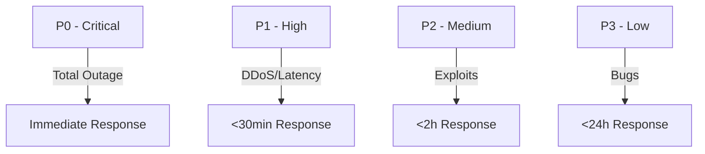
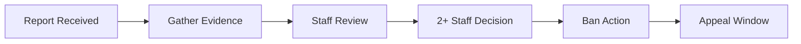
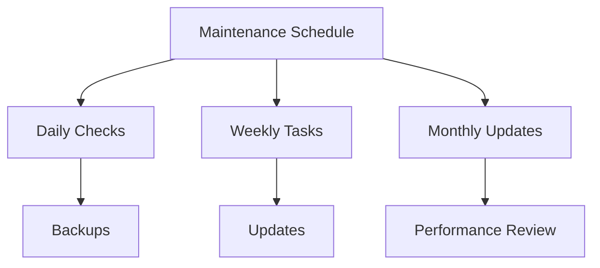

# Standard Operating Procedures (SOPs)

## Incident Management

### Priority Levels

### Response Matrix
| Priority | Description | Response Time | Communication | RCA Required |
|----------|-------------|---------------|---------------|--------------|
| P0 | Service Down | Immediate | All channels | Yes (48h) |
| P1 | Major Impact | <30 min | Discord + Site | Yes (72h) |
| P2 | Limited Impact | <2 hours | Discord | Optional |
| P3 | Minor Impact | <24 hours | Tracking only | No |

### Incident Response Checklist
1. **Detection & Assessment**
   - Confirm incident
   - Determine priority
   - Initial logging
   - Team notification

2. **Response & Mitigation**
   - Engage required teams
   - Apply mitigation
   - Monitor effectiveness
   - Update status

3. **Communication**
   - User notifications
   - Status updates
   - ETA updates
   - Resolution notice

4. **Post-Incident**
   - RCA completion
   - Update procedures
   - Team debrief
   - Documentation

## Moderation Procedures

### Ban Process

### Ban Guidelines
| Violation | First Offense | Second Offense | Third Offense |
|-----------|---------------|----------------|---------------|
| Cheating | 30 days | 180 days | Permanent |
| Harassment | 7 days | 30 days | 180 days |
| Exploits | Warning | 7 days | 30 days |
| Bug Abuse | Warning | 3 days | 7 days |

### Appeal Process
1. **Submission**
   - Appeal form
   - Evidence
   - Statement
   - References

2. **Review**
   - Case review
   - Evidence check
   - History check
   - Staff discussion

3. **Decision**
   - 2+ staff consensus
   - Documentation
   - Communication
   - Action taken

### Review SLAs
| Action | Time Frame | Staff Required | Documentation |
|--------|------------|----------------|---------------|
| Initial Review | 24h | 1 | Required |
| Staff Discussion | 48h | 2+ | Required |
| Final Decision | 72h | 2+ | Required |
| Communication | 24h | 1 | Required |

## Server Management

### Maintenance Schedule

### Routine Tasks
| Frequency | Task | Duration | Impact |
|-----------|------|----------|---------|
| Daily | Backups | 1h | None |
| Weekly | Updates | 2h | Low |
| Monthly | Maintenance | 4h | Medium |
| Quarterly | Review | 8h | Low |

### Performance Monitoring
1. **Metrics**
   - Server load
   - Memory usage
   - Network latency
   - Player count

2. **Thresholds**
   - CPU: 80%
   - Memory: 85%
   - Latency: 100ms
   - Storage: 90%

3. **Actions**
   - Alert generation
   - Auto-scaling
   - Load balancing
   - Resource allocation

## Documentation & Training

### Documentation Requirements
1. **Incident Reports**
   - Timeline
   - Actions taken
   - Impact analysis
   - Lessons learned

2. **Process Updates**
   - Change logs
   - Version control
   - Review dates
   - Approvals

3. **Training Materials**
   - Procedures
   - Guidelines
   - Examples
   - Exercises

### Staff Training
| Topic | Frequency | Format | Verification |
|-------|-----------|---------|-------------|
| Incident Response | Monthly | Workshop | Practical |
| Moderation | Bi-weekly | Session | Quiz |
| Security | Quarterly | Course | Certification |
| Tools | As needed | Hands-on | Assessment |

## Version Information
- Last Update: 2025-09-17
- Version: 2.0
- Review Frequency: Monthly
- Next Review: 2025-10-17
