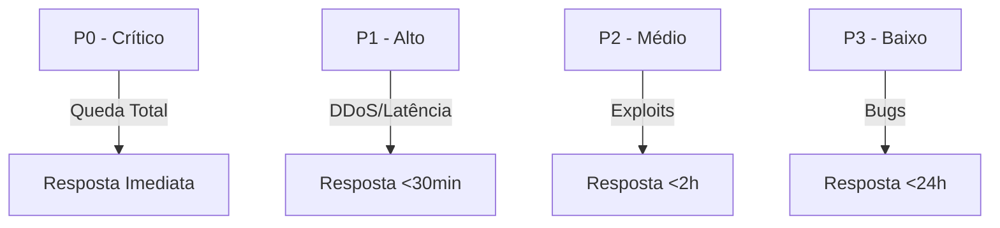
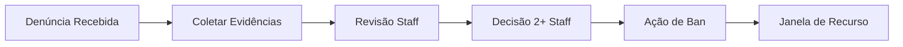
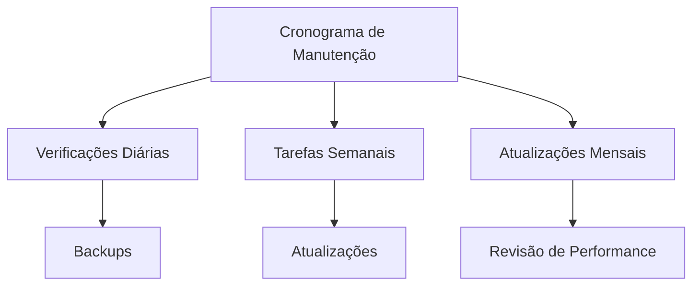

# Procedimentos Operacionais Padrão (SOPs)

## Gestão de Incidentes

### Níveis de Prioridade

### Matriz de Resposta
| Prioridade | Descrição | Tempo de Resposta | Comunicação | RCA Necessário |
|------------|-----------|-------------------|-------------|----------------|
| P0 | Serviço Fora | Imediato | Todos canais | Sim (48h) |
| P1 | Impacto Maior | <30 min | Discord + Site | Sim (72h) |
| P2 | Impacto Limitado | <2 horas | Discord | Opcional |
| P3 | Impacto Menor | <24 horas | Apenas registro | Não |

### Checklist de Resposta a Incidentes
1. **Detecção & Avaliação**
   - Confirmar incidente
   - Determinar prioridade
   - Registro inicial
   - Notificação da equipe

2. **Resposta & Mitigação**
   - Mobilizar equipes
   - Aplicar mitigação
   - Monitorar eficácia
   - Atualizar status

3. **Comunicação**
   - Notificações aos usuários
   - Atualizações de status
   - Atualizações de ETA
   - Aviso de resolução

4. **Pós-Incidente**
   - Conclusão do RCA
   - Atualizar procedimentos
   - Debriefing da equipe
   - Documentação

## Procedimentos de Moderação

### Processo de Banimento

### Diretrizes de Banimento
| Violação | Primeira Ofensa | Segunda Ofensa | Terceira Ofensa |
|----------|-----------------|----------------|------------------|
| Trapaça | 30 dias | 180 dias | Permanente |
| Assédio | 7 dias | 30 dias | 180 dias |
| Exploits | Advertência | 7 dias | 30 dias |
| Abuso de Bug | Advertência | 3 dias | 7 dias |

### Processo de Recurso
1. **Submissão**
   - Formulário
   - Evidências
   - Declaração
   - Referências

2. **Revisão**
   - Análise do caso
   - Verificação de provas
   - Verificação de histórico
   - Discussão da equipe

3. **Decisão**
   - Consenso 2+ staff
   - Documentação
   - Comunicação
   - Ação tomada

### SLAs de Revisão
| Ação | Prazo | Staff Necessário | Documentação |
|------|-------|------------------|--------------|
| Revisão Inicial | 24h | 1 | Obrigatória |
| Discussão Staff | 48h | 2+ | Obrigatória |
| Decisão Final | 72h | 2+ | Obrigatória |
| Comunicação | 24h | 1 | Obrigatória |

## Gestão de Servidor

### Cronograma de Manutenção

### Tarefas de Rotina
| Frequência | Tarefa | Duração | Impacto |
|------------|--------|----------|---------|
| Diária | Backups | 1h | Nenhum |
| Semanal | Atualizações | 2h | Baixo |
| Mensal | Manutenção | 4h | Médio |
| Trimestral | Revisão | 8h | Baixo |

### Monitoramento de Performance
1. **Métricas**
   - Carga do servidor
   - Uso de memória
   - Latência de rede
   - Contagem de jogadores

2. **Limites**
   - CPU: 80%
   - Memória: 85%
   - Latência: 100ms
   - Armazenamento: 90%

3. **Ações**
   - Geração de alertas
   - Auto-scaling
   - Balanceamento de carga
   - Alocação de recursos

## Documentação & Treinamento

### Requisitos de Documentação
1. **Relatórios de Incidentes**
   - Linha do tempo
   - Ações tomadas
   - Análise de impacto
   - Lições aprendidas

2. **Atualizações de Processo**
   - Logs de mudanças
   - Controle de versão
   - Datas de revisão
   - Aprovações

3. **Materiais de Treinamento**
   - Procedimentos
   - Diretrizes
   - Exemplos
   - Exercícios

### Treinamento da Equipe
| Tópico | Frequência | Formato | Verificação |
|--------|------------|---------|-------------|
| Resposta a Incidentes | Mensal | Workshop | Prática |
| Moderação | Quinzenal | Sessão | Quiz |
| Segurança | Trimestral | Curso | Certificação |
| Ferramentas | Conforme necessário | Hands-on | Avaliação |

## Informações de Versão
- Última Atualização: 2025-09-17
- Versão: 2.0
- Frequência de Revisão: Mensal
- Próxima Revisão: 2025-10-17
