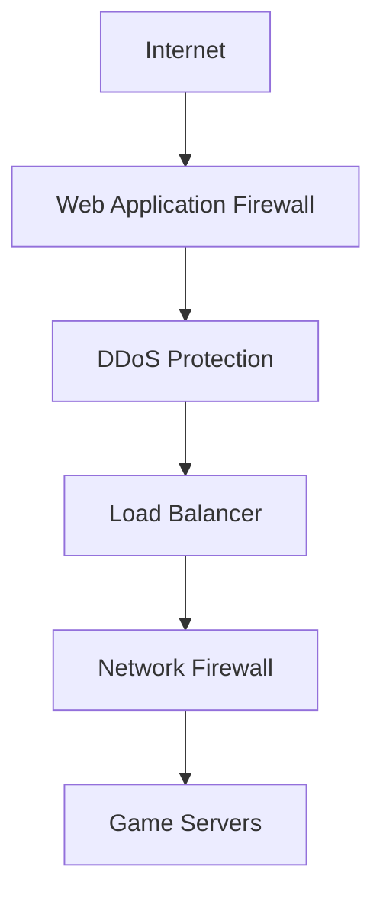
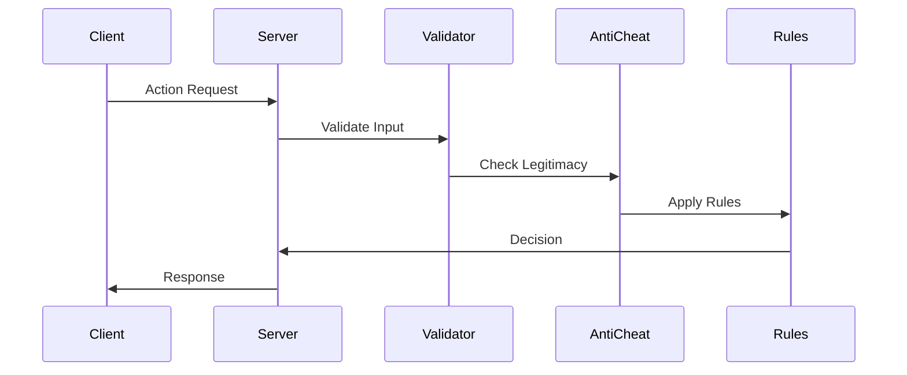
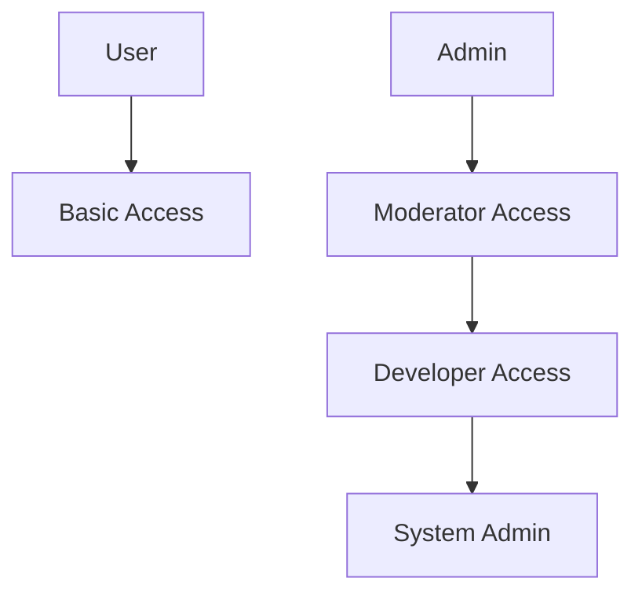

# Security Architecture & Protocols

## Overview
This document outlines the comprehensive security architecture and protocols implemented in Marola RP to ensure platform integrity, user data protection, and fair gameplay.

## Security Layers

### Network Security

#### DDoS Protection
| Layer | Protection Method | Threshold | Action |
|-------|------------------|-----------|--------|
| L3 | IP Filtering | 1M pps | Block |
| L4 | SYN Protection | 500K pps | Challenge |
| L7 | Rate Limiting | 10K rps | Throttle |

#### Network Hardening
- TCP/IP Stack Tuning
- Port Security
- Traffic Segmentation
- SSL/TLS Configuration

### Application Security

#### Server-Side Validation

#### Anti-Cheat System
1. **Detection Methods**
   - Heuristic Analysis
   - Signature Detection
   - Behavior Monitoring
   - Memory Scanning

2. **Protection Features**
   - Memory Protection
   - Code Integrity
   - Driver Validation
   - Screenshot Capture

3. **Ban System Integration**
   - Global Ban Lists
   - Local Ban Database
   - Appeal Process
   - Evidence Storage

### Data Security

#### Encryption Standards
| Data Type | At Rest | In Transit |
|-----------|----------|------------|
| User Data | AES-256 | TLS 1.3 |
| Backups | AES-256 | TLS 1.3 |
| Configs | AES-256 | TLS 1.3 |
| Logs | AES-256 | TLS 1.3 |

#### Backup Security
- **Strategy**
  - Daily Incremental
  - Weekly Full
  - Monthly Archive
  - Yearly Long-term

- **Protection**
  - Encryption
  - Versioning
  - Access Control
  - Integrity Checks

## Access Control

### Role-Based Access Control (RBAC)

### Permission Matrix
| Role | Game Access | Admin Panel | Logs | Config |
|------|-------------|-------------|------|---------|
| User | Read | None | None | None |
| Moderator | Read/Write | Read | Read | None |
| Admin | Full | Read/Write | Full | Read |
| SysAdmin | Full | Full | Full | Full |

## Monitoring & Response

### Security Monitoring
1. **Real-time Monitoring**
   - Network Traffic
   - Server Performance
   - User Actions
   - System Events

2. **Alert System**
   - Severity Levels
   - Response SLAs
   - Escalation Path
   - Notification Channels

### Incident Response Plan

#### Response Levels
| Level | Description | Response Time | Team |
|-------|-------------|---------------|------|
| P0 | Critical Security Breach | 15 min | All Hands |
| P1 | Major Vulnerability | 1 hour | Security Team |
| P2 | Minor Violation | 4 hours | Mod Team |
| P3 | Suspicious Activity | 24 hours | Support |

#### Response Process
1. **Detection**
   - Alert Triggering
   - Initial Assessment
   - Team Notification

2. **Analysis**
   - Impact Evaluation
   - Scope Definition
   - Evidence Collection

3. **Containment**
   - Threat Isolation
   - Access Control
   - System Protection

4. **Eradication**
   - Threat Removal
   - System Cleanup
   - Verification

5. **Recovery**
   - Service Restoration
   - Data Verification
   - System Hardening

6. **Documentation**
   - Incident Report
   - Timeline
   - Lessons Learned

## Compliance & Auditing

### Regular Audits
- Weekly Security Scans
- Monthly Permission Review
- Quarterly Penetration Tests
- Annual Full Assessment

### Compliance Checks
| Area | Frequency | Method | Documentation |
|------|-----------|--------|---------------|
| Access Control | Weekly | Automated | Report |
| Configurations | Monthly | Manual | Checklist |
| Vulnerabilities | Daily | Automated | Scan Results |
| Backups | Weekly | Automated | Verification |

### Evidence Management
1. **Collection**
   - Screenshot Capture
   - Log Collection
   - Network Captures
   - System States

2. **Storage**
   - Encrypted Storage
   - Access Logging
   - Version Control
   - Retention Policy

3. **Chain of Custody**
   - Access Records
   - Modification Logs
   - Transfer History
   - Disposal Records

## Testing & Verification

### Security Testing
- Vulnerability Scanning
- Penetration Testing
- Configuration Review
- Code Analysis

### Recovery Testing
| Test Type | Frequency | Success Criteria |
|-----------|-----------|------------------|
| Backup Restore | Monthly | <4 hours |
| Failover | Quarterly | <15 minutes |
| Full DR | Annually | <24 hours |
| Security Response | Monthly | Per SLA |

## Documentation Requirements

### Security Documentation
- Incident Reports
- Audit Logs
- Change Records
- Access Logs

### Process Documentation
- Response Procedures
- Recovery Plans
- Training Materials
- Update Logs

## Version Control
- Last Updated: 2025-09-17
- Next Review: 2025-09-24
- Review Frequency: Weekly
