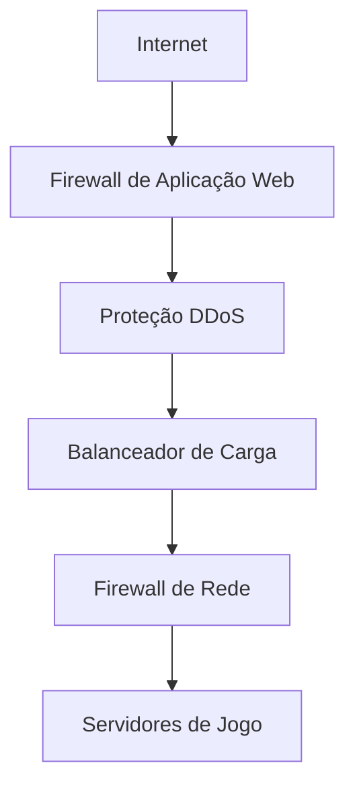
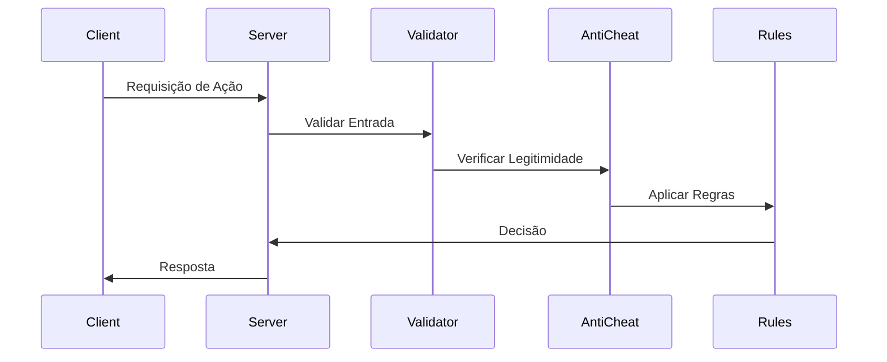
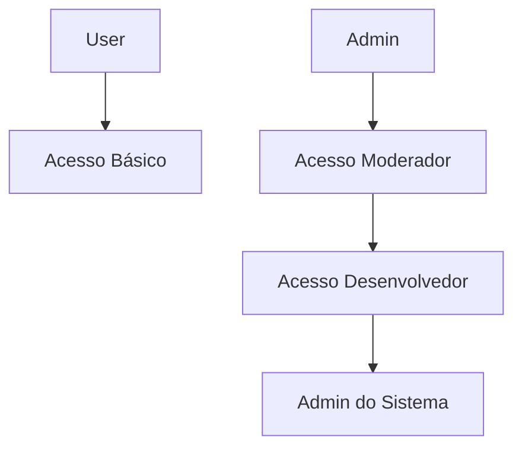

# Arquitetura & Protocolos de Segurança

## Visão Geral
Este documento descreve a arquitetura e protocolos de segurança abrangentes implementados no Marola RP para garantir a integridade da plataforma, proteção de dados dos usuários e gameplay justo.

## Camadas de Segurança

### Segurança de Rede

#### Proteção DDoS
| Camada | Método de Proteção | Limite | Ação |
|--------|-------------------|---------|-------|
| L3 | Filtragem IP | 1M pps | Bloquear |
| L4 | Proteção SYN | 500K pps | Desafiar |
| L7 | Limitação de Taxa | 10K rps | Throttle |

#### Hardening de Rede
- Ajuste da Pilha TCP/IP
- Segurança de Portas
- Segmentação de Tráfego
- Configuração SSL/TLS

### Segurança da Aplicação

#### Validação Server-Side

#### Sistema Anti-Cheat
1. **Métodos de Detecção**
   - Análise Heurística
   - Detecção de Assinaturas
   - Monitoramento de Comportamento
   - Varredura de Memória

2. **Recursos de Proteção**
   - Proteção de Memória
   - Integridade de Código
   - Validação de Driver
   - Captura de Screenshot

3. **Integração do Sistema de Ban**
   - Listas de Ban Globais
   - Banco de Dados Local de Bans
   - Processo de Apelação
   - Armazenamento de Evidências

### Segurança de Dados

#### Padrões de Criptografia
| Tipo de Dado | Em Repouso | Em Trânsito |
|--------------|------------|-------------|
| Dados do Usuário | AES-256 | TLS 1.3 |
| Backups | AES-256 | TLS 1.3 |
| Configurações | AES-256 | TLS 1.3 |
| Logs | AES-256 | TLS 1.3 |

#### Segurança de Backup
- **Estratégia**
  - Incremental Diário
  - Completo Semanal
  - Arquivo Mensal
  - Longo Prazo Anual

- **Proteção**
  - Criptografia
  - Versionamento
  - Controle de Acesso
  - Verificações de Integridade

## Controle de Acesso

### Controle de Acesso Baseado em Função (RBAC)

### Matriz de Permissões
| Função | Acesso ao Jogo | Painel Admin | Logs | Config |
|--------|----------------|--------------|------|---------|
| Usuário | Leitura | Nenhum | Nenhum | Nenhum |
| Moderador | Leitura/Escrita | Leitura | Leitura | Nenhum |
| Admin | Total | Leitura/Escrita | Total | Leitura |
| SysAdmin | Total | Total | Total | Total |

## Monitoramento & Resposta

### Monitoramento de Segurança
1. **Monitoramento em Tempo Real**
   - Tráfego de Rede
   - Performance do Servidor
   - Ações do Usuário
   - Eventos do Sistema

2. **Sistema de Alerta**
   - Níveis de Severidade
   - SLAs de Resposta
   - Caminho de Escalação
   - Canais de Notificação

### Plano de Resposta a Incidentes

#### Níveis de Resposta
| Nível | Descrição | Tempo de Resposta | Equipe |
|-------|-----------|-------------------|--------|
| P0 | Violação Crítica | 15 min | Todos |
| P1 | Vulnerabilidade Maior | 1 hora | Equipe de Segurança |
| P2 | Violação Menor | 4 horas | Equipe de Mod |
| P3 | Atividade Suspeita | 24 horas | Suporte |

#### Processo de Resposta
1. **Detecção**
   - Disparo de Alerta
   - Avaliação Inicial
   - Notificação da Equipe

2. **Análise**
   - Avaliação de Impacto
   - Definição de Escopo
   - Coleta de Evidências

3. **Contenção**
   - Isolamento da Ameaça
   - Controle de Acesso
   - Proteção do Sistema

4. **Erradicação**
   - Remoção da Ameaça
   - Limpeza do Sistema
   - Verificação

5. **Recuperação**
   - Restauração de Serviço
   - Verificação de Dados
   - Hardening do Sistema

6. **Documentação**
   - Relatório do Incidente
   - Linha do Tempo
   - Lições Aprendidas

## Conformidade & Auditoria

### Auditorias Regulares
- Scans Semanais de Segurança
- Revisão Mensal de Permissões
- Testes Trimestrais de Penetração
- Avaliação Anual Completa

### Verificações de Conformidade
| Área | Frequência | Método | Documentação |
|------|------------|--------|--------------|
| Controle de Acesso | Semanal | Automatizado | Relatório |
| Configurações | Mensal | Manual | Checklist |
| Vulnerabilidades | Diário | Automatizado | Resultados do Scan |
| Backups | Semanal | Automatizado | Verificação |

### Gestão de Evidências
1. **Coleta**
   - Captura de Screenshot
   - Coleta de Logs
   - Capturas de Rede
   - Estados do Sistema

2. **Armazenamento**
   - Armazenamento Criptografado
   - Logging de Acesso
   - Controle de Versão
   - Política de Retenção

3. **Cadeia de Custódia**
   - Registros de Acesso
   - Logs de Modificação
   - Histórico de Transferência
   - Registros de Descarte

## Testes & Verificação

### Testes de Segurança
- Varredura de Vulnerabilidades
- Testes de Penetração
- Revisão de Configuração
- Análise de Código

### Testes de Recuperação
| Tipo de Teste | Frequência | Critério de Sucesso |
|---------------|------------|-------------------|
| Restauração de Backup | Mensal | <4 horas |
| Failover | Trimestral | <15 minutos |
| DR Completo | Anual | <24 horas |
| Resposta de Segurança | Mensal | Conforme SLA |

## Requisitos de Documentação

### Documentação de Segurança
- Relatórios de Incidentes
- Logs de Auditoria
- Registros de Mudanças
- Logs de Acesso

### Documentação de Processos
- Procedimentos de Resposta
- Planos de Recuperação
- Materiais de Treinamento
- Logs de Atualização

## Controle de Versão
- Última Atualização: 2025-09-17
- Próxima Revisão: 2025-09-24
- Frequência de Revisão: Semanal
