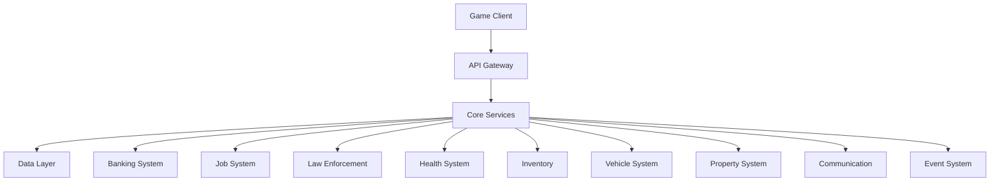
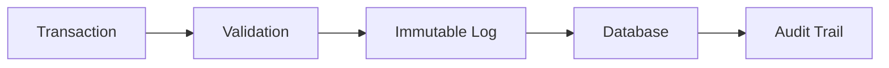
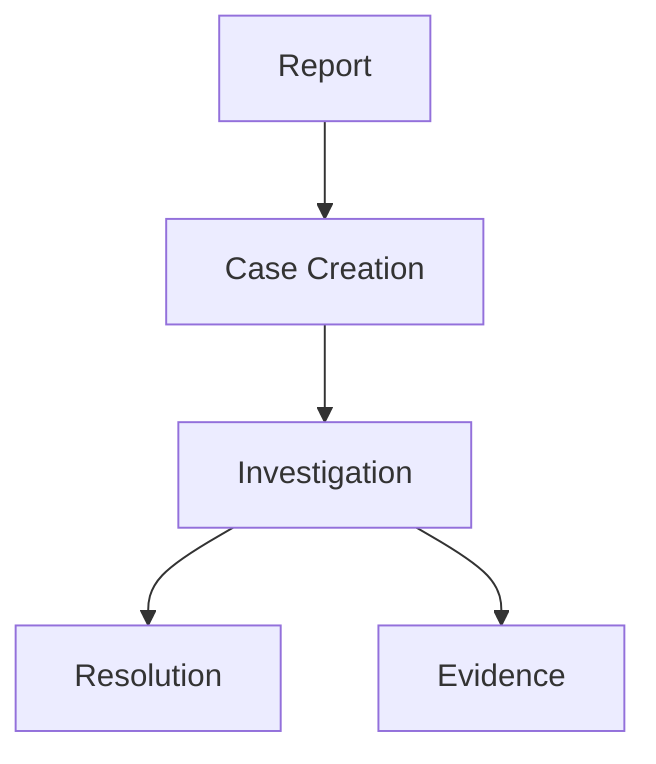
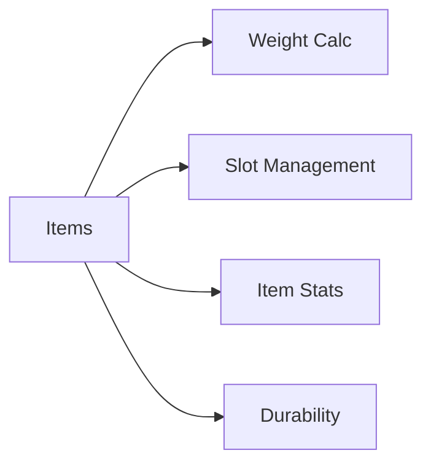
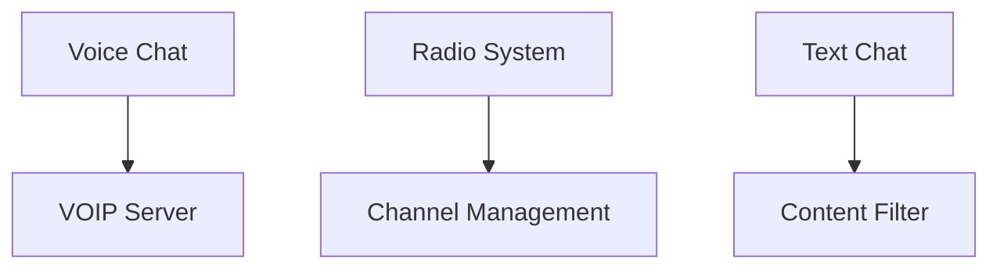
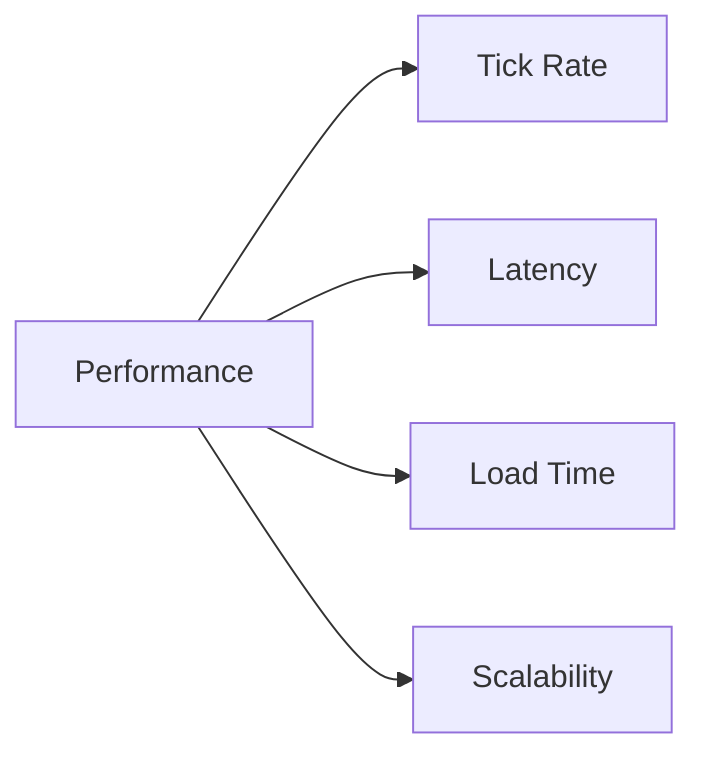
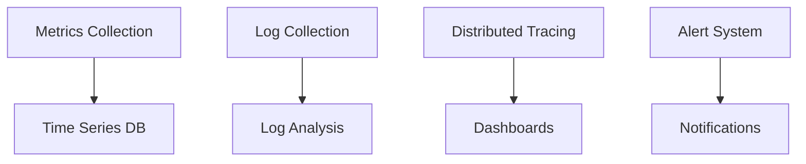

# Systems Requirements & Specifications

## System Architecture Overview

### High-Level Architecture

## Functional Requirements

### Banking System (BANK)

#### Core Features
| Feature | Description | Priority |
|---------|------------|----------|
| Transactions | Real-time money transfers | P0 |
| Accounts | Player banking accounts | P0 |
| Audit Logs | Immutable transaction history | P0 |
| Analytics | Financial reporting | P1 |

### Job System (JOB)
#### Career Management
| Component | Features | Integration |
|-----------|----------|-------------|
| Ranks | Progression system | XP System |
| Salaries | Dynamic pay scales | Banking |
| Skills | Skill requirements | Inventory |
| Scheduling | Shift management | Events |

### Law Enforcement System (LAW)

#### Police CRM Features
- Case Management
- Evidence Tracking
- Warrant System
- Patrol Management
- Dispatch System

### Health System (HLTH)
#### Medical Features
| Feature | Implementation | Integration |
|---------|----------------|-------------|
| Triage | Priority-based | Events |
| Injuries | Status effects | Inventory |
| Treatment | Recovery system | Banking |
| Insurance | Coverage plans | Banking |

### Inventory System (INV)

#### Inventory Management
- Weight Limits
- Slot System
- Item Categories
- Durability System
- Trading Interface

### Vehicle System (VEH)
#### Vehicle Features
| Feature | Requirements | Integration |
|---------|--------------|-------------|
| Licenses | Testing system | Law System |
| Maintenance | Regular upkeep | Banking |
| Insurance | Coverage plans | Banking |
| Registration | Documentation | Law System |

### Property System (PROP)
#### Property Management
- Ownership Records
- Maintenance Costs
- Access Control
- Customization
- Rental System

### Communication System (COM)

#### Communication Features
- VOIP Integration
- Radio Channels
- Proximity Chat
- Emergency Channels
- Moderation Tools

### Event System (EVT)
#### Event Management
| Feature | Automation | Integration |
|---------|------------|-------------|
| Scheduler | Automated events | All Systems |
| Triggers | Condition-based | Core Logic |
| Rewards | Automated distribution | Banking |
| Logging | Event tracking | Analytics |

## Non-Functional Requirements

### Performance Requirements

#### Performance Metrics
| Metric | Target | Critical Threshold |
|--------|--------|-------------------|
| Tick Rate | 64/s | 32/s |
| Latency | <100ms | 200ms |
| Load Time | <30s | 60s |
| Concurrent Users | 1000 | 500 |

### Security Requirements
#### Security Measures
1. **Server-Side Validation**
   - Input Validation
   - State Validation
   - Action Validation
   - Rate Limiting

2. **Anti-Cheat System**
   - Memory Protection
   - Behavior Analysis
   - Pattern Detection
   - Automated Response

### Availability Requirements
#### Service Level Objectives
| Service | Availability | MTTR | MTBF |
|---------|--------------|------|------|
| Core Services | 99.9% | 30min | 720h |
| Database | 99.99% | 15min | 1440h |
| Communication | 99.5% | 45min | 360h |

### Observability Requirements
#### Monitoring Stack

## Integration Requirements

### System Dependencies
| System | Dependencies | Integration Points |
|--------|--------------|-------------------|
| Banking | Law, Job | Transactions |
| Jobs | Banking, Events | Payments |
| Law | Health, Vehicle | Incidents |
| Health | Inventory, Banking | Treatment |

### API Requirements
- RESTful Endpoints
- GraphQL Support
- WebSocket Integration
- Rate Limiting
- Authentication
- Documentation

## Documentation Requirements

### Technical Documentation
1. **API Documentation**
   - Endpoint Specifications
   - Authentication Methods
   - Request/Response Examples
   - Error Handling

2. **System Documentation**
   - Architecture Diagrams
   - Data Models
   - Flow Charts
   - Deployment Guides

3. **Integration Guides**
   - Setup Instructions
   - Configuration Examples
   - Troubleshooting Guide
   - Best Practices

## Version Control
- Last Update: 2025-09-17
- Next Review: 2025-09-24
- Review Frequency: Weekly
