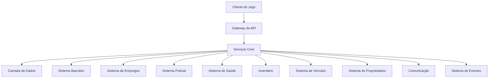
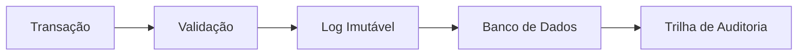
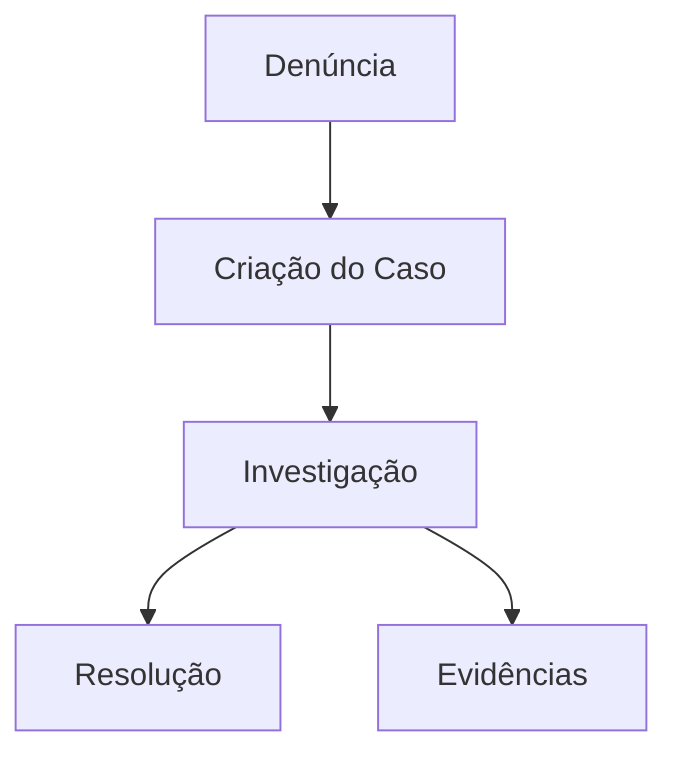
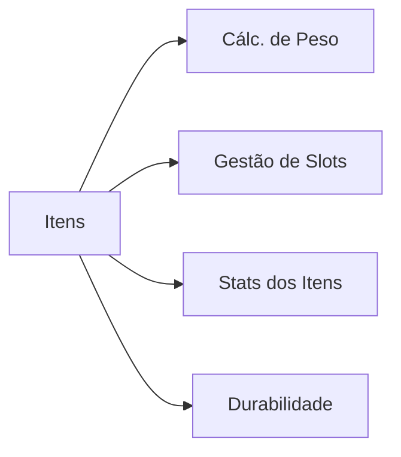
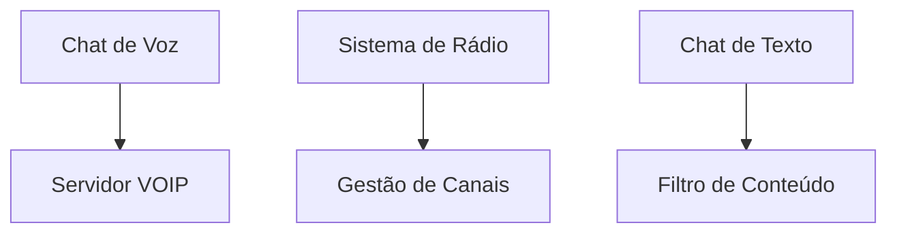
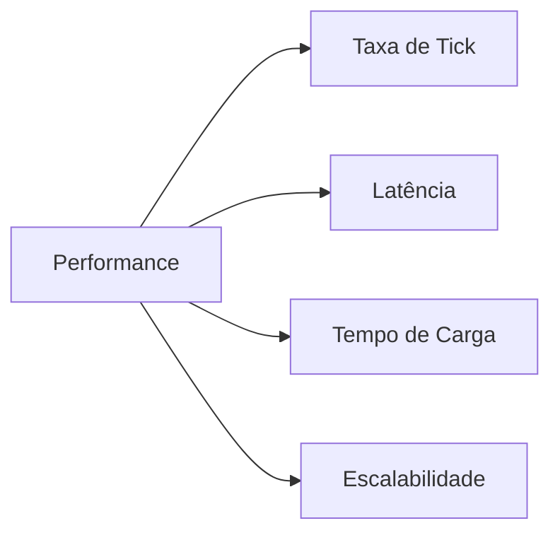
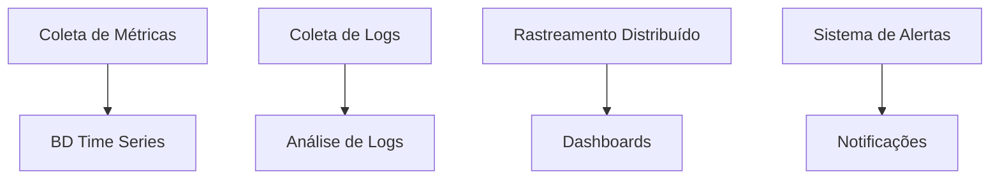

# Requisitos & Especificações dos Sistemas

## Visão Geral da Arquitetura do Sistema

### Arquitetura de Alto Nível

## Requisitos Funcionais

### Sistema Bancário (BANK)

#### Recursos Principais
| Recurso | Descrição | Prioridade |
|---------|-----------|------------|
| Transações | Transferências em tempo real | P0 |
| Contas | Contas bancárias de jogadores | P0 |
| Logs de Auditoria | Histórico imutável de transações | P0 |
| Análises | Relatórios financeiros | P1 |

### Sistema de Empregos (JOB)
#### Gestão de Carreira
| Componente | Recursos | Integração |
|------------|----------|------------|
| Ranks | Sistema de progressão | Sistema XP |
| Salários | Escalas dinâmicas | Bancário |
| Habilidades | Requisitos de skill | Inventário |
| Agendamento | Gestão de turnos | Eventos |

### Sistema Policial (LAW)

#### Recursos do CRM Policial
- Gestão de Casos
- Rastreamento de Evidências
- Sistema de Mandados
- Gestão de Patrulha
- Sistema de Despacho

### Sistema de Saúde (HLTH)
#### Recursos Médicos
| Recurso | Implementação | Integração |
|---------|---------------|------------|
| Triagem | Baseada em prioridade | Eventos |
| Ferimentos | Efeitos de status | Inventário |
| Tratamento | Sistema de recuperação | Bancário |
| Seguro | Planos de cobertura | Bancário |

### Sistema de Inventário (INV)

#### Gestão de Inventário
- Limites de Peso
- Sistema de Slots
- Categorias de Itens
- Sistema de Durabilidade
- Interface de Troca

### Sistema de Veículos (VEH)
#### Recursos de Veículos
| Recurso | Requisitos | Integração |
|---------|------------|------------|
| Licenças | Sistema de testes | Sistema Policial |
| Manutenção | Manutenção regular | Bancário |
| Seguro | Planos de cobertura | Bancário |
| Registro | Documentação | Sistema Policial |

### Sistema de Propriedades (PROP)
#### Gestão de Propriedades
- Registros de Propriedade
- Custos de Manutenção
- Controle de Acesso
- Personalização
- Sistema de Aluguel

### Sistema de Comunicação (COM)

#### Recursos de Comunicação
- Integração VOIP
- Canais de Rádio
- Chat por Proximidade
- Canais de Emergência
- Ferramentas de Moderação

### Sistema de Eventos (EVT)
#### Gestão de Eventos
| Recurso | Automação | Integração |
|---------|-----------|------------|
| Agenda | Eventos automáticos | Todos Sistemas |
| Gatilhos | Baseado em condições | Lógica Core |
| Recompensas | Distribuição automática | Bancário |
| Logging | Rastreamento de eventos | Analytics |

## Requisitos Não Funcionais

### Requisitos de Performance

#### Métricas de Performance
| Métrica | Meta | Limite Crítico |
|---------|------|----------------|
| Taxa de Tick | 64/s | 32/s |
| Latência | <100ms | 200ms |
| Tempo de Carga | <30s | 60s |
| Usuários Simultâneos | 1000 | 500 |

### Requisitos de Segurança
#### Medidas de Segurança
1. **Validação Server-Side**
   - Validação de Entrada
   - Validação de Estado
   - Validação de Ação
   - Limitação de Taxa

2. **Sistema Anti-Cheat**
   - Proteção de Memória
   - Análise de Comportamento
   - Detecção de Padrões
   - Resposta Automatizada

### Requisitos de Disponibilidade
#### Objetivos de Nível de Serviço
| Serviço | Disponibilidade | MTTR | MTBF |
|---------|----------------|------|------|
| Serviços Core | 99,9% | 30min | 720h |
| Banco de Dados | 99,99% | 15min | 1440h |
| Comunicação | 99,5% | 45min | 360h |

### Requisitos de Observabilidade
#### Stack de Monitoramento

## Requisitos de Integração

### Dependências do Sistema
| Sistema | Dependências | Pontos de Integração |
|---------|--------------|---------------------|
| Bancário | Policial, Empregos | Transações |
| Empregos | Bancário, Eventos | Pagamentos |
| Policial | Saúde, Veículos | Incidentes |
| Saúde | Inventário, Bancário | Tratamento |

### Requisitos de API
- Endpoints RESTful
- Suporte a GraphQL
- Integração WebSocket
- Limitação de Taxa
- Autenticação
- Documentação

## Requisitos de Documentação

### Documentação Técnica
1. **Documentação da API**
   - Especificações de Endpoints
   - Métodos de Autenticação
   - Exemplos de Request/Response
   - Tratamento de Erros

2. **Documentação do Sistema**
   - Diagramas de Arquitetura
   - Modelos de Dados
   - Fluxogramas
   - Guias de Implantação

3. **Guias de Integração**
   - Instruções de Setup
   - Exemplos de Configuração
   - Guia de Solução de Problemas
   - Melhores Práticas

## Controle de Versão
- Última Atualização: 2025-09-17
- Próxima Revisão: 2025-09-24
- Frequência de Revisão: Semanal
